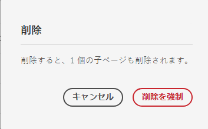

# ContextHub でのセグメント化の設定{#configuring-segmentation-with-contexthub}

キャンペーンを作成する場合、セグメント化を考えることが重要になります。セグメント化の仕組みと主な用語について詳しくは、「[セグメント化について](segmentation.md)」を参照してください。

サイト訪問者についてこれまでに収集した情報と、達成する目標に応じて、ターゲットコンテンツに必要なセグメントと戦略を定義する必要があります。

このようなセグメントを使用して、訪問者に特定のターゲットコンテンツを提供します。ここで定義された[アクティビティ](activities.md)は、任意のページに追加できます。また、専用のコンテンツを適用できる訪問者セグメントを定義できます。

AEM では、ユーザーエクスペリエンスを簡単にパーソナライズできます。また、セグメント定義の結果を検証することもできます。

## セグメントへのアクセス {#accessing-segments}

[オーディエンス](audiences.md)コンソールは、ContextHub のセグメントを管理したり、Adobe Target アカウントのオーディエンスを管理したりする目的で使用します。このドキュメントでは、ContextHub のセグメントの管理について取り上げます。

セグメントにアクセスするには、グローバルナビゲーションで&#x200B;**ナビゲーション／パーソナライズ機能／オーディエンス**&#x200B;を選択します。


## セグメントエディター {#segment-editor}

<!--The **Segment Editor** allows you to easily modify a segment. To edit a segment, select a segment in the [list of segments](/help/sites-administering/segmentation.md#accessing-segments) and click the **Edit** button.-->
**セグメントエディター**&#x200B;を使用すると、セグメントを簡単に変更できます。セグメントを編集するには、セグメントリストからセグメントを選択し、「**編集**」ボタンをクリックします。


コンポーネントブラウザーを使用すると、**AND** および **OR** コンテナを追加してセグメントロジックを定義してから、別のコンポーネントを追加してプロパティや値を比較できます。また、スクリプトやその他のセグメントを参照して選択条件を定義する（[新しいセグメントの作成](#creating-a-new-segment)を参照）ことによって、セグメントの選択シナリオを正確に定義できます。

ステートメント全体が true と評価されると、セグメントは解決されます。複数のセグメントを適用可能な場合、**ブースト**&#x200B;係数も使用されます。ブースト係数について詳しくは、「[新しいセグメントの作成](#creating-a-new-segment)」を参照してください。

>[!CAUTION]
>
>セグメントエディターは、循環参照をチェックしません。例えば、セグメント A が別のセグメント B を参照していて、そのセグメント B がセグメント A を参照している場合などです。このため、セグメントに循環参照が存在しないことを必ず確認してください。

### コンテナ {#containers}

次のコンテナは標準で用意されており、比較や参照をグループ化してブール評価をおこなうために使用できます。これらはコンポーネントブラウザーからエディターにドラッグできます。詳しくは、「[AND コンテナと OR コンテナの使用](#using-and-and-or-containers)」の節を参照してください。

|  |  |
|---|---|
| コンテナ AND | AND ブール演算値 |
| コンテナ OR | OR ブール演算値 |

### 比較 {#comparisons}

次のセグメント比較は標準で用意されており、セグメントプロパティを評価するために使用できます。これらはコンポーネントブラウザーからエディターにドラッグできます。

|  |  |
|---|---|
| プロパティ - 値 | ストアのプロパティと定義済みの値を比較 |
| プロパティ - プロパティ | ストアの 1 つのプロパティと別のプロパティを比較 |
| プロパティ - セグメントの参照 | ストアのプロパティを参照先の別のセグメントと比較 |
| プロパティ - スクリプトの参照 | ストアのプロパティとスクリプトの結果を比較 |
| セグメントリファレンス - スクリプトリファレンス | 参照先セグメントとスクリプトの結果を比較 |

>[!NOTE]
>
>値の比較時に比較のデータタイプが設定されていない場合（つまり、自動検出に設定されている場合）、ContextHub のセグメント化エンジンでは、javascript と同じように値が比較されます。値が想定されたタイプにキャストされないので、誤解を招く結果となることがあります。次に例を示します。
>
>`null < 30 // will return true`
>
>したがって、[セグメントの作成](#creating-a-new-segment)時に比較対象の値のタイプがわかる場合は、常に&#x200B;**データタイプ**&#x200B;を選択してください。次に例を示します。
>
>`profile/age` プロパティを比較する場合は、比較対象のタイプが&#x200B;**数値**&#x200B;であることが既にわかっているので、`profile/age` が設定されていなくても、`profile/age` が 30 より小さいという比較では、想定どおりに **false** が返されます。

### 参照 {#references}

次の参照は標準で用意されており、スクリプトや別のセグメントに直接リンクするために使用できます。これらはコンポーネントブラウザーからエディターにドラッグできます。

|  |  |
|---|---|
| セグメントの参照 | 参照先セグメントを評価 |
| スクリプト参照 | 参照先セグメントをします。詳しくは、次の「[スクリプト参照の使用](#using-script-references)」の節を参照してください。 |

## 新しいセグメントの作成 {#creating-a-new-segment}

新しいセグメントを定義するには、次の手順に従います。

1. [セグメント](#accessing-segments)にアクセスした後、[セグメントを作成するフォルダー](#organizing-segments)に移動するか、ルートに残します。

1. 「**作成**」ボタンをタップまたはクリックし、「**ContextHubセグメントを作成**」を選択します。

   

1. 「**新しい ContextHub セグメント**」で、セグメントのタイトルと必要に応じてブースト値を入力し、「**作成**」をタップまたはクリックします。

   

   各セグメントには、重み付け係数として使用されるブーストパラメーターがあります。複数のセグメントが有効である場合、数値が小さいセグメントよりも、数値が大きいセグメントのほうが優先して選択されます。

   * 最小値：`0`
   * 最大値：`1000000`

1. セグメントコンソールから、新しく作成したセグメントを編集し、セグメントエディターで開きます。
1. 比較または参照をセグメントエディターにドラッグすると、デフォルトの AND コンテナに表示されます。
1. 新しい参照またはセグメントの設定オプションをダブルクリックまたはタップして、特定のパラメーターを編集します。この例では、バーゼルのユーザーをテストしています。

   

   比較が適切に評価されるように、可能であれば常に「**データタイプ**」を設定します。詳しくは、[比較](#comparisons)を参照してください。

1. 「**完了**」をクリックして定義を保存します。
1. 必要に応じてその他のコンポーネントを追加します。AND 比較および OR 比較のコンテナコンポーネントを使用して、ブール式を作成できます（後述の [AND コンテナと OR コンテナの使用](#using-and-and-or-containers)を参照）。セグメントエディターでは、不要になったコンポーネントを削除したり、コンポーネントをステートメント内の別の場所へドラッグしたりすることができます。

### AND コンテナと OR コンテナの使用  {#using-and-and-or-containers}

AND および OR コンテナコンポーネントを使用すると、AEM で複雑なセグメントを作成できます。この際、次の基本事項に留意してください。

* 定義の最上位レベルは必ず、最初に作成された AND コンテナになります。これは変更できませんが、他のセグメント定義には影響しません。
* コンテナのネストが意味のあるものになっていることを確認してください。コンテナは、ブール式の括弧として見ることができます。

次の例では、スイスターゲットグループに属すると見なされる訪問者を選択しています。

```text
 People in Basel

 OR

 People in Zürich
```

最初に、OR コンテナコンポーネントをデフォルトの AND コンテナ内に配置します。OR コンテナ内で、プロパティまたは参照コンポーネントを追加できます。


必要に応じて、複数の AND および OR 演算子をネストできます。

### スクリプト参照の使用 {#using-script-references}

スクリプト参照コンポーネントを使用すると、セグメントプロパティの評価を外部スクリプトに委任できます。適切に設定したスクリプトは、セグメント条件の他のコンポーネントと同じように使用できます。

#### 参照するスクリプトの定義  {#defining-a-script-to-reference}

1. `contexthub.segment-engine.scripts` クライアントライブラリにファイルを追加します。
1. 値を返す関数を実装します。次に例を示します。

   ```javascript
   ContextHub.console.log(ContextHub.Shared.timestamp(), '[loading] contexthub.segment-engine.scripts - script.profile-info.js');
   
   (function() {
       'use strict';
   
       /**
        * Sample script returning profile information. Returns user info if data is available, false otherwise.
        *
        * @returns {Boolean}
        */
       var getProfileInfo = function() {
           /* let the SegmentEngine know when script should be re-run */
           this.dependOn(ContextHub.SegmentEngine.Property('profile/age'));
           this.dependOn(ContextHub.SegmentEngine.Property('profile/givenName'));
   
           /* variables */
           var name = ContextHub.get('profile/givenName');
           var age = ContextHub.get('profile/age');
   
           return name === 'Joe' && age === 123;
       };
   
       /* register function */
       ContextHub.SegmentEngine.ScriptManager.register('getProfileInfo', getProfileInfo);
   
   })();
   ```

1. スクリプトを `ContextHub.SegmentEngine.ScriptManager.register` に登録します。

その他のプロパティに依存するスクリプトでは、`this.dependOn()` を呼び出す必要があります。例えば、スクリプトが `profile/age` に依存する場合は次のようになります。

```javascript
this.dependOn(ContextHub.SegmentEngine.Property('profile/age'));
```

#### スクリプトの参照 {#referencing-a-script}

1. ContextHub セグメントを作成します。
1. **スクリプト参照**&#x200B;コンポーネントをセグメントの目的の場所に追加します。
1. **スクリプト参照**&#x200B;コンポーネントの編集ダイアログを開きます。スクリプトが[適切に設定](#defining-a-script-to-reference)されていれば、「**スクリプト名**」ドロップダウンに表示されます。

## セグメントの整理{#organizing-segments}

多数のセグメントがある場合、フラットリストとして管理が困難になる可能性があります。 このような場合は、フォルダーを作成してセグメントを管理すると便利です。

### 新しいフォルダーの作成{#create-folder}

1. [セグメント](#accessing-segments)にアクセスした後、**「**&#x200B;作成」ボタンをクリックまたはタップし、**フォルダー**&#x200B;を選択します。

   

1. フォルダーの&#x200B;**タイトル**&#x200B;と&#x200B;**名前**&#x200B;を指定します。
   * **タイトル**&#x200B;は説明的にします。
   * **Name**&#x200B;がリポジトリのノード名になります。
      * タイトルに基づいて自動的に生成され、[AEMの命名規則に従って調整されます。](/help/implementing/developing/introduction/naming-conventions.md)
      * 必要に応じて調整できます。

   

1. 「**作成**」をタップまたはクリックします。

   

1. フォルダーがセグメントのリストに表示されます。
   * 列の並べ替え方法は、リスト内の新しいフォルダが表示される場所に影響します。
   * 列見出しをタップまたはクリックして並べ替えを調整できます。
      

### 既存のフォルダの変更{#modify-folders}

1. [セグメント](#accessing-segments)にアクセスした後、変更するフォルダーをクリックまたはタップして選択します。

   

1. ツールバーの&#x200B;**「**&#x200B;名前を変更」をタップまたはクリックして、フォルダー名を変更します。

1. 新しい&#x200B;**フォルダーのタイトル**&#x200B;を指定し、「**保存**」をタップまたはクリックします。

   

>[!NOTE]
>
>フォルダ名を変更する場合は、タイトルのみを変更できます。 名前は変更できません。

### フォルダの削除

1. [セグメント](#accessing-segments)にアクセスした後、変更するフォルダーをクリックまたはタップして選択します。

   

1. ツールバーの&#x200B;**「削除**」をタップまたはクリックして、フォルダーを削除します。

1. 削除対象として選択したフォルダのリストがダイアログに表示されます。

   

   * 「**削除**」をタップまたはクリックして確定します。
   * 「**キャンセル**」をタップまたはクリックして中止します。

1. 選択したフォルダーのいずれかにサブフォルダーまたはセグメントが含まれている場合は、そのフォルダーの削除を確認する必要があります。

   

   * 「**削除を強制**」をタップまたはクリックして確認します。
   * 「**キャンセル**」をタップまたはクリックして中止します。

>[!NOTE]
>
> あるフォルダーから別のフォルダーにセグメントを移動することはできません。

## セグメントの適用のテスト {#testing-the-application-of-a-segment}

セグメントを定義したら、**[ContextHub](contexthub.md)** を使用して、考えられる結果についてテストすることができます。

1. ページのプレビュー
1. ContextHub アイコンをクリックして ContextHub ツールバーを表示します。
1. 作成したセグメントと一致するペルソナを選択します。
1. ContextHub によって、選択したペルソナに適用できるセグメントが解決されます。

例えば、バーゼルのユーザーを識別するための単純なセグメント定義は、ユーザーの場所に基づいています。これらの条件に一致する特定のペルソナを読み込むと、次のようにセグメントが正常に解決されたかどうかがわかります。


解決されていない場合は次のようになります。


>[!NOTE]
>
>すべての特性がただちに解決されます。ただし、ほとんどの特性はページを再読み込みしたときにのみ変更されます。

このようなテストは、ターゲットコンテンツや関連する&#x200B;**アクティビティ**&#x200B;および&#x200B;**エクスペリエンス**&#x200B;と組み合わせて、コンテンツページでも実行できます。

アクティビティとエクスペリエンスを設定した場合は、アクティビティを使用してセグメントを簡単にテストできます。アクティビティの設定について詳しくは、[ターゲットコンテンツのオーサリングに関するドキュメント](targeted-content.md)を参照してください。

1. ターゲットコンテンツを設定したページの編集モードでは、ターゲットとなるコンテンツが矢印アイコンによって示されます。
1. プレビューモードに切り替えてから、ContextHub を使用して、エクスペリエンスに設定されているセグメント化と一致しないペルソナに切り替えます。
1. エクスペリエンスに設定されているセグメント化と一致するペルソナに切り替え、それに応じてエクスペリエンスが変化することを確認します。

## セグメントの使用  {#using-your-segment}

セグメントを使用して、特定のターゲットオーディエンスに向けられた実際のコンテンツを制御することができます。オーディエンスおよびセグメントについて詳しくは、[オーディエンスの管理](audiences.md)を参照してください。オーディエンスおよびセグメントを使用したコンテンツのターゲティングについては、[ターゲットコンテンツのオーサリング](targeted-content.md)を参照してください。
