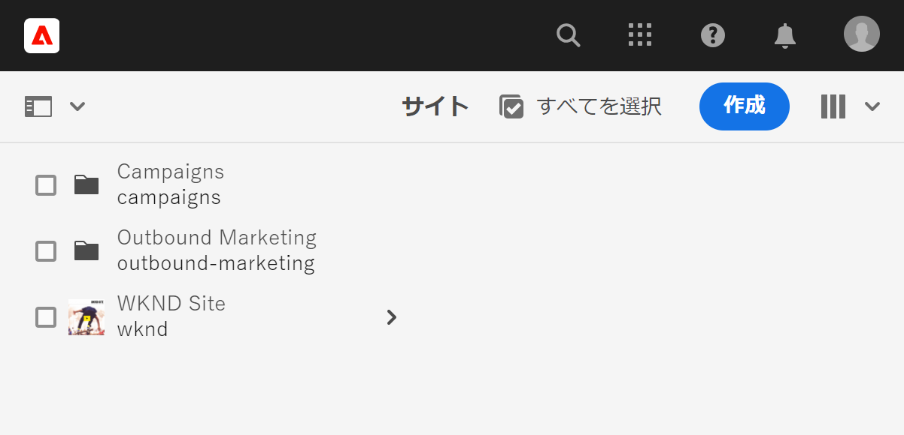
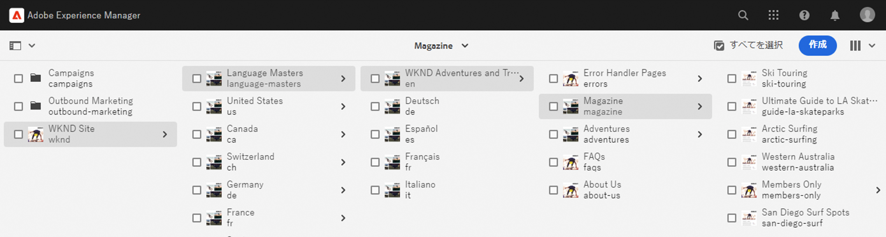
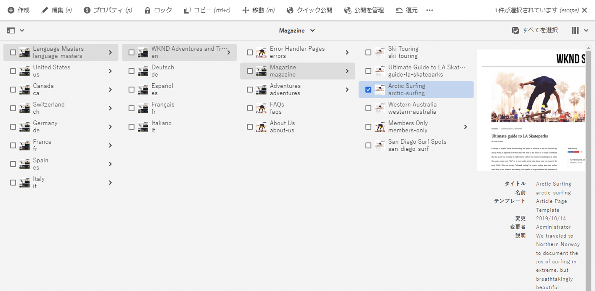
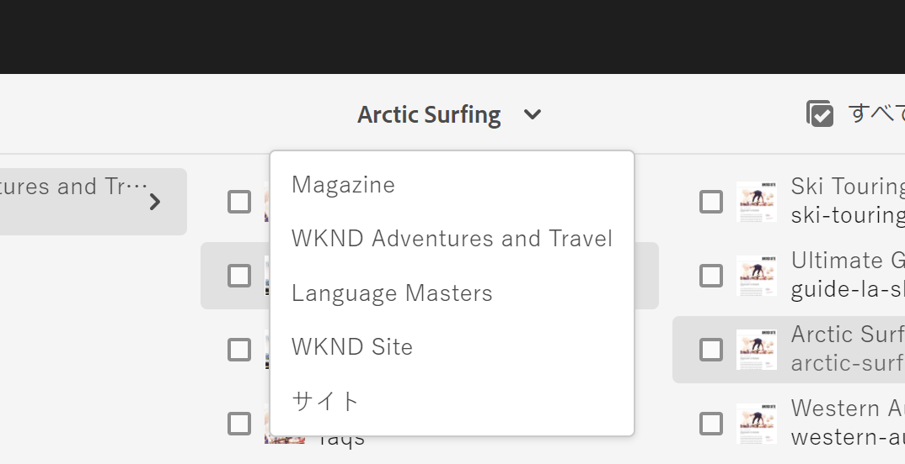
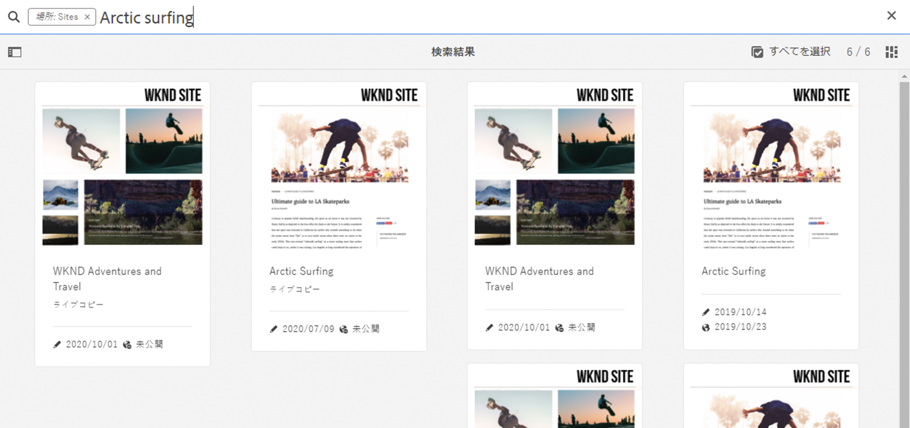
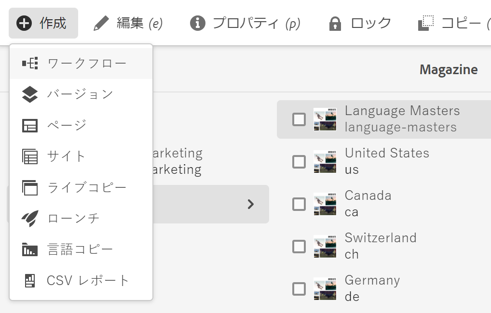
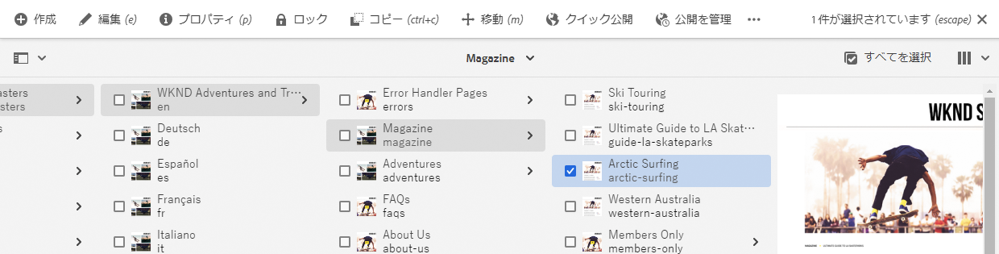
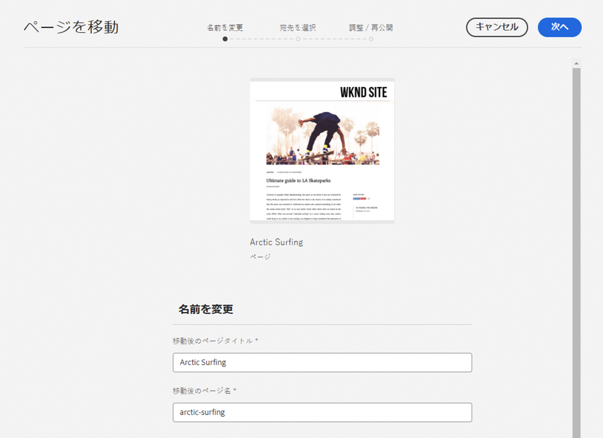
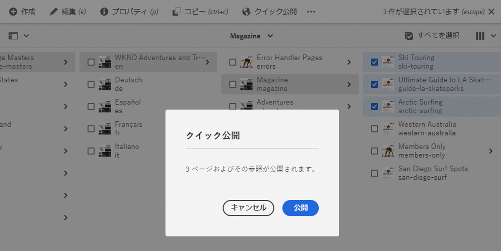

# オーサリングのクイックスタートガイド {#quick-guide-to-authoring}

**Sites** コンソールを使用してコンテンツのオーサリングを開始する概要レベルのクイックガイドについて詳しくは、ここから始めてください。

>[!TIP]
>
>このクイックスタートガイドでは、Sites のオーサリングに焦点を当てていますが、ほとんどの概念は他のコンソールに幅広く適用できます。

## すべては Sites コンソールから始めます。 {#sites-console}

新規のコンテンツを作成する場合でも、既存のコンテンツを表示および管理する場合でも、中心的な概要は **Sites** コンソールです。

AEM に初めてログインすると、グローバルナビゲーション画面が表示されます。「**Sites**」をタップまたはクリックするだけで、**Sites** コンソールが開きます。

AEM の他の場所からグローバルナビゲーションにアクセスするには、AEM 画面の左上にある **Adobe Experience Manager** リンクをタップまたはクリックすると、グローバルナビゲーションのドロップダウンオーバーレイが開きます。

**Sites** コンソールに入ると、コンテンツは簡単に移動でき、デフォルトでは列表示で表示されます。

## ビュー {#views}

デフォルトでは、**Sites** コンソールは&#x200B;**列**&#x200B;表示で開きます。各階層レベルは列として表示されるので、web ベースの階層的に整理されたコンテンツに適しています。

列内のエントリをタップまたはクリックして選択するか、階層内の次のレベルを開きます。選択した項目には、チェックマークが付きます。

次の 2 つの表示を追加で使用できます。

* **カード表示** - この表示では、すべてのエントリが簡単に操作できるカードとして表示され、追加のオプションに簡単にアクセスできるようになります。
* **リスト表示** - 階層の 1 つのレベルが 1 つのリストとして表示され、個々の項目に関する詳細が提供されます。

表示を切り替えるには、画面の左上にある表示切り替えを使用します。このドキュメントでは、デフォルトの列表示を使用します。

## コンテンツの移動 {#navigating}

**列表示**&#x200B;では、コンテンツを一連のカスケード列として表示します。現在の列で項目を選択すると、ドキュメントの場合は右側の列にその詳細が表示され、フォルダーの場合は次の階層レベルのコンテンツが表示されます。

この方法で、コンテンツ構造を上下に移動できます。

レベル間をすばやくジャンプするには、ページ上部のパンくずリストを使用します。

また、いつでも画面の右上にある検索アイコンを使用して、特定のコンテンツを探すことができます。

検索は、コンソール全体にドロップダウンオーバーレイとして表示されます。検索語句を入力して、コンテンツを検索します。

## コンテンツの作成 {#creating}

新しいページを作成するには、コンテンツ階層内の目的の場所に移動し、ツールバーの「**作成**」ボタンをタップまたはクリックするだけです。

使用できるオプションはコンテキストに応じて異なります。コンテンツ構造のルートにいる場合は、まったく新しいサイトを作成できます。そうでない場合は、新しいページや他のページ関連のコンテンツを作成できます。

作成対象として選択した内容に応じて、適切なウィザードが起動し、作成プロセスの手順が示されます。

## コンテンツの編集 {#editing}

ページを編集するには、**Sites** コンソールでページをタップまたはクリックして選択します。次に、表示されるツールバーで&#x200B;**編集**&#x200B;アイコンをタップまたはクリックします。

これにより、ページがコンテンツに適したエディターで開きます。

タグやページ名などのページのプロパティを更新するだけの場合は、ツールバーの&#x200B;**プロパティ**&#x200B;アイコンをタップまたはクリックします。

## コンテンツの整理 {#organizing}

ページを移動またはコピーするには、コンソールでページを選択し、ツールバーで「**移動**」または「**コピー**」をタップまたはクリックします。これにより、移動またはコピーの手順を示すウィザードが起動し、結果のページの名前と場所を定義します。

## コンテンツの公開 {#publishing}

**Sites** コンソールを使用して、コンテンツに対する変更を完了したら、コンテンツを公開できます。公開するコンテンツを選択し、ツールバーの「**クイック公開**」アイコンをタップまたはクリックします。

ダイアログで「**公開**」をもう一度タップするかクリックして、公開を確認します。

## その他のリソース {#additional-resources}

これは、Sites コンテンツのオーサリングの機能に関する簡単な紹介です。したがって、すべてのトピックやすべてのオプションについては説明していません。

ここでは、コンソールのすべての機能に関する詳細なリソースと、コンテンツのオーサリングに関する一般的なトピックについて説明します。

* [基本操作](/help/sites-cloud/authoring/basic-handling.md)
* [オーサリングの概念](/help/sites-cloud/authoring/author-publish.md)
* [Sites コンソール](/help/sites-cloud/authoring/sites-console/introduction.md)
* [ページエディター](/help/sites-cloud/authoring/page-editor/introduction.md)
* [ページの公開](/help/sites-cloud/authoring/sites-console/publishing-pages.md)
