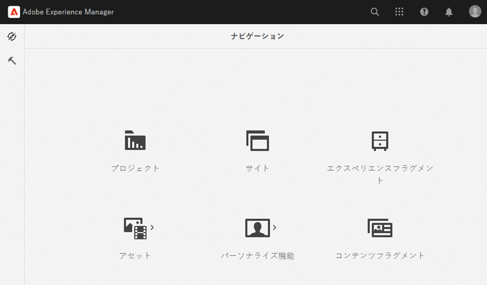

# オーサリングのクイックスタートガイド {#quick-guide-to-authoring}

を使用してコンテンツのオーサリングを開始する際に役立つ概要レベルのクイックガイドについては、ここから始めてください。 **Sites** コンソール。

>[!TIP]
>
>このクイックスタートガイドでは、サイトのオーサリングに焦点を当てていますが、ほとんどの概念は他のコンソールに幅広く適用できます。

## すべてはサイトコンソールで開始します。 {#sites-console}

新しいコンテンツを作成する場合も、既存のコンテンツを表示および管理する場合も、主な概要は次のとおりです **Sites** コンソール。

AEMに初めてログインすると、グローバルナビゲーション画面が表示されます。 タップまたはクリックするだけです **Sites** 開く **Sites** コンソール。

AEMの他の場所からグローバルナビゲーションにアクセスするには、 **Adobe Experience Manager** 任意のAEM画面の左上にあるリンク。グローバルナビゲーションのドロップダウンオーバーレイが開きます。

1 回 **Sites** コンソールの場合、コンテンツの移動は簡単で、デフォルトでは列表示で表示されます。

## ビュー {#views}

デフォルトでは、 **Sites** コンソールが開く **列** 表示。 各階層レベルは、Web ベースの階層的に整理されたコンテンツに適した列として表示されます。

列内のエントリをタップまたはクリックすると、そのエントリを選択するか、階層内の次のレベルの下のレベルを開くことができます。 選択した項目には、チェックマークが付きます。

次の 2 つのビューを追加で使用できます。

* **カード表示**  — このビューは、すべてのエントリを操作しやすいカードとして表示し、追加のオプションに簡単にアクセスできるようにします。
* **リスト表示**  — 単一レベルの階層を単一のリストとして表示し、個々の項目の詳細を提供します。

画面の左上にあるビュースイッチャーを使用して、ビューを切り替えます。 このドキュメントでは、デフォルトの列表示を使用します。

## コンテンツの移動 {#navigating}

**列表示** は、コンテンツを一連のカスケード列として表示します。 現在の列で項目を選択すると、その詳細が文書の場合は右側の列に表示され、フォルダの場合は次の階層レベルのコンテンツが表示されます。

この方法で、コンテンツ構造を上下に移動できます。

レベル間をすばやくジャンプするには、ページ上部のパンくずリストを使用します。

また、画面の右上にある検索アイコンを使用して、特定のコンテンツを探すことができます。

検索は、コンソール全体にドロップダウンオーバーレイとして表示されます。 検索語句を入力して、コンテンツを検索します。

## コンテンツの作成 {#creating}

新しいページを作成するには、コンテンツ階層内の目的の場所に移動し、 **作成** 」ボタンをクリックします。

使用できるオプションはコンテキストに応じて異なります。 コンテンツ構造のルートにいる場合は、まったく新しいサイトを作成できます。 そうでない場合は、新しいページや他のページ関連のコンテンツを作成できます。

選択した内容に応じて、適切なウィザードが起動し、作成プロセスの手順を示します。

## コンテンツの編集 {#editing}

ページを編集するには、ページをタップまたはクリックして、 **Sites** コンソール。 次に、表示されるツールバーで、 **編集** アイコン。

これにより、ページがコンテンツに適したエディターで開きます。

タグや名前など、ページのプロパティを更新するだけの場合は、 **プロパティ** アイコンをクリックします。

## コンテンツの整理 {#organizing}

ページを移動またはコピーするには、コンソールでページを選択し、ツールバーでをタップまたはクリックします **移動** または **コピー**. これにより、移動またはコピーの手順を示すウィザードが起動し、結果ページの名前と場所を定義します。

## コンテンツの公開 {#publishing}

を使用して、コンテンツに対する変更を完了したら、 **Sites** コンソールを使用して、コンテンツを公開できます。 公開するコンテンツを選択し、 **クイック公開** アイコンをクリックします。

別のタップまたはクリックで公開を確認 **公開** 」と入力します。

## その他のリソース {#additional-resources}

これは、Sites コンテンツのオーサリングの機能に関する簡単な紹介です。したがって、すべてのトピックやすべてのオプションについては説明していません。

以下に、コンソールのすべての機能に関する詳細なリソースと、コンテンツのオーサリングに関する一般的なトピックについて説明します。

* [基本操作](/help/sites-cloud/authoring/basic-handling.md)
* [オーサリングの概念](/help/sites-cloud/authoring/author-publish.md)
* [Sites コンソール](/help/sites-cloud/authoring/sites-console/introduction.md)
* [ページエディター](/help/sites-cloud/authoring/page-editor/introduction.md)
* [ページの公開](/help/sites-cloud/authoring/sites-console/publishing-pages.md)
