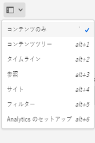
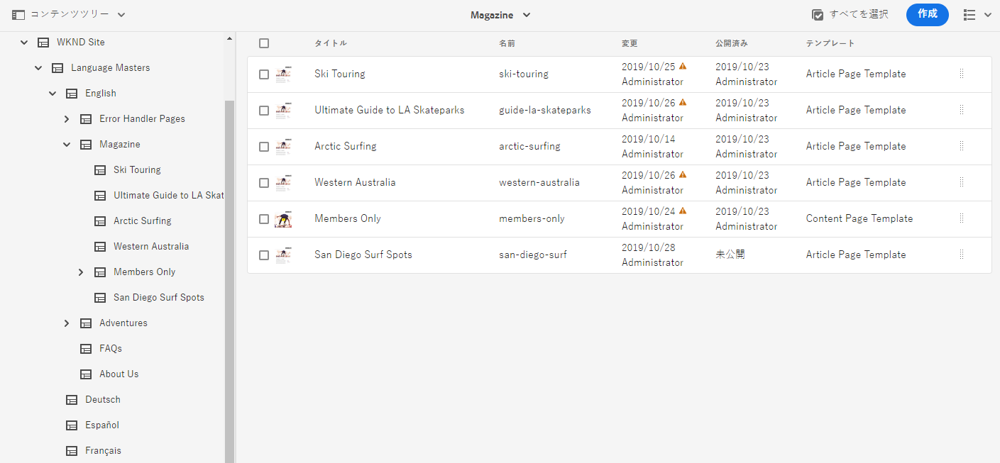
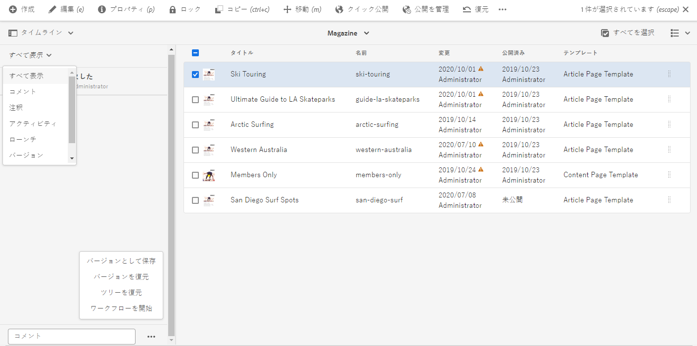
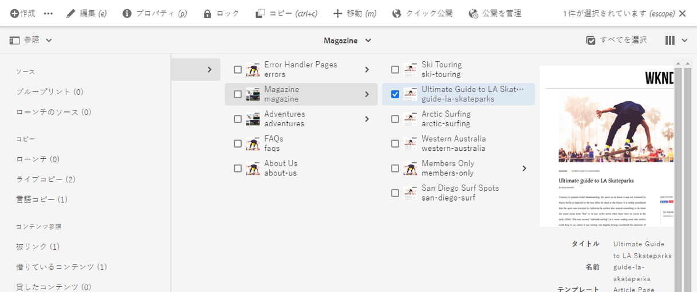
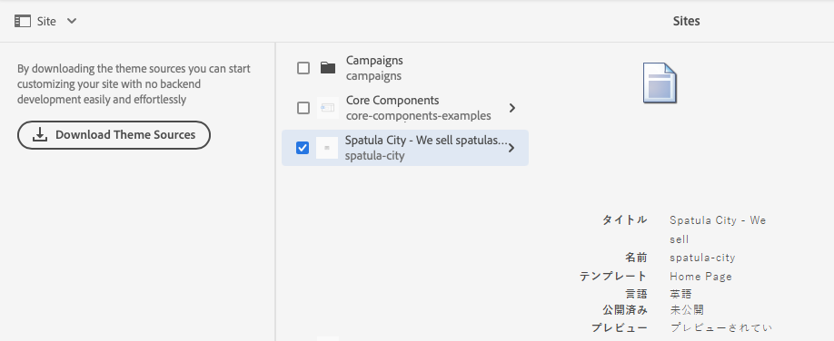
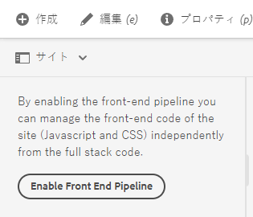
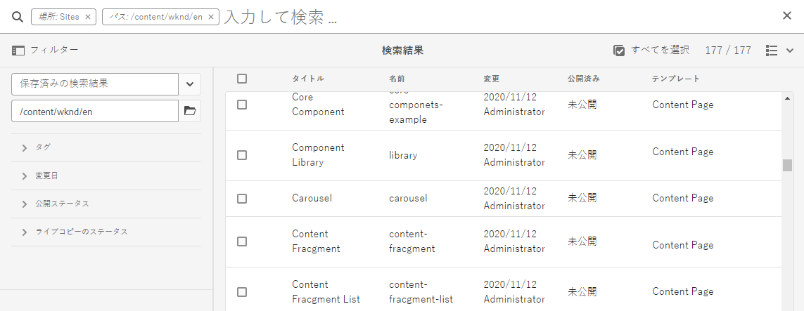
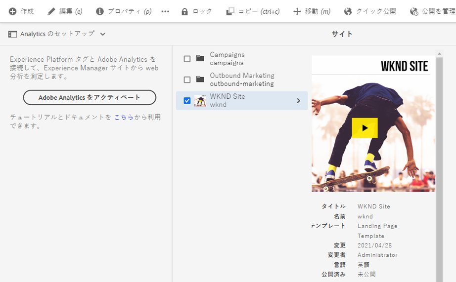

# Sites コンソールのサイドパネル {#side-panel}

AEM **Sites** コンソールのサイドパネルを使用して、コンテンツをより深く理解し、移動する方法について説明します。

## オリエンテーション {#orientation}

**Sites** コンソールを開くと、サイドパネルはデフォルトで閉じられます。このようにして、画面は完全にコンテンツ専用になります。

**Sites** コンソールツールバーの&#x200B;**サイドパネル**&#x200B;アイコンをタップまたはクリックしてサイドパネルをアクティブ化し、コンテンツの表示を選択します。

* [コンテンツのみ](#content-only)
* [コンテンツツリー](#content-tree)
* [タイムライン](#timeline)
* [参照](#references)
* [サイト](#site)
* [フィルター](#filter)
* [Analytics を設定](#setup-analytics)

選択した現在の表示はドロップダウンの青いチェックマークで示され、選択した表示の名前でツールバーのサイドパネルアイコンが更新されます。

## コンテンツのみ {#content-only}

サイドパネルのこの表示では事実上、サイドパネルをオフにしています。つまり、サイトのコンテンツのみが表示されます。

>[!TIP]
>
>抑音符付き／逆目盛り `´` キーボードショートカットを使用して、サイドパネルのコンテンツのみの表示に切り替えます。

## コンテンツツリー {#content-tree}

サイドパネルのこの表示では、コンテンツがツリー階層で表示されます。コンテンツツリーを使用すると、サイドパネル内のサイト階層をすばやく移動して、現在のフォルダー内のページに関する多くの情報を表示できます。

ツリー内の項目の横にある右向きの山括弧は、展開してその子を表示できるノードを示します。山括弧をタップまたはクリックすると、子が表示されます。

コンソールには、コンテンツツリーで現在選択されている項目のコンテンツが表示されます。

コンテンツツリーサイドパネルをリスト表示またはカード表示と共に使用すると、プロジェクトの階層構造を簡単に確認したり、コンテンツツリーサイドパネルを使用してコンテンツ構造を簡単に移動したり、リスト表示で詳細なページ情報を表示したりできます。

>[!TIP]
>
>* `Alt+1` キーボードショートカットを使用すると、サイドパネルのコンテンツツリー表示に切り替えることができます。
>* 階層表示のエントリを選択すると、矢印キーを使用して階層をすばやく移動できます。
>* 詳しくは、[キーボードショートカット](/help/sites-cloud/authoring/sites-console/keyboard-shortcuts.md)を参照してください。

## タイムライン {#timeline}

タイムラインを使用して、選択したリソースに影響を与えたイベントを表示できます。また、これを使用して、ワークフローやバージョンなどの特定のイベントを開始することもできます。

**タイムライン**&#x200B;サイドパネルでは、ドロップダウンリストからタイプとして選択できる選択した項目に関連する様々なイベントを表示できます。

* コメント
* [注釈](/help/sites-cloud/authoring/page-editor/annotations.md)
* [アクティビティ](/help/sites-cloud/authoring/personalization/activities.md)
* [ローンチ](/help/sites-cloud/authoring/launches/overview.md)
* [バージョン](/help/sites-cloud/authoring/sites-console/page-versions.md)
* [ワークフロー](/help/sites-cloud/authoring/workflows/overview.md)
   * 一時的なワークフローの履歴情報は保存されないので、情報は表示されません。<!--With the exception of [transient workflows](/help/sites-developing/workflows.md#transient-workflows) as no history information is saved for these-->
* すべて表示

また、イベントのリストの下部に表示される「**コメント**」ボックスを使用して、選択した項目に関するコメントを追加／表示できます。コメントを入力して `Return` キーを押すと、コメントが登録されます。「**コメント**」または「**すべてを表示**」が選択されている場合に表示されます。

また、**Sites** コンソールでは、「**コメント**」フィールドの横にある省略記号（...）ボタンから追加機能にアクセスすることもできます。

* [バージョンの保存](/help/sites-cloud/authoring/sites-console/page-versions.md)
* [ワークフローを開始](/help/sites-cloud/authoring/workflows/applying.md)

>[!TIP]
>
>* `Alt+2` キーボードショートカットを使用して、サイドパネルのタイムライン表示に切り替えます。
>* 詳しくは、[キーボードショートカット](/help/sites-cloud/authoring/sites-console/keyboard-shortcuts.md)を参照してください。

## 参照 {#references}

**参照**&#x200B;ビューには、コンソールで選択したリソースに対する参照タイプや、リソースからの参照タイプのリストが表示されます。

適切な参照タイプを選択すると、詳細情報が表示されます。状況によっては、特定の参照を選択すると、次のような追加のアクションが使用可能です。

* **着信リンク** は、特定のリンクを選択すると、選択したページを直接参照するページと、それらのページのいずれかに直接アクセスする **編集** ページのリストを提供します。
   * これは、静的リンクのみを表示し、リストコンポーネントからなどの動的に生成されたリンクは表示しません。
* [ローンチ](/help/sites-cloud/authoring/launches/overview.md)（関連するローンチへのアクセスを提供）
* [ライブコピー](/help/sites-cloud/administering/msm/overview.md)（選択したリソースに基づくすべてのライブコピーのパスを表示）
* [ブループリント](/help/sites-cloud/administering/msm/best-practices.md)（詳細と各種アクションを提供）
* [言語コピー](/help/sites-cloud/administering/translation/managing-projects.md#creating-translation-projects-using-the-references-panel)（詳細と各種アクションを提供）

## サイト {#site}

サイドパネルの&#x200B;**サイト**&#x200B;ビューには、[サイトテンプレートを使用して作成された](/help/sites-cloud/administering/site-creation/create-site.md)サイトの詳細が表示されます。

サイトパネルを使用して[サイトのテーマ](/help/sites-cloud/administering/site-creation/site-themes.md)を管理する方法について詳しくは、[サイトパネルを使用したサイトテーマの管理](/help/sites-cloud/administering/site-creation/site-rail.md)のドキュメントを参照してください。

テーマベースのサイト作成を可能にするフロントエンドパイプラインをまだ設定していない場合は、サイドパネルにそのオプションが表示されます。

>[!TIP]
>
>テンプレートからサイトを作成し、そのテーマをカスタマイズするプロセスに関するエンドツーエンドの説明について詳しくは、[クイックサイト作成ジャーニー](/help/journey-sites/quick-site/overview.md)を参照してください。

## フィルター {#filter}

**フィルター**&#x200B;パネルは、適切な場所フィルターが既に設定された状態の[検索機能](/help/sites-cloud/authoring/search.md)と同様に、表示するコンテンツをさらにフィルタリングできます。

サイドパネルの他のビューとは異なり、別の表示に切り替えるには、検索フィールドの「`X`」をタップまたはクリックします。

## Analytics を設定 {#setup-analytics}

このビューを使用すると、選択したサイトに対して Adobe Analytics をすばやく設定できます。

