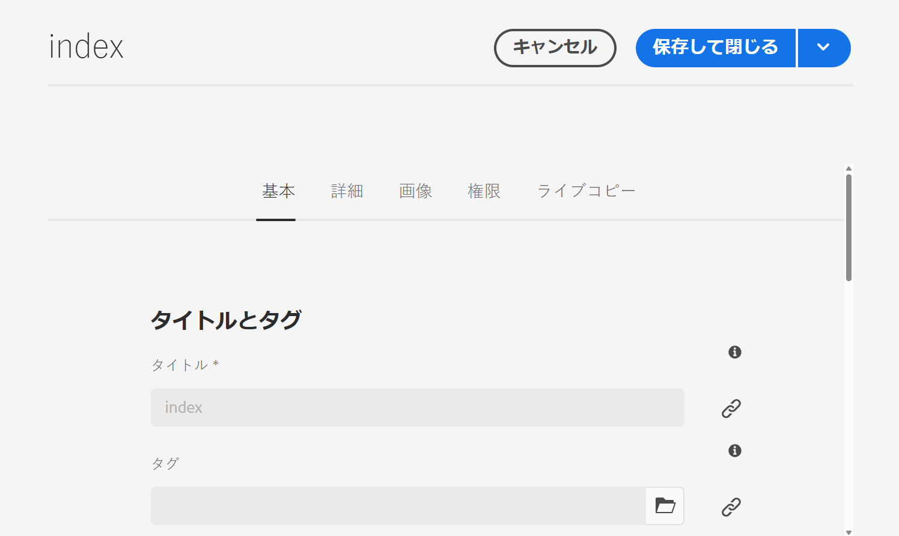
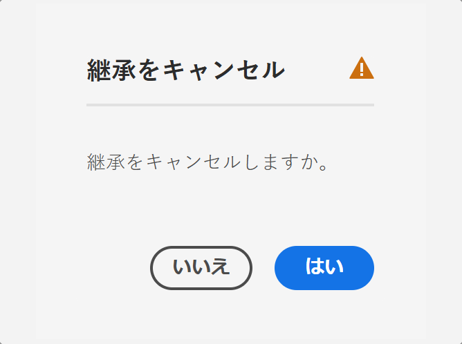
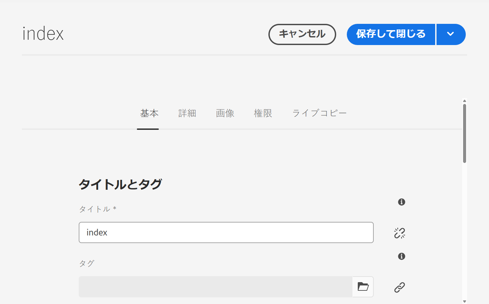
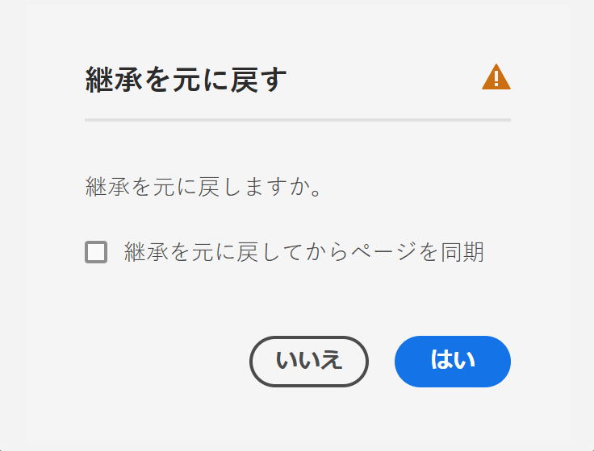

# ページプロパティの編集 {#page-properties}

[ ページのプロパティ ](/help/sites-cloud/authoring/sites-console/page-properties.md) を編集する方法、ページの動作と管理方法を変更する方法について説明します。

>[!TIP]
>
>使用可能な個々のページプロパティについて詳しくは、[ ページのプロパティ ](/help/sites-cloud/authoring/sites-console/page-properties.md) のドキュメントを参照してください。

## ページプロパティの編集場所 {#where}

AEMの様々な場所からページプロパティを編集できます。

* [次から： ](#from-the-sites-console)
* [ページエディターから](#from-the-page-editor)
* [ユニバーサルエディターから](#from-the-universal-editor)

サイトコンソールを使用して、[ 複数ページのプロパティを一度に編集 ](#editing-multiple-pages) することもできます。

### サイトコンソールから {#from-the-sites-console}

**Sites** コンソールでコンテンツを参照する際には、ツールバーの **プロパティ** ボタンを使用してページのプロパティを編集できます。

1. [**Sites** コンソールを使用して ](/help/sites-cloud/authoring/sites-console/introduction.md) プロパティを表示および編集するページの場所に移動します。
1. 次のいずれかを使用して、目的のページで「**プロパティ**」オプションを選択します。
   * [クイックアクション](/help/sites-cloud/authoring/basic-handling.md#quick-actions)
   * [選択モード](/help/sites-cloud/authoring/basic-handling.md#selecting-resources)
   * ページのプロパティが該当するタブに表示されます。
1. 必要に応じてプロパティを表示または編集します。
1. その後、「**保存**」を使用して更新内容を保存し、「**閉じる**」を使用してコンソールに戻ります。

### ページエディターから {#from-the-page-editor}

ページエディターを使用してページを編集する場合、**ページ情報** を使用してページのプロパティを定義できます。

1. [ ページエディター ](/help/sites-cloud/authoring/page-editor/introduction.md) で、プロパティを編集するページを開きます。
1. **ページ情報**&#x200B;アイコンを選択して選択メニューを開きます。
1. **プロパティを開く** を選択すると、プロパティを編集できるダイアログが開きます。プロパティは適切なタブに分類されています。 ツールバーの右側にある次のボタンを使用できます。
   * **キャンセル**
   * **保存して閉じる**
1. 「**保存して閉じる**」ボタンを使用して、変更を保存します。

## ユニバーサルエディターから {#from-the-universal-editor}

ユニバーサルエディターを使用してページを編集する場合、「**ページプロパティ**」アイコンを使用してプロパティを編集できます。

1. [ ユニバーサルエディター ](/help/sites-cloud/authoring/universal-editor/authoring.md#page-properties) で、プロパティを編集するページを開きます。
1. ツールバーの **ページプロパティ** アイコンを選択します。
1. AEMのページプロパティウィンドウが、[ ページエディターでページプロパティを編集する場合と同様に、新しいブラウザータブで開きます。](#from-the-page-editor) ツールバーの右側には、次のボタンがあります。
   * **キャンセル**
   * **保存して閉じる**
1. 「**保存して閉じる**」ボタンを使用して、変更を保存します。
1. ユニバーサルエディターのブラウザータブに戻ります。

## 複数ページのプロパティの編集 {#editing-multiple-pages}

[**Sites** コンソールから複数のページを選択し ](/help/sites-cloud/authoring/sites-console/introduction.md)**プロパティを表示** を使用して、ページのプロパティを表示または編集することができます。 これは、ページプロパティの一括編集と呼ばれます。

次の方法を含む様々な方法で、複数のページを一括編集用に選択することができます。

* **Sites** コンソールの参照時
* **検索**&#x200B;によって複数のページを特定した後

ページを選択して「**プロパティ**」オプションをクリックまたはタップすると、一括プロパティが表示されます。

一括編集ができるのは、次のようなページに限られます。

* 同じリソースタイプを共有する
* ライブコピーに含まれない
   * 選択したページのいずれかがライブコピーの一部である場合は、プロパティを開いたときにメッセージが表示されます。

一括編集ウィンドウは垂直方向に半分に分割されています。

* 左側は、一括編集用に選択したページのリストです。
   * 必要に応じて、ページを選択/選択解除できます。
   * デフォルトでは、すべてが選択されています。
* 右側は [ 一括編集に使用できるプロパティ ](/help/implementing/developing/extending/bulk-editor.md) のリストです。
   * 単一ページのプロパティを表示する場合と同様に、プロパティがタブの下で順に並べられます。
   * 選択したすべてのページで使用できるプロパティ（および一括編集で使用できると明示的に定義されたプロパティ）が表示されます。
   * 選択するページを 1 つに減らすと、すべてのプロパティが表示されます。
   * 共通の値を持つプロパティのみが表示されます。
   * フィールドが複数値（タグなど）の場合、*すべて*&#x200B;の値が共通の場合に限り、値が表示されます。一部の値のみが共通の場合は、それらの値は編集時に限り表示されます。
* 共通のフィールドに、ページによって異なる値が設定されている場合、それらのフィールドは特別な値（「`<Mixed Entries>`」というテキストなど）で示されます。

選択したページで使用可能なフィールドの値を更新できます。 「**完了**」を選択すると、選択したすべてのページに新しい値が適用されます。 フィールドが複数値（タグなど）の場合は、新しい値を追加するか、共通の値を削除できます。

## プロパティの継承 {#inheritance}

ページがブループリントを基にしている場合や、別のページからコンテンツを継承している場合、継承は各フィールドの&#x200B;**ページのプロパティ**&#x200B;ウィンドウに反映されます。

継承されたプロパティは編集できません。特定のフィールドの横にある「**継承をキャンセル**」アイコンをタップまたはクリックすると、継承が解除されます。

**継承をキャンセル**&#x200B;モーダルでキャンセルを確定します。

フィールドの継承をキャンセルすると、そのフィールドが編集可能になります。

継承を元に戻すには、フィールドの横にある「**継承を元に戻す**」アイコンをタップまたはクリックします。

**継承を元に戻す**&#x200B;モーダルで、元に戻す操作を確定します。

「**継承を元に戻した後にページを同期**」を選択すると、ブループリントの最新の値でフィールドが更新されます。同期しない場合、ライブコピーが次回同期されるときに値が更新されます。

>[!TIP]
>
>継承について詳しくは、[マルチサイトマネージャーと翻訳](/help/sites-cloud/administering/msm-and-translation.md)を参照してください。
