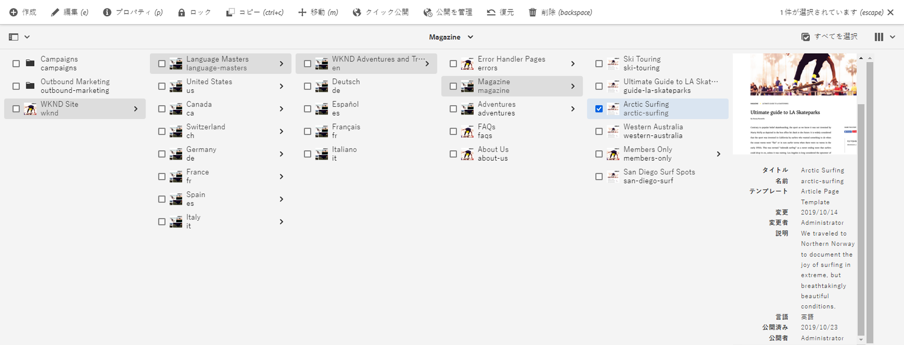

# Sites コンソール {#sites-console}

**Sites** コンソールを使用して AEM ページを管理および整理する方法について説明します。

## オリエンテーション {#orientation}

**Sites** コンソールでは、ページ階層を表示できます。

ページの管理と整理に役立つ様々なビューとツールバーが用意されています。

* [コンソールツールバー](#toolbar)は、移動に役立つように常に表示されます。
* [3 つの異なる表示](#views)では、ページを簡単に見つけて選択できます。
* [アクションツールバー](#action-toolbar)は、アクションを実行する項目を選択すると表示されます。
* [サイドパネル](#side-panel)には、選択したページの詳細情報を表示する複数のオプションがあります。

## コンソールツールバー {#console-toolbar}

コンソールツールバーは常にコンソール上に表示され、コンテンツ内の位置を確認したり、コンテンツ内を移動したりするのに役立ちます。

### サイドパネルセレクター {#side-panel-selector}

サイドパネルセレクターを使用すると、コンソールで選択した項目に関する追加情報を表示できます。

現在のコンソールに応じて表示されるオプションです。例えば、**Sites** では、コンテンツのみ（デフォルト）、タイムライン、参照またはフィルターのサイドパネルを選択できます。

サイドパネルについて詳しくは、[Sites コンソールのサイドパネル](/help/sites-cloud/authoring/sites-console/console-side-panel.md)を参照してください。

### パンくずリスト {#breadcrumbs}

パネルの中央に位置し、現在選択している項目の説明を常に表示するパンくずリストを使用すると、web サイトのレベル間を移動できます。

パンくずリストのテキストをタップまたはクリックすると、現在選択している項目の階層レベルをリストするドロップダウンが表示されます。エントリをタップまたはクリックすると、その場所にジャンプします。

### すべてを選択 {#select-all}

「**すべてを選択**」ボタンをタップまたはクリックすると、コンソールの現在の表示にあるすべての項目が選択されます。

すべての項目を選択すると、選択した項目の数が、「**すべてを選択**」ボタンが表示されたツールバーの右上に表示されます。

すべての項目の選択を解除して選択モードを終了するには、次の操作を行います。

* カウントの横にある「**X**」をクリックまたはタップする。
* **Esc** キーを使用する。

### 「作成」ボタン {#create-button}

「**作成**」ボタンを使用すると、サイトに新しいページを追加したり、ライブコピーやローンチなどの追加の Sites オブジェクトを作成したりできます。

クリックすると、コンソール／コンテキストに適したオプションが表示されます。最も一般的なものは次のとおりです。

* [ページ](/help/sites-cloud/authoring/sites-console/creating-pages.md)
* [サイト](/help/sites-cloud/administering/site-creation/create-site.md)
* [ライブコピー](/help/sites-cloud/administering/msm/overview.md)
* [Experience Platform Launch](/help/sites-cloud/authoring/launches/overview.md)
* [言語コピー](/help/sites-cloud/administering/translation/overview.md)
* [CSV レポート](/help/sites-cloud/authoring/sites-console/csv-export.md)

機能について詳しくは、これらの機能へのリンクを参照してください。

## ページの表示と選択 {#views}

**Sites** コンソールには、コンテンツ階層の 3 つの異なる表示が用意されています。使用可能な任意の表示方法で、リソースを表示、ナビゲート、選択（追加のアクションのために）できます。

* [列表示](#column-view)
* [カード表示](#card-view)
* [リスト表示](#list-view)

AEM ツールバーの右端にある&#x200B;**表示**&#x200B;アイコンは、現在選択されている表示を示します。

タップまたはクリックすると、別の表示を選択できます。

列表示、カード表示、リスト表示を切り替えることができます。リスト表示では、表示設定も表示されます。

>[!NOTE]
>
>「**表示設定**」オプションは、**リスト表示**&#x200B;モードでのみ使用できます。

概念上、表示、ナビゲーションおよび選択はすべての表示で同じ操作ですが、使用している表示によって処理がわずかに異なります。

>[!NOTE]
>
>デフォルトでは、AEM Assets のいずれの表示においても、UI のアセットの元のレンディションはサムネールとして表示されません。管理者の場合は、オーバーレイを使用すると、元のレンディションをサムネールとして AEM Assets に表示するように設定できます。

### リソースの選択 {#selecting-resources}

特定のリソースの選択方法は、表示とデバイスの組み合わせによって異なります。

| 表示 | タッチの選択 | デスクトップの選択 | タッチの選択解除 | デスクトップの選択解除 |
|---|---|---|---|---|
| 列 | サムネールを選択 | サムネールをクリック | サムネールを選択 | サムネールをクリック |
| カード | カードを選択＆ホールド | 項目の上にマウスを移動しチェックマークのクイックアクションを使用 | カードを選択 | カードをクリック |
| リスト | サムネールを選択 | サムネールをクリック | サムネールを選択 | サムネールをクリック |

#### 選択の例 {#selecting-example}

1. 例えば、カード表示では次のようになります。

   

1. リソースを選択すると、上部のヘッダーの上に[アクションツールバー](#actions-toolbar)が重なって表示され、選択したリソースで現在適用可能なアクションにアクセスできます。

1. 選択モードを終了するには、右上の「**X**」を選択するか、**Esc** キーを使用します。

### 列表示 {#column-view}

列表示を使用すると、一連のカスケード表示された列を通じて、コンテンツツリーの視覚的なナビゲーションができます。この表示では、web サイトのツリー構造を視覚化して移動できます。

一番左の列でリソースを選択すると、右の列に子リソースが表示されます。右側の列でリソースを選択すると、さらに右側の列にその子リソースが表示されます。

* リソース名またはその右にある山形記号をタップまたはクリックすると、ツリー内を上下に移動できます。

   * タップまたはクリックするとリソース名と山形記号がハイライト表示されます。
   * クリックまたはタップしたリソースの子は、クリックまたはタップしたリソースの右側の列に表示されます。
   * 子を持たないリソース名を選択すると、その詳細が最後の列に表示されます。

* サムネールをタップまたはクリックすると、リソースが選択されます。

   * すると、チェックマークがサムネールにオーバーレイ表示され、リソース名もハイライト表示されます。
   * 選択されたリソースの詳細が最後の列に表示されます。
   * アクションツールバーが使用可能になります。

* 列表示でページを選択すると、選択したページが次の詳細と共に最後の列に表示されます。

   * ページタイトル
   * ページ名（ページの URL の一部）
   * ページの基になるテンプレート
   * 変更の詳細
   * ページ言語
   * 公開およびプレビューの詳細

### カード表示 {#card-view}

カード表示では、階層内の現在のレベルにある各項目が大きなカードとして表示されます。

* カードには次のような情報が含まれています。

   * ページの内容を視覚的に表現したもの。
   * ページのタイトル。
   * 重要な日付（最終編集日、最終公開日など）。
   * ページがロックされている、非表示、またはライブコピーの一部であるかどうか。
   * ワークフローの一部として項目に対応する必要があるかどうかを示すインジケーター。

また、カード表示では、項目の選択などの[クイックアクション](#quick-actions)や、編集などの一般的なアクションも用意されています。

カードを（クイックアクションのタップを回避するために慎重に）タップまたはクリックしてツリーの下位に移動したり、[ヘッダーのパンくずリスト](#the-header)を使用して再度上位に移動したりできます。

### リスト表示 {#list-view}

リスト表示では、各リソースの情報がリスト内の現在のレベルで表示されます。

* リソース名をタップまたはクリックしてツリーの下位に移動したり、[ヘッダーのパンくずリスト](#the-header)を使用して再度上位に移動したりできます。
* リスト内のすべての項目を簡単に選択するには、ツールバーの「[**すべてを選択**](#select-all)」チェックボックスを使用します。

* 表示ボタンの下にある「**設定を表示**」オプションを使用して、表示する列を選択します。次の列を表示できます。

   * **名前** - ページ名。ページの URL の一部であり、言語に関係なく変化しないので、多言語オーサリング環境で役立つ場合があります。
   * **更新** - 最終更新日と最終更新者
   * **公開** - 公開ステータス
   * **プレビュー** - プレビューステータス
   * **テンプレート** - ページがベースにしているテンプレート
   * **操作**
   * **ワークフロー** - 現在ページに適用されているワークフロー。ポインタを合わせたり、タイムラインを開いたりすると、詳細情報が表示されます。
   * **翻訳済み**
   * **ページ表示**
   * **ユニーク訪問者**
   * **ページ滞在時間**

デフォルトでは、ページの URL の一部を構成する「**名前**」列が表示されます。場合によっては、作成者は、異なる言語のページにアクセスする必要があることがあり、ページの名前（通常は変更なし）を確認することは、作成者がページの言語を知らない場合に非常に役立ちます。

* リストの各項目の右端にある縦の点線マークを使用して項目の順序を変更します。

縦の選択バーを選択して、項目をリストの新しい位置にドラッグします。

>[!NOTE]
>
>順序を変更できるのは、`jcr:primaryType` 値が `sling:OrderedFolder` である順序付きフォルダーの内部のみです。

## アクションツールバー {#actions-toolbar}

リソースが選択されている場合は、選択した項目に対して様々なアクションを実行できます。これらのアクションは、アクションツールバーに表示されます。

アクションツールバーは、コンソールでリソースが選択されている場合にのみ表示されます。アクションツールバーで使用できるアクションは、選択した特定の項目に対して取ることのできるアクションを反映して変化します。最も一般的なアクションは次のとおりです。

* [**作成**](#create-action) - 新しいコンテンツまたはコンテンツ関連のアクションを作成します
* **編集** - 選択したページの作成方法に応じて、**編集**&#x200B;アクションを実行すると、該当するエディターが開きます
   * [ページエディター](/help/sites-cloud/authoring/page-editor/introduction.md) - AEM ページエディターで作成されたページの場合
   * [ユニバーサルエディター](/help/sites-cloud/authoring/universal-editor/authoring.md) - ユニバーサルエディターで作成されたページの場合
* [**プロパティ**](/help/sites-cloud/authoring/sites-console/edit-page-properties.md) - ページのプロパティウィンドウを開きます
* [**ロック**](/help/sites-cloud/authoring/sites-console/managing-pages.md#locking-a-page) - 他のユーザーがページを変更できないようにページをロックします
* [**コピー**](/help/sites-cloud/authoring/sites-console/managing-pages.md#copying-and-pasting-a-page) - ページをコピーします
* [**移動**](/help/sites-cloud/authoring/sites-console/managing-pages.md#moving-or-renaming-a-page) - ページの移動や名前変更を行います
* [**クイック公開**](/help/sites-cloud/authoring/sites-console/publishing-pages.md#quick-publish) - 1 ページまたは複数のページを直ちに公開します
* [**公開を管理**](/help/sites-cloud/authoring/sites-console/publishing-pages.md#manage-publication) - 1 ページまたは複数のページを公開するようにスケジュール設定します
* [**復元**](/help/sites-cloud/authoring/sites-console/page-versions.md#restore-version) - ページまたはページツリーのバージョンを復元します
* [**削除**](/help/sites-cloud/authoring/sites-console/managing-pages.md#deleting-a-page) - 1 ページまたは複数のページを削除します

一部のウィンドウではスペースが制限されるので、使用可能なスペースよりもツールバーのほうが長くなることがよくあります。この場合は、追加のオプションが表示されます。省略記号（三点リーダーまたは **...**）をクリックまたはタップすると、その他のすべてのアクションを含むドロップダウンセレクターが開きます。

### アクションを作成 {#create-action}

作成アクションでは、新しいページや類似のアイテムを作成するための&#x200B;[**作成**&#x200B;ツールバーボタン](#create-button)と同様のオプションが提供されます。

また、ページ関連のアクションを作成する機能も提供します。

* [**ワークフロー**](/help/sites-cloud/authoring/workflows/overview.md) - ページにワークフローを適用
* [**バージョン**](/help/sites-cloud/authoring/sites-console/page-versions.md) - ページのバージョンを作成

## テンプレート

[**列表示**](/help/sites-cloud/authoring/basic-handling.md#column-view)&#x200B;または&#x200B;[**リスト表示**](/help/sites-cloud/authoring/basic-handling.md#list-view)&#x200B;でページを選択するときに、ページが基にしているテンプレートを簡単に確認できます。
