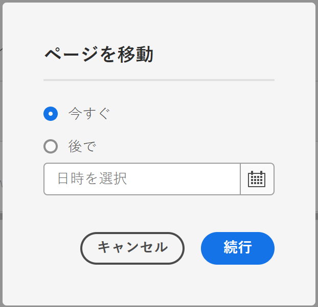

# ページの管理 {#managing-pages}

AEM で web サイトのページを管理する方法（移動、コピー、削除など）について説明します。

>[!TIP]
>
>ページの管理を始める前に、[AEM でページがどのように編成されているか](/help/sites-cloud/authoring/sites-console/organizing-pages.md)を理解しておいてください。

>[!TIP]
>
>Web サイトコンソールから使用できる[キーボードショートカット](/help/sites-cloud/authoring/sites-console/keyboard-shortcuts.md)がいくつかあり、ページをより効率的に整理できます。

## アクセス権 {#access-privileges}

適切なアクセス権と、ページに対する処理（作成、コピー、移動、編集、削除など）を実行するための権限を持つアカウントが必要です。

問題が発生した場合は、システム管理者にお問い合わせください。

## ページを開いて編集 {#opening-a-page-for-editing}

[ページを作成](/help/sites-cloud/authoring/sites-console/creating-pages.md)するか、[**Sites** コンソール](/help/sites-cloud/authoring/sites-console/introduction.md)を使用して既存のページに移動したら、そのページを開いて編集できます。

1. [**Sites** コンソール](/help/sites-cloud/authoring/sites-console/introduction.md)を開きます。
1. 移動して、編集するページを見つけます。
1. 次のいずれかを使用してページを選択します。

   * [クイックアクション](/help/sites-cloud/authoring/basic-handling.md#quick-actions)
   * [選択モード](/help/sites-cloud/authoring/basic-handling.md#selecting-resources)とツールバー

1. **編集**&#x200B;アイコンをタップまたはクリックします。

   

1. ページが開き、必要に応じて、ページを編集できます。選択したページの作成方法に応じて、**編集**&#x200B;アクションを実行すると、該当するエディターが開きます。
   * [ページエディター](/help/sites-cloud/authoring/page-editor/introduction.md) - AEM ページエディターで作成されたページの場合
   * [ユニバーサルエディター](/help/sites-cloud/authoring/universal-editor/authoring.md) - ユニバーサルエディターで作成されたページの場合

## ページのコピーと貼り付け {#copying-and-pasting-a-page}

ページとそのすべてのサブページを新しい場所にコピーできます。

1. [**Sites** コンソール](/help/sites-cloud/authoring/sites-console/introduction.md)を開きます。
1. 移動して、コピーするページを見つけます。
1. 次のいずれかを使用してページを選択します。

   * [クイックアクション](/help/sites-cloud/authoring/basic-handling.md#quick-actions)
   * [選択モード](/help/sites-cloud/authoring/basic-handling.md#selecting-resources)とツールバー

1. **コピー**&#x200B;ページのアイコンをタップまたはクリックします。

   

1. ページの新しいコピーを配置する場所に移動します。
1. 使用可能になった「**貼り付け**」アイコンを選択してください。

   

1. 貼り付けダイアログには、貼り付けトランザクションの概要のほか、次の機能が表示されます。
   * **新規サイト名**：貼り付けたページの名前を変更します。
   * **子を含めずに貼り付け**：貼り付け時に、選択したページの子ページを除外します（デフォルトでは子ページも貼り付けられます）。

   

1. 「**貼り付け**」ボタンを選択して、貼り付けトランザクションを確定し、新しいページを作成します。

>[!NOTE]
>
>ページのコピー先に同名のページが既に存在する場合は、その名前のバリエーションが数字を付加して自動的に生成されます。例えば、`beach` が既に存在する場合は、`beach` という名前の新しいページは `beach1` になります。

>[!NOTE]
>
>貼り付けアクションを選択モードで開始した場合は、ページがコピーされ次第、選択モードが自動的に終了します。

## ページの移動または名前の変更 {#moving-or-renaming-a-page}

ページの移動手順と名前の変更手順は基本的に同じで、どちらのアクションもページを移動ウィザードで処理されます。このウィザードでは、次の操作を実行できます。

* ページを移動せずにページの名前を変更します。
* ページを名前変更せずに移動する。
* 移動と名前の変更を同時に行います。

AEM では、名前変更または移動が行われるページへの内部リンクを更新する機能が用意されています。この機能はページ単位で実行できるので、非常に柔軟性があります。

1. [**Sites** コンソール](/help/sites-cloud/authoring/sites-console/introduction.md)を開きます。
1. 移動対象のページが表示されるまで移動します。
1. 次のいずれかを使用してページを選択します。

   * [クイックアクション](/help/sites-cloud/authoring/basic-handling.md#quick-actions)
   * [選択モード](/help/sites-cloud/authoring/basic-handling.md#selecting-resources)とツールバー

1. 「**移動**」ページアイコンをタップまたはクリックして、ページを移動ウィザードを開きます。

   

1. ウィザードの&#x200B;**名前変更**&#x200B;手順では、作成日、パス、直接参照の数など、ページに関する&#x200B;**情報**&#x200B;が表示されます。ここから、次のいずれかを実行できます。

   * 移動後にページに表示する名前を指定し、「**次へ**」を選択して続行します。
   * 「**キャンセル**」を使用してプロセスを中止します。

   

   * ページを移動するだけの場合は、ページ名はそのままにできます。

   >[!NOTE]
   >
   >ページの移動先に同名のページが既に存在する場合は、その名前のバリエーションが数字を付加して自動的に生成されます。例えば、`beach` が既に存在する場合は、`beach` という名前の新しいページは `beach1` になります。

1. ウィザードの&#x200B;**宛先を選択**&#x200B;ステップで、次のいずれかを実行できます。

   * [列表示](/help/sites-cloud/authoring/basic-handling.md#column-view)を使用して、次のようにページの新しい場所に移動します。

      * 移動先のサムネールをクリックして、移動先を選択します。
      * 「**次へ**」をクリックして次に進みます。

   * 「**戻る**」を使用してページ名の指定に戻ります。

   >[!NOTE]
   >
   >デフォルトでは、移動または名前変更するページの親が、移動先として選択されます。

   

   >[!NOTE]
   >
   >ページの移動先に同名のページが既に存在する場合は、その名前のバリエーションが数字を付加して自動的に生成されます。例えば、`winter` が既に存在する場合、`winter` は `winter1` になります。

1. ページがリンクまたは参照されている場合、またはページが公開されている場合は、詳細が&#x200B;**調整／再公開**&#x200B;手順で一覧表示されます。

   * 調整または再公開するページを適宜指定できます。

   >[!NOTE]
   >
   >* ページがリンクも参照もされていない場合は、このステップは使用できません。
   >* この手順では、直接参照と間接参照の両方をリストします。これは、ウィザードの&#x200B;**名前変更**&#x200B;手順で報告される量や参照パネルで報告される参照とは異なる場合があります。どちらもパフォーマンス上の理由から直接参照のみが報告されます。

   

1. 「**移動**」をタップまたはクリックして、移動アクションを実行するタイミングを定義します。

   * 「**今すぐ**」は、ページをすぐに移動する[非同期ジョブ](#asynchronous-actions)をトリガーします。
   * 「**後で**」では、移動を処理する日付をスケジュールできます。

   

1. 「**続行**」をタップまたはクリックしてページの移動を完了します。

>[!NOTE]
>
>ページを既に公開している場合、ページを移動すると自動的に非公開になります。デフォルトでは、移動が完了すると再公開されますが、**調整／再公開**&#x200B;手順の「**再公開**」フィールドをオフにすることによって変更できます。

>[!NOTE]
>
>ページ名の変更で新しいページ名を指定する際にも、[ページ命名規則](#page-naming-conventions)に従います。

>[!NOTE]
>
>ページは、ページの基となるテンプレートが許可されている場所にのみ移動できます。詳しくは、[使用可能なテンプレート](/help/implementing/developing/components/templates.md#template-availability)を参照してください。

### 非同期アクション {#asynchronous-actions}

ページ移動アクションは常に非同期で処理されるので、ユーザーは妨げられることなく UI でのオーサリングを続行できます。

非同期ジョブの状態は、[**非同期ジョブステータス**&#x200B;ダッシュボード](/help/operations/asynchronous-jobs.md#monitor-the-status-of-asynchronous-operations)（**グローバルナビゲーション**／**ツール**／**操作**／**ジョブ**）で確認できます。

>[!TIP]
>
>非同期ジョブ処理の詳細およびページ移動や名前変更アクションの制限の設定方法については、運用ユーザーガイドの[非同期ジョブ](/help/operations/asynchronous-jobs.md)を参照してください。

### ページの削除 {#deleting-a-page}

1. [**Sites** コンソール](/help/sites-cloud/authoring/sites-console/introduction.md)を開きます。
1. 削除するページに移動します。
1. [選択モード](/help/sites-cloud/authoring/basic-handling.md#viewing-and-selecting-resources)を使用して必要なページを選択してから、ツールバーの「**削除**」を使用します。

   

1. 確認を求めるダイアログが表示されます。

   

   * **削除する前にページをアーカイブしますか？** - 選択すると、削除対象として選択したページのバージョンが削除時に作成されます。
      * [バージョンは、後日復元できます](/help/sites-cloud/authoring/sites-console/page-versions.md)。
      * 以前のバージョンがない場合は、ページを復元できません。
1. 「**キャンセル**」をタップまたはクリックしてアクションを中止するか、「**削除**」をタップまたはクリックしてアクションを確認します。
   * ページに参照がない場合、ページは削除されます。
   * ページに参照がある場合は、メッセージボックスに「**1 つ以上のページが参照されています。**」と表示されます。「**削除を強制**」または「**キャンセル**」を選択できます。

>[!NOTE]
>
>ページが既に公開されている場合は、削除する前に自動的に非公開になります。

### ページのロック {#locking-a-page}

コンソールから、または個々のページの編集時に[ページをロック／ロック解除](/help/sites-cloud/authoring/page-editor/edit-content.md#locking-a-page)できます。ページがロックされているかどうかに関する情報も、両方の場所で示されます。

### 新しいフォルダーの作成 {#creating-a-new-folder}

ファイルやページの整理に役立つフォルダーを作成できます。

1. [**Sites** コンソール](/help/sites-cloud/authoring/sites-console/introduction.md)を開きます。
1. 必要な場所に移動します。
1. オプションリストを開くには、ツールバーの「**作成**」を選択します。
1. 「**フォルダー**」を選択して、ダイアログを開きます。ここで、「**名前**」と「**タイトル**」を入力できます。

   

1. 「**作成**」を選択してフォルダーを作成します。

>[!NOTE]
>
>* フォルダーに新しいフォルダー名を指定する際にも、[ページ命名規則](#page-naming-conventions)に従います。
>* フォルダーは、**Sites** 直下か、他のフォルダーの下にのみ作成できます。ページの下には作成できません。
>* 標準のアクション（移動、コピー、貼り付け、削除、公開、非公開、プロパティの表示／編集）は、フォルダーに対して実行できます。
>* ライブコピー内ではフォルダーを選択できません。
