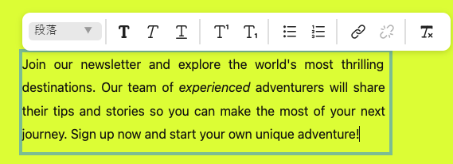
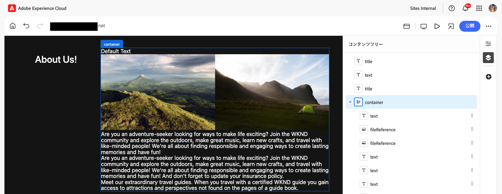
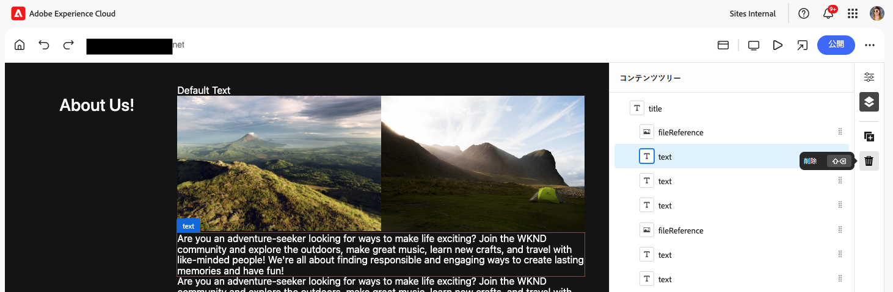

# ユニバーサルエディターを使用したコンテンツのオーサリング {#authoring}

コンテンツ作成者がユニバーサルエディターを使用してコンテンツを作成する際に、簡単で直感的な方法を説明します。

## はじめに {#introduction}

ユニバーサルエディターを使用すると、実装におけるあらゆるコンテンツの様々な側面を編集できるので、優れたエクスペリエンスを提供し、コンテンツベロシティを向上させることができます。

これを行うために、ユニバーサルエディターはコンテンツ作成者に、最小限のトレーニングで簡単にコンテンツの編集を開始できる直感的な UI を提供します。このドキュメントでは、ユニバーサルエディターのオーサリングエクスペリエンスについて説明します。

>[!NOTE]
>
>このドキュメントは、ユニバーサルエディターへのアクセスと操作の方法を、ユーザーが既に理解していることを前提としています。そうでない場合は、[ユニバーサルエディターへのアクセスと操作](/help/sites-cloud/authoring/universal-editor/navigation.md)を参照してください。

>[!TIP]
>
>ユニバーサルエディターについて詳しくは、[ユニバーサルエディターの概要](/help/implementing/universal-editor/introduction.md)を参照してください。

## コンテンツの編集 {#editing-content}

コンテンツの編集はシンプルで直感的です。エディターでコンテンツにマウスカーソルを重ねると、編集可能なコンテンツが薄い青色のアウトラインでハイライト表示されます。

>[!TIP]
>
>デフォルトでは、コンテンツをタップまたはクリックすると、そのコンテンツが編集用に選択されます。リンクをたどってコンテンツを移動する場合は、[プレビューモード](/help/sites-cloud/authoring/universal-editor/navigation.md#preview-mode)に切り替えます。

選択したコンテンツに応じて、異なるインプレース編集オプションが設定されている場合や、[プロパティパネル](/help/sites-cloud/authoring/universal-editor/navigation.md#properties-rail)にコンテンツの追加情報やオプションが表示される場合があります。

### プレーンテキストの編集 {#edit-plain-text}

コンポーネントをダブルクリックまたはダブルタップすると、その場でテキストを編集できます。

薄い青色のアウトラインは、選択を示す濃い青色のアウトラインに変わり、カーソルが表示されます。変更を行ったら、Enter キーまたは Return キーを押すか、テキストボックスの外側を選択して、変更を保存します。

テキストコンポーネントを選択すると、その詳細が[プロパティパネル](/help/sites-cloud/authoring/universal-editor/navigation.md#properties-rail)に表示されます。また、パネル内のテキストを編集することもできます。

また、テキストの詳細はプロパティパネルで確認できます。フォーカスがプロパティパネルの編集されたフィールドを離れると、変更は自動的に保存されます。

### リッチテキストの編集 {#edit-rich-text}

コンポーネントをダブルクリックまたはダブルタップすると、その場でテキストを編集できます。

利便性のために、テキストの書式設定オプションと詳細は、2 か所で利用できます。

#### コンテキストメニュー {#context-menu}

コンテキストメニューは、リッチテキストブロック上で開き、コンテキスト内の基本的な書式設定オプションを提供します。スペースの都合上、一部のオプションが省略記号ボタンの後ろに隠れている場合があります。

編集されたフィールドからフォーカスが離れると、変更は自動的に保存されます。

#### プロパティパネル {#properties-rail}

[プロパティパネル](/help/sites-cloud/authoring/universal-editor/navigation.md#properties-rail)には、選択したテキストの項目が表示されます。エントリをタップすると、テキストを編集するための大きいキャンバスを表示するダイアログが開きます。

変更を破棄または保存するには、それぞれ「**キャンセル**」または「**完了**」をタップまたはクリックします。

### メディアの編集 {#edit-media}

詳細は、[プロパティパネル](/help/sites-cloud/authoring/universal-editor/navigation.md#properties-rail)で確認できます。

1. プロパティパネルで、選択した画像のプレビューをタップまたはクリックします。
1. [アセットセレクター](/help/assets/overview-asset-selector.md#using-asset-selector)ウィンドウが開き、アセットを選択できます。
1. 選択して、新しいアセットを選択します。
1. 「**選択**」を選択して、アセットが置き換えられたプロパティパネルに戻ります。

変更はコンテンツに自動的に保存されます。

### コンテンツフラグメントの編集 {#edit-content-fragment}

[コンテンツフラグメント](/help/sites-cloud/administering/content-fragments/overview.md)を選択した場合、詳細は、[プロパティパネル](/help/sites-cloud/authoring/universal-editor/navigation.md#properties-rail)で編集できます。

選択したコンテンツフラグメントのコンテンツモデルで定義されたフィールドが、プロパティパネルに表示され編集可能になります。

コンテンツフラグメントに関連するフィールドを選択した場合、コンポーネントパネルにコンテンツフラグメントが読み込まれ、フィールドが自動的にスクロールされます。

フォーカスがプロパティパネルの編集されたフィールドを離れると、変更は自動的に保存されます。

代わりにコンテンツフラグメントを[コンテンツフラグメントエディター](/help/sites-cloud/administering/content-fragments/authoring.md)で編集する場合は、プロパティパネルの [**CF エディターで開く**&#x200B;ボタン](/help/sites-cloud/authoring/universal-editor/navigation.md#edit)をタップまたはクリックします。

>[!TIP]
>
>コンテンツフラグメントエディターで選択したコンテンツフラグメントを編集するには、ホットキー `e` を使用します。

ワークフローのニーズに応じて、コンテンツフラグメントをユニバーサルエディターで編集することも、コンテンツフラグメントエディターで直接編集することもできます。

>[!NOTE]
>
>ユニバーサルエディターでは、[モデルに基づいてコンテンツフラグメントフィールドを検証](/help/assets/content-fragments/content-fragments-models.md#validation)し、正規表現パターンや一意性制約などのデータ整合性ルールを適用できます。
>
>これにより、コンテンツを公開する前に、特定のビジネス要件が満たされます。

### コンテナへのコンポーネントの追加 {#adding-components}

1. [コンテンツツリー](/help/sites-cloud/authoring/universal-editor/navigation.md#content-tree-mode)またはエディターでコンテナコンポーネントを選択します。

   

1. 次に、プロパティパネルで追加アイコンを選択します。

   

コンポーネントがコンテナに挿入され、エディターで編集できます。

>[!TIP]
>
>ホットキー `a` を使用して、選択したコンテナにコンポーネントを追加します。

### コンテナ内のコンポーネントの複製 {#duplicating-components}

1. [コンテンツツリー](/help/sites-cloud/authoring/universal-editor/navigation.md#content-tree-mode)またはエディターを使用して、コンテナ内のコンポーネントを選択します。
1. 次に、プロパティパネルで&#x200B;**複製**&#x200B;アイコンを選択します。

   
1. コンポーネントが複製され、選択したコンポーネントの下に挿入されます。

コンポーネントがコンテナに挿入され、エディターで編集できます。

### コンテナからのコンポーネントの削除 {#deleting-components}

1. [コンテンツツリー](/help/sites-cloud/authoring/universal-editor/navigation.md#content-tree-mode)またはエディターでコンテナコンポーネントを選択します。
1. コンテナの山形アイコンを選択して、コンテンツツリーでコンテンツを展開します。
1. 次に、コンテンツツリーで、コンテナ内のコンポーネントを選択します。
1. プロパティパネルで削除アイコンを選択します。

   

選択したコンポーネントが削除されました。

>[!TIP]
>
>ホットキー `Shift+Backspace` を使用して、選択したコンポーネントをコンテナから削除します。

### コンポーネントの並べ替え {#reordering-components}

1. [コンテンツツリーモード](/help/sites-cloud/authoring/universal-editor/navigation.md#content-tree-mode)でない場合はそれに切り替えます。
1. コンテンツツリーまたはエディターでコンテナコンポーネントを選択します。
1. コンテナの山形アイコンを選択して、コンテンツツリーでコンテンツを展開します。
1. コンテナ内のコンポーネントの横にあるハンドルアイコンをドラッグすると、それらを並べ替えることができます。コンポーネントをドラッグして、コンテナ内で並べ替えます。

   

1. ドラッグしたコンポーネントがコンテンツツリー内で灰色に変わり、挿入ポイントは青い線で表されます。コンポーネントをリリースして、新しい場所に配置します。

コンポーネントは、コンテンツツリーおよびエディターの両方で並べ替えられます。

>[!NOTE]
>
>選択したコンポーネントがターゲットコンテナの[コンポーネントフィルター](/help/implementing/universal-editor/filtering.md)で許可されている場合にのみ、コンテナ間でコンポーネントを移動できます。

### 「バリエーションを生成」で生成 AI を使用したバリエーションの作成 {#generate-variations-ai}

生成バリエーションを使用して生成 AI を活用し、コンテンツ作成を高速化します。

ユニバーサルエディターを開き、バリエーションを生成するエントリポイントを見つけます。

詳しくは、[バリエーションを生成 - AEM エディターに統合済み](/help/generative-ai/generate-variations-integrated-editor.md)を参照してください。

## コンテンツのプレビュー {#previewing-content}

コンテンツの編集が完了したら、他のページのコンテンツでコンテンツがどのように表示されるかを確認するためにコンテンツ内を移動したい場合がよくあります。[プレビューモード](/help/sites-cloud/authoring/universal-editor/navigation.md#preview-mode)でリンクをクリックして、読者と同じようにコンテンツ内を移動できます。コンテンツは、公開されるときと同じように、エディターでレンダリングされます。

プレビューモードでは、コンテンツをタップまたはクリックすると、コンテンツの読者に対するように反応します。編集するコンテンツを選択する場合は、[プレビューモード](/help/sites-cloud/authoring/universal-editor/navigation.md#preview-mode)から切り替えます。

## コンポーネントの継承の編集 {#inheritance}

継承とは、一方を変更するともう一方も自動的に変更されるようにコンテンツをリンクできるメカニズムです。

ユニバーサルエディターを使用すると、コンテンツを更新するだけで、コンテンツの継承をキャンセルできます。エディターでは、そのページの作成者が行ったすべての変更の継承を自動的に無効にし、ブループリントから更新を同期した際に変更済みのコンテンツが保持されるようにします。

**AEM Multi-Site-Management （MSM）拡張機能** がプログラムに対して有効になっている場合、ユニバーサルエディター内の個々のコンポーネントの継承ステータスを表示および変更するための [ 追加のツールバーオプション ](#inheritance-extension) が表示されます。

ユニバーサルエディターを使用した継承の仕組みについて詳しくは、[ユニバーサルエディターでのコンテンツの継承](/help/sites-cloud/authoring/universal-editor/inheritance.md)を参照してください。

## オプションのツールバーオプション{#toolbar-options}

ページやコンテンツをさらに管理するのに役立つ追加機能が、ユニバーサルエディターの拡張機能として使用できます。 [ これらの拡張機能は ](/help/implementing/universal-editor/extending.md) コンテンツ作成者としてユニバーサルエディターツールバーに表示される前に [ 管理者がプログラムで有効にする必要があります ](/help/sites-cloud/authoring/universal-editor/navigation.md#universal-editor-toolbar)。

### 継承 {#inheritance-extension}

**AEM Multi-Site-Management （MSM）拡張機能** には、選択したコンポーネントの現在の継承ステータスが表示され、継承を [ 解除または復元 ](/help/sites-cloud/authoring/universal-editor/inheritance.md) できます。

ユニバーサルエディターツールバーの **継承がインストール済み** アイコンは、選択したコンポーネントの継承が引き続きアクティブであることを示します。

アイコンをタップまたはクリックすると、選択したコンポーネントの継承が解除されます。 コンポーネントを編集すると、継承が自動的に解除されます。

**継承が壊れている** アイコンは、選択したコンポーネントの継承が壊れていることを示しています。

アイコンをタップまたはクリックして、選択したコンポーネントの継承を復元します。 継承されたコンテンツを表示するには、ページをリロードしてコンテンツを更新する必要があります。

この拡張機能を有効にする方法については、[Extension Managerのドキュメントを参照してください ](https://developer.adobe.com/uix/docs/extension-manager/)。

>[!NOTE]
>
>**インストール済みの継承** および **壊れた継承** アイコンは、コンポーネントが選択され、ページがブループリントに基づいている場合にのみ表示されます。

>[!NOTE]
>
>**AEM マルチサイト管理（MSM）拡張機能は** ページに対してのみ機能し、コンテンツフラグメントには機能しません。

### ページプロパティへのアクセス {#page-properties}

**AEMのページプロパティ拡張機能** を使用すると、現在編集中のページの [ ページプロパティ ](/help/sites-cloud/authoring/sites-console/page-properties.md) ウィンドウにすばやくアクセスできます。

ユニバーサルエディターツールバーの **ページプロパティ** アイコンをタップまたはクリックして、新しいブラウザータブでページのページプロパティを開きます。

この拡張機能を有効にする方法については、[Extension Managerのドキュメントを参照してください ](https://developer.adobe.com/uix/docs/extension-manager/)。

>[!NOTE]
>
>**AEMのページプロパティ拡張機能は** ページに対してのみ機能し、コンテンツフラグメントには機能しません。

### Sites コンソールへのアクセス {#sites-console}

**AEM サイト管理拡張機能** を使用すると、AEMの [Sites コンソール ](/help/sites-cloud/authoring/sites-console/introduction.md) で編集中のページにすばやくアクセスでき、サイトツリーを移動したり、コンソールでページレベルのアクションを実行したりできます。

アイコンをタップまたはクリックすると、新しいブラウザータブで Sites コンソールが開き、エディターで現在表示されているページに移動します。

この拡張機能を有効にする方法については、[Extension Managerのドキュメントを参照してください ](https://developer.adobe.com/uix/docs/extension-manager/)。

### ページのロックとロック解除 {#locking-pages}

**AEMページロック拡張機能** は、ページの現在のロックステータスをエディターに表示し、ページを [ ロックまたはロック解除 ](/help/sites-cloud/authoring/sites-console/managing-pages.md#locking-a-page) できます。

ユニバーサルエディターツールバーの **ロック解除** アイコンは、現在エディターにあるページがロックされていないことを示しています。

ページをロックするには、アイコンをタップまたはクリックします。

ユニバーサルエディターツールバーの **ロック済み** アイコンは、現在エディターにあるページがロックされていることを示します。 アイコンの上にマウスポインターを置くと、ページをロックしたユーザーを示すツールヒントが表示されます。

ユーザーがページをロックした場合は、アイコンをタップまたはクリックしてページのロックを解除します。

この拡張機能を有効にする方法については、[Extension Managerのドキュメントを参照してください ](https://developer.adobe.com/uix/docs/extension-manager/)。

>[!NOTE]
>
>**AEM ページロック拡張機能は** ページに対してのみ機能し、コンテンツフラグメントには機能しません。

### ワークフロー {#workflows}

**AEM ワークフロー拡張機能** を使用すると、現在エディターにあるページで [ ワークフローを開始 ](/help/sites-cloud/authoring/workflows/overview.md) できます。

ユニバーサルエディターツールバーの **ワークフロー** アイコンをタップまたはクリックして **ワークフローを開始** モーダルを開きます。 ウィンドウには、ワークフローを適用できるコンテンツのリストが表示されます。

1. **ワークフローモデル** ドロップダウンで、適用するワークフローを選択します。
1. 「**名前**」フィールドにワークフローの説明を入力します。
1. **ワークフローに含めるコンテンツ** リストで、チェックボックスを使用して、ワークフローに含めるコンテンツを定義します。
1. **ワークフローを開始** をタップまたはクリックしてワークフローを開始するか、**閉じる** をタップまたはクリックして中止します。

この拡張機能を有効にする方法については、[Extension Managerのドキュメントを参照してください ](https://developer.adobe.com/uix/docs/extension-manager/)。

### 開発者ログイン {#developer-login}

**AEM Universal Editor Dev Login Extension** は、ローカルで開発する開発者が便利な方法で、テスト目的でローカルのAEM SDKに対する認証を行うことができます。

ユニバーサルエディターツールバーの「**開発者ログオン**」アイコンをタップまたはクリックして、ローカルのAEM SDKにログインするためのローカルログイン資格情報を指定します。

この拡張機能を有効にする方法については、[Extension Managerのドキュメントを参照してください ](https://developer.adobe.com/uix/docs/extension-manager/)。

## その他のリソース {#additional-resources}

ユニバーサルエディターを使用してコンテンツを公開する方法については、このドキュメントを参照してください。

* [ユニバーサルエディターを使用したコンテンツの公開](publishing.md) - ユニバーサルエディターでのコンテンツの公開方法と、アプリでの公開済みコンテンツの処理方法について説明します。

ユニバーサルエディターの技術的な詳細について詳しくは、次の開発者向けドキュメントを参照してください。

* [ユニバーサルエディターの概要](/help/implementing/universal-editor/introduction.md) - ユニバーサルエディターを使用して、実装おけるあらゆるコンテンツの様々な側面を編集できるようにして、優れたエクスペリエンスを実現し、コンテンツベロシティを向上させる方法について説明します。
* [AEM のユニバーサルエディターの概要](/help/implementing/universal-editor/getting-started.md) - ユニバーサルエディターへのアクセス権を取得する方法と、これを使用するために最初の AEM アプリのインストルメントを開始する方法について説明します。
* [ユニバーサルエディターのアーキテクチャ](/help/implementing/universal-editor/architecture.md) - ユニバーサルエディターのアーキテクチャと、そのサービスとレイヤー間でのデータのフローについて説明します。
* [属性とタイプ](/help/implementing/universal-editor/attributes-types.md) - ユニバーサルエディターで必要なデータ属性とデータ型について説明します。
* [ユニバーサルエディターの認証](/help/implementing/universal-editor/authentication.md) - ユニバーサルエディターの認証方法について説明します。
