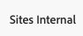

# ユニバーサルエディターへのアクセスと操作 {#navigating}

ユニバーサルエディターへのアクセスと操作の基本について説明します。

## はじめに {#introduction}

ユニバーサルエディターを使用すると、あらゆる実装、あらゆるコンテンツ、あらゆる側面を編集できるため、優れたエクスペリエンスを提供し、コンテンツベロシティを向上させ、最新のデベロッパーエクスペリエンスを提供できます。

これを行うために、ユニバーサルエディターはコンテンツ作成者に、最小限のトレーニングで簡単にコンテンツの編集を開始できる直感的な UI を提供します。このドキュメントでは、ユニバーサルエディターの操作方法について説明します。

>[!TIP]
>
>* ユニバーサルエディターを使用したオーサリングについて詳しくは、ドキュメント [ ユニバーサルエディターを使用したコンテンツのオーサリング ](/help/sites-cloud/authoring/universal-editor/authoring.md) を参照してください。
>* ユニバーサルエディターの詳細については、「[ ユニバーサルエディターの概要 ](/help/implementing/universal-editor/introduction.md)」を参照してください。

## アプリを準備する {#prepare-app}

ユニバーサルエディターを使用してアプリのコンテンツを作成するには、エディターをサポートするために、デベロッパーがアプリを実装する必要があります。

>[!TIP]
>
>ユニバーサルエディターと連携する AEM アプリの設定方法の例は、[AEM でのユニバーサルエディターの概要](/help/implementing/universal-editor/getting-started.md)ドキュメントを参照してください。

## ユニバーサルエディターへのアクセス {#accessing}

アプリをユニバーサルエディターと連携するように実装すると、ユニバーサルエディターでは、AEM as a Cloud Service 内からアクセスすることも、AEM にアクセスせずに直接アクセスすることもできます。

### AEM as a Cloud Service 内でのアクセス {#accessing-aem}

1. AEM as a Cloud Service オーサリングインスタンスにログインします。
1. [**Sites** コンソール](/help/sites-cloud/authoring/sites-console/introduction.md)を使用して、ユニバーサルエディターで使用するために作成された、編集対象のページに移動します。
1. ページを編集します。
1. ユニバーサルエディターが開き、選択したページを編集します。

>[!NOTE]
>
>[**Sites** コンソール ](/help/sites-cloud/authoring/sites-console/introduction.md) でページを編集する場合、コンソールは、ページの [ テンプレート ](/help/sites-cloud/authoring/page-editor/templates.md) このドキュメントで説明されているユニバーサルエディター、または [ ページエディター ](/help/sites-cloud/authoring/page-editor/introduction.md) に適したエディターを開きます。

### 直接アクセス {#accessing-directly}

1. ユニバーサルエディターにログインします。ログインして [ ユニバーサルエディターへのアクセス権を持つ ](/help/implementing/universal-editor/getting-started.md#request-access) には、Adobe IDが必要です。

1. ログインしたら、編集するページの URL を [ ロケーションバー ](#location-bar) に入力して、テキストコンテンツやメディアコンテンツなどのコンテンツの編集を開始できるようにします。

## UI について {#ui}

UI は以下の主なエリアに分かれています。

* [Experience Cloud ヘッダー](#experience-cloud-header)
* [ユニバーサルエディターのツールバー](#universal-editor-toolbar)
* [エディター](#editor)
* [プロパティパネル](#properties-rail)

### Experience Cloud ヘッダー {#experience-cloud-header}

Experience Cloud ヘッダーは、常に画面の上部に表示されます。Experience Cloud 内の位置を示し、他の Experience Cloud アプリへの移動に役立つアンカーです。

#### Experience Manager {#experience-manager}

ヘッダーの左側にあるAdobe Experience Cloud リンクをクリックしてExperience Managerソリューションのルートに移動し、[Cloud Manager](/help/onboarding/cloud-manager-introduction.md)、[Cloud Acceleration Manager](/help/journey-migration/cloud-acceleration-manager/introduction/overview-cam.md)、ソフトウェア配布 [ などのツールにアクセス ](https://experienceleague.adobe.com/docs/experience-cloud/software-distribution/home.html?lang=ja) ます。

#### 組織 {#organization}

現在ログインしている組織が表示されます。Adobe ID が複数の組織に関連付けられている場合、別の組織に切り替えるには、選択します。

#### ソリューション {#solutions}

ソリューション切り替えボタンをタップまたはクリックすると、他の Experience Cloud ソリューションに素早くジャンプすることができます。

#### ヘルプ {#help}

ヘルプアイコンを使用すると、学習リソースやサポートリソースに素早くアクセスできます。

#### 通知 {#notifications}

このアイコンには、現在割り当てられている未完了の[通知](/help/implementing/cloud-manager/notifications.md)の数を示すバッジが付きます。

#### ユーザープロパティ {#user-properties}

ユーザー設定にアクセスするには、ユーザーを表すアイコンを選択します。ユーザー画像が設定されていない場合、アイコンがランダムに割り当てられます。

### ユニバーサルエディターのツールバー {#universal-editor-toolbar}

ユニバーサルエディターツールバーは、常に画面の上部（Experience Cloudヘッダー [ のすぐ下に表示さ ](#experience-cloud-header) ます。 このツールを使用すると、別のページに素早くアクセスして編集し、現在のページを公開できます。

#### 「ホーム」ボタン {#home-button}

「ホーム」ボタンをクリックすると、ユニバーサルエディターの開始ページに戻ります。

開始ページで、ユニバーサルエディターで編集するサイトの URL を入力できます。

>[!NOTE]
>
>ユニバーサルエディターで編集するページは、ユニバーサルエディターをサポートするために [ インストルメントを行 ](/help/implementing/universal-editor/getting-started.md) 必要があります。

#### ロケーションバー {#location-bar}

ロケーションバーに、編集中のページのアドレスが表示されます。別のページを編集するには、選択してアドレスを入力します。

>[!TIP]
>
>ホットキー `l`（文字 l）を使用して、アドレスバーを開きます。

>[!NOTE]
>
>ユニバーサルエディターで編集するページは、ユニバーサルエディターをサポートするために [ インストルメントを行 ](/help/implementing/universal-editor/getting-started.md) 必要があります。

#### 認証ヘッダーの設定 {#authentication-settings}

[ 認証目的でカスタム認証ヘッダーを設定する ](/help/implementing/universal-editor/developer-overview.md#auth-header) 必要がある場合は、「ローカル開発ヘッダー設定」アイコンを選択します。

#### エミュレーターの設定 {#emulator}

エミュレーションアイコンを選択して、ユニバーサルエディターによるページのレンダリング方法を定義します。

エミュレーションアイコンをタップまたはクリックすると、オプションが表示されます。

デフォルトでは、エディターはデスクトップレイアウトで開き、高さと幅はブラウザーで自動的に定義されます。

また、ユニバーサルエディター内でモバイルデバイスをエミュレートすることもできます。

* 向きを定義する
* 幅と高さを定義する
* 向きを変更する

#### プレビューモード {#preview-mode}

プレビューモードでは、ページは、公開されたサービスで表示されるとおりに、エディターでレンダリングされます。これにより、コンテンツ作成者は、リンクをクリックするなどしてコンテンツ内を移動できます。

>[!TIP]
>
>ホットキー `p` を使用してプレビューモードを切り替えます。

#### アプリのプレビューを開く {#open-app-preview}

「アプリのプレビューを開く」アイコンを選択すると、現在編集中のページをエディターなしで独自のブラウザーで開いて、内容をプレビューできます。

>[!TIP]
>
>ホットキー `o`（文字 o）を使用して、アプリのプレビューを開きます。

>[!TIP]
>
>アプリのプレビュー URL [ カスタマイズ可能 ](/help/implementing/universal-editor/customizing.md#custom-preview-urls)。

#### 公開 {#publish}

「公開」ボタンを選択すると、コンテンツへの変更がライブで公開され、読者が使用できるようにになります。

>[!TIP]
>
>ユニバーサルエディターを使用した公開について詳しくは、[ユニバーサルエディターを使用したコンテンツの公開](publishing.md)のドキュメントを参照してください。

#### 省略記号 {#ellipsis}

省略記号ボタンを使用すると、その他の標準オプションにアクセスできます。

例えば、ページを非公開にする機能（つまり、「[**公開**」ボタン](#publish)のアクションを元に戻す）には、省略記号ボタンからアクセスできます。

#### その他のボタン {#additional-toolbar-buttons}

ユニバーサルエディターには、カスタマイズ可能で拡張性の高いオーサリングエクスペリエンスが用意されています。ツールバーにその他のボタンを表示する場合は、ユニバーサルエディターが拡張されています。

* 拡張機能の設定について詳しくは、[ ユニバーサルエディターのカスタマイズと拡張 ](/help/implementing/universal-editor/customizing.md) を参照してください。
* 個々の拡張機能の仕組みについて詳しくは、[Extension Managerドキュメント ](https://developer.adobe.com/uix/docs/extension-manager/extension-developed-by-adobe/) を参照してください。

### エディター {#editor}

エディターはウィンドウのほとんどを占め、そこに[ロケーションバー](#location-bar)で指定したページがレンダリングされます。

エディターが [ プレビューモード ](#preview-mode) の場合、コンテンツはナビゲート可能で、リンクをたどることができますが、コンテンツを編集することはできません。

### プロパティパネル {#properties-rail}

プロパティパネルは、エディターの右側に常に表示されます。モードに応じて、コンテンツ内で選択されたコンポーネントの詳細またはページコンテンツの階層を表示できます。

#### プロパティモード {#properties-mode}

プロパティモードでは、パネルには、エディターで現在選択されているコンポーネントのプロパティが表示されます。これは、ページが読み込まれたときのプロパティパネルのデフォルトのモードです。

選択するコンポーネントのタイプに応じて、プロパティパネルに詳細を表示して変更できます。

表示や編集が可能な詳細が含まれていないコンポーネントもあります。

>[!TIP]
>
>ホットキー `d` を使用してプロパティモードに切り替えます。

#### コンテンツツリーモード {#content-tree-mode}

コンテンツツリーモードでは、パネルにページコンテンツの階層が表示されます。

コンテンツツリー内の項目を選択する場合、エディターはそのコンテンツまでスクロールして選択します。

>[!TIP]
>
>ホットキー `f` を使用してコンテンツツリーモードに切り替えます。

##### CF エディターで開く {#edit}

編集時に、選択したコンポーネントのオプションがプロパティパネルに表示され、選択したコンポーネントを編集できます。選択したコンポーネントがコンテンツフラグメントの場合は、「**CF エディターで開く**」ボタンを選択することもできます。

「**CF エディターで開く**」ボタンをタップまたはクリックすると、[コンテンツフラグメントエディター](/help/assets/content-fragments/content-fragments-managing.md#opening-the-fragment-editor)が新しいタブで開きます。これにより、コンテンツフラグメントエディターを最大限に活用して、関連するコンテンツフラグメントを編集できます。

ワークフローのニーズに応じて、コンテンツフラグメントをユニバーサルエディターで編集することも、コンテンツフラグメントエディターで直接編集することもできます。

>[!TIP]
>
>コンテンツフラグメントエディターで選択したコンテンツフラグメントを開くには、ホットキー `e` を使用します。

##### 追加 {#add}

コンテンツツリーまたはエディターでコンテナコンポーネントを選択した場合は、プロパティパネルに「追加」オプションが表示されます。

追加ボタンをタップまたはクリックすると、[ 選択したコンテナに追加 ](/help/sites-cloud/authoring/universal-editor/authoring.md#adding-components) できるコンポーネントのドロップダウンメニューが開きます。

>[!TIP]
>
>ホットキー `a` を使用して、選択したコンテナコンポーネントにコンポーネントを追加します。

##### 複製 {#duplicate}

コンテンツツリーまたはエディターでコンテナコンポーネント内のコンポーネントを選択すると、プロパティパネルに「複製」オプションが表示されます。

「複製」ボタンをタップまたはクリック [ 選択したコンポーネントを複製 ](/help/sites-cloud/authoring/universal-editor/authoring.md#duplicating-components) します。

##### 削除 {#delete}

コンテンツツリーまたはエディターでコンテナコンポーネント内のコンポーネントを選択すると、プロパティパネルに「削除」オプションが表示されます。

「削除」ボタンをタップまたはクリック [ コンポーネントを削除 ](/help/sites-cloud/authoring/universal-editor/authoring.md#deleting-components)。

>[!TIP]
>
>ホットキー `Shift+Backspace` を使用して、選択したコンポーネントをコンテナから削除します。

#### その他のボタン {#additional-properties-rail-buttons}

ユニバーサルエディターには、カスタマイズ可能で拡張性の高いオーサリングエクスペリエンスが用意されています。プロパティパネルにその他のボタンを表示する場合は、ユニバーサルエディターが拡張されています。

* 拡張機能の設定について詳しくは、[ ユニバーサルエディターのカスタマイズと拡張 ](/help/implementing/universal-editor/customizing.md) を参照してください。
* 個々の拡張機能の仕組みについて詳しくは、[Extension Managerドキュメント ](https://developer.adobe.com/uix/docs/extension-manager/extension-developed-by-adobe/) を参照してください。

## 次の手順 {#next-steps}

ユニバーサルエディターへのアクセスと操作の方法がわかったので、次は [ それを使用してコンテンツを作成する ](/help/sites-cloud/authoring/universal-editor/authoring.md) 準備が整いました。
