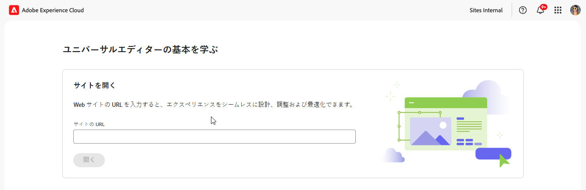

# ユニバーサルエディターへのアクセスと操作 {#navigating}

ユニバーサルエディターへのアクセスと操作の基本について説明します。

## はじめに {#introduction}

ユニバーサルエディターを使用すると、あらゆる実装、あらゆるコンテンツ、あらゆる側面を編集できるため、優れたエクスペリエンスを提供し、コンテンツベロシティを向上させ、最新のデベロッパーエクスペリエンスを提供できます。

これを行うために、ユニバーサルエディターはコンテンツ作成者に、最小限のトレーニングで簡単にコンテンツの編集を開始できる直感的な UI を提供します。このドキュメントでは、ユニバーサルエディターの操作方法について説明します。

>[!TIP]
>
>* ユニバーサルエディターを使用したオーサリングについて詳しくは、[ユニバーサルエディターを使用したコンテンツのオーサリング](/help/sites-cloud/authoring/universal-editor/authoring.md)ドキュメントを参照してください。
>* ユニバーサルエディターについて詳しくは、[ユニバーサルエディターの概要](/help/implementing/universal-editor/introduction.md)を参照してください。

## アプリを準備する {#prepare-app}

ユニバーサルエディターを使用してアプリのコンテンツを作成するには、エディターをサポートするために、デベロッパーがアプリを実装する必要があります。

>[!TIP]
>
>ユニバーサルエディターと連携する AEM アプリの設定方法の例は、[AEM でのユニバーサルエディターの概要](/help/implementing/universal-editor/getting-started.md)ドキュメントを参照してください。

## ユニバーサルエディターへのアクセス {#accessing}

アプリをユニバーサルエディターと連携するように実装すると、ユニバーサルエディターでは、AEM as a Cloud Service 内からアクセスすることも、AEM にアクセスせずに直接アクセスすることもできます。

### AEM as a Cloud Service 内でのアクセス {#accessing-aem}

1. AEM as a Cloud Service オーサリングインスタンスにログインします。
1. [**Sites** コンソール](/help/sites-cloud/authoring/sites-console/introduction.md)を使用して、ユニバーサルエディターで使用するために作成された、編集対象のページに移動します。
1. ページを編集します。
1. ユニバーサルエディターが開き、選択したページを編集します。

>[!NOTE]
>
>[**Sites** コンソール](/help/sites-cloud/authoring/sites-console/introduction.md)でページを編集する際、コンソールはページの[テンプレート](/help/sites-cloud/authoring/page-editor/templates.md)に適したエディター（このドキュメントで説明するユニバーサルエディターや[ページエディター](/help/sites-cloud/authoring/page-editor/introduction.md)）を開きます。

### 直接アクセス {#accessing-directly}

1. ユニバーサルエディターにログインします。ログインして[ユニバーサルエディターにアクセスする](/help/implementing/universal-editor/getting-started.md#request-access)には、Adobe ID が必要です。

1. ログインしたら、編集するページの URL を[ロケーションバー](#location-bar)に入力すると、テキストコンテンツやメディアコンテンツなどのコンテンツの編集を開始できます。

## UI について {#ui}

UI は以下の主なエリアに分かれています。

* [Experience Platformの上部ナビゲーションバー](#experience-cloud-header)
* [ユニバーサルエディターのツールバー](#universal-editor-toolbar)
* [エディター](#editor)
* [プロパティパネル](#properties-rail)

>[!TIP]
>
>ユニバーサルエディターには、エディターの機能を変更して追加できる[カスタマイズオプション](/help/implementing/universal-editor/customizing.md)と[拡張ポイント](/help/implementing/universal-editor/extending.md)が多数用意されています。このため、ここに記載されている標準のオプションとは異なるオプションが表示される場合があります。

### Experience Platformの上部ナビゲーションバー {#experience-cloud-header}

Experience Platformの上部ナビゲーションバーは、常に画面の上部に表示されます。 Experience Cloud 内の位置を示し、他の Experience Cloud アプリへの移動に役立つアンカーです。

Experience Platformの上部ナビゲーションバーについて詳しくは、[Adobe Experience Platform UI ガイドを参照してください ](https://experienceleague.adobe.com/en/docs/experience-platform/landing/platform-ui/ui-guide#top-navigation-bar)

#### アカウント {#user-properties}

アカウントアイコンをタップまたはクリックすると、ユーザー設定を含むメニューが開きます。

ユニバーサルエディターの場合、見出し **製品設定** の下に、ユニバーサルエディターの現在の実稼動バージョンと今後のプレビューバージョンを切り替えるオプションがあります。

### ユニバーサルエディターのツールバー {#universal-editor-toolbar}

ユニバーサルエディターのツールバーは、常に画面の上部、[Experience Cloud ヘッダー](#experience-cloud-header)のすぐ下に表示されます。このツールを使用すると、別のページに素早くアクセスして編集したり、現在のページを公開したりできます。

プログラムの設定に応じて、[管理者によって拡張機能として有効にされた追加機能](#additional-toolbar-buttons)も表示される場合があります。

#### 「ホーム」ボタン {#home-button}

「ホーム」ボタンをクリックすると、ユニバーサルエディターの開始ページに戻ります。

開始ページで、ユニバーサルエディターで編集するサイトの URL を入力できます。

>[!NOTE]
>
>ユニバーサルエディターで編集するページは、[ユニバーサルエディターをサポートするのに実装する](/help/implementing/universal-editor/getting-started.md)必要があります。

「**クイックリンク**」セクションにはヘルプリソースが表示され、「**最近使用したもの**」セクションにはユニバーサルエディターで最近開いたページへのリンクが表示されます。

#### ロケーションバー {#location-bar}

ロケーションバーに、編集中のページのアドレスが表示されます。別のページを編集するには、選択してアドレスを入力します。

>[!TIP]
>
>ホットキー `l`（文字 l）を使用して、アドレスバーを開きます。

>[!NOTE]
>
>ユニバーサルエディターで編集するページは、[ユニバーサルエディターをサポートするのに実装する](/help/implementing/universal-editor/getting-started.md)必要があります。

#### 取り消しとやり直し {#undo-redo}

エディターで最後に行った編集を取り消すまたはやり直すには、「取り消し」ボタンまたは「やり直し」ボタンを選択します。詳しくは、[ユニバーサルエディターを使用したコンテンツのオーサリング](/help/sites-cloud/authoring/universal-editor/authoring.md#undo-redo)ドキュメントを参照してください。

>[!TIP]
>
>取り消すには `Command-Z`、やり直すには `Shift-Command-Z` のホットキーを使用します。

#### ローカル開発者ログイン {#local-developer-login}

[ ローカルで開発する場合 ](/help/implementing/universal-editor/local-dev.md)、ローカルのAEM SDKを簡単に認証する必要がある場合は、「ローカル開発者ログイン」アイコンを選択します。

#### レスポンシブモード {#emulator}

レスポンシブモードアイコンを選択して、ユニバーサルエディターによるページのレンダリング方法を定義します。

レスポンシブモードアイコンをタップまたはクリックすると、オプションが表示されます。

デフォルトでは、エディターはデスクトップレイアウトで開き、高さと幅はブラウザーで自動的に定義されます。

また、ユニバーサルエディター内でモバイルデバイスをエミュレートすることもできます。

* 向きを定義する
* 幅と高さを定義する
* 向きを変更する

#### プレビュー {#preview-mode}

プレビューモードでは、ページは、公開されたサービスで表示されるとおりに、エディターでレンダリングされます。これにより、コンテンツ作成者は、リンクをクリックするなどしてコンテンツ内を移動できます。

>[!TIP]
>
>ホットキー `p` を使用してプレビューモードを切り替えます。

#### ページを開く {#open-page}

「ページを開く」アイコンを選択すると、現在編集中のページをエディターを使用せずに独自のブラウザーで開き、内容をプレビューできます。

>[!TIP]
>
>ホットキー `o`（文字 o）を使用して、アプリのプレビューを開きます。

>[!TIP]
>
>アプリのプレビュー URL は[カスタマイズできます](/help/implementing/universal-editor/customizing.md#custom-preview-urls)。

>[!NOTE]
>
>「ページを開く」ボタンは[無効にすることができ](/help/implementing/universal-editor/customizing.md#open-page)、その場合はエディターに表示されない可能性があります。

#### 公開 {#publish}

「公開」ボタンを選択すると、コンテンツへの変更を消費者が利用できるようライブに公開したり、レビュー用にプレビュー環境に公開したりできます。

>[!TIP]
>
>ユニバーサルエディターを使用した公開について詳しくは、[ユニバーサルエディターを使用したコンテンツの公開](publishing.md)のドキュメントを参照してください。

>[!NOTE]
>
>「公開」ボタンは[無効にすることができ](/help/implementing/universal-editor/customizing.md#disable-publish)、その場合はエディターに表示されない可能性があります。

#### 省略記号 {#ellipsis}

省略記号ボタンを使用すると、その他の標準オプションにアクセスできます。

例えば、ページを非公開にする機能（つまり、「[**公開**」ボタン](#publish)のアクションを元に戻す）には、省略記号ボタンからアクセスできます。

#### その他のボタン {#additional-toolbar-buttons}

ユニバーサルエディターには、カスタマイズ可能で拡張性の高いオーサリングエクスペリエンスが用意されています。ツールバーにその他のボタンを表示する場合は、ユニバーサルエディターが拡張されています。

* 個別の拡張機能の動作について詳しくは、[ユニバーサルエディターオーサリングのドキュメント](/help/sites-cloud/authoring/universal-editor/authoring.md#toolbar-options)を参照してください。
* 拡張機能について詳しくは、[ユニバーサルエディターの拡張](/help/implementing/universal-editor/extending.md)を参照してください。
* 個別の拡張機能のインストール方法について詳しくは、[Extension Manager ドキュメント](https://developer.adobe.com/uix/docs/extension-manager/extension-developed-by-adobe/)を参照してください。

### エディター {#editor}

エディターはウィンドウのほとんどを占め、そこに[ロケーションバー](#location-bar)で指定したページがレンダリングされます。

デフォルトでは、エディターが開き、インプレースでも [ プロパティパネルを使用しても ](/help/sites-cloud/authoring/universal-editor/authoring.md) コンテンツを作成 [ できます ](#properties-rail)。

エディターが[プレビューモード](#preview-mode)の場合、コンテンツに移動し、リンクをたどることはできますが、コンテンツは編集できません。

### プロパティパネル {#properties-rail}

プロパティパネルは、エディターの右側に常に表示されます。モードに応じて、コンテンツ内で選択されたコンポーネントの詳細またはページコンテンツの階層を表示できます。

プログラムの設定に応じて、[管理者によって拡張機能として有効にされた追加機能](#additional-properties-panel-buttons)も表示される場合があります。

#### プロパティモード {#properties-mode}

プロパティモードでは、パネルには、エディターで現在選択されているコンポーネントのプロパティが表示されます。これは、ページが読み込まれたときのプロパティパネルのデフォルトのモードです。

選択するコンポーネントのタイプに応じて、プロパティパネルに詳細を表示して変更できます。

表示や編集が可能な詳細が含まれていないコンポーネントもあります。

>[!TIP]
>
>ホットキー `d` を使用してプロパティモードに切り替えます。

#### コンテンツツリーモード {#content-tree-mode}

コンテンツツリーモードでは、パネルにページコンテンツの階層が表示されます。

* コンテンツツリー内の項目を選択する場合、エディターはそのコンテンツまでスクロールして選択します。
* コンテンツツリー内の項目をダブルクリックする場合、エディターはそのコンテンツまでスクロールして選択し、関連するプロパティを[プロパティモード](#properties-mode)で開きます。
* ツリー内の項目を右クリックすると、コンテキストメニューが開き、その項目に適したアクションが表示されます。

>[!TIP]
>
>ホットキー `f` を使用してコンテンツツリーモードに切り替えます。

##### CF エディターで開く {#edit}

編集時に、選択したコンポーネントのオプションがプロパティパネルに表示され、選択したコンポーネントを編集できます。選択したコンポーネントがコンテンツフラグメントの場合は、「**CF エディターで開く**」ボタンを選択することもできます。

「**CF エディターで開く**」ボタンをタップまたはクリックすると、[コンテンツフラグメントエディター](/help/assets/content-fragments/content-fragments-managing.md#opening-the-fragment-editor)が新しいタブで開きます。これにより、コンテンツフラグメントエディターを最大限に活用して、関連するコンテンツフラグメントを編集できます。

ワークフローのニーズに応じて、コンテンツフラグメントをユニバーサルエディターで編集することも、コンテンツフラグメントエディターで直接編集することもできます。

>[!TIP]
>
>コンテンツフラグメントエディターで選択したコンテンツフラグメントを開くには、ホットキー `e` を使用します。

##### 追加 {#add}

コンテンツツリーまたはエディターでコンテナコンポーネントを選択した場合は、プロパティパネルに「追加」オプションが表示されます。

「追加」ボタンをタップまたはクリックすると、使用できるコンポーネントのドロップダウンメニューが開き、[選択したコンテナに追加](/help/sites-cloud/authoring/universal-editor/authoring.md#adding-components)します。

>[!TIP]
>
>ホットキー `a` を使用して、選択したコンテナコンポーネントにコンポーネントを追加します。

##### 複製 {#duplicate}

コンテンツツリーまたはエディターでコンテナコンポーネント内のコンポーネントを選択すると、プロパティパネルに「複製」オプションが表示されます。

「複製」ボタンをタップまたはクリックすると、[選択したコンポーネントが複製されます](/help/sites-cloud/authoring/universal-editor/authoring.md#duplicating-components)。

>[!TIP]
>
>ホットキー `Command+d` を使用して、選択したコンポーネントをコンテナから削除します。

##### 削除 {#delete}

コンテンツツリーまたはエディターでコンテナコンポーネント内のコンポーネントを選択すると、プロパティパネルに「削除」オプションが表示されます。

「削除」ボタンをタップまたはクリックすると、[コンポーネントが削除されます](/help/sites-cloud/authoring/universal-editor/authoring.md#deleting-components)。

>[!TIP]
>
>ホットキー `Shift+Backspace` を使用して、選択したコンポーネントをコンテナから削除します。

##### コピー＆ぺースト {#copy-paste}

[コンテナ](/help/implementing/universal-editor/field-types.md#container)内にあるコンポーネントをコピー＆ペーストできます。

>[!TIP]
>
>コピーするには `Command-C`、ペーストするには `Command-V` のホットキーを使用します。

詳しくは、[ユニバーサルエディターを使用したコンテンツのオーサリング](/help/sites-cloud/authoring/universal-editor/authoring.md#copy-paste)ドキュメントを参照してください。

#### その他のボタン {#additional-properties-panel-buttons}

ユニバーサルエディターには、カスタマイズ可能で拡張性の高いオーサリングエクスペリエンスが用意されています。プロパティパネルにその他のボタンを表示する場合は、ユニバーサルエディターが拡張されています。

* 個別の拡張機能の動作について詳しくは、[ユニバーサルエディターオーサリングのドキュメント](/help/sites-cloud/authoring/universal-editor/authoring.md#properties-panel-options)を参照してください。
* 拡張機能について詳しくは、[ユニバーサルエディターの拡張](/help/implementing/universal-editor/extending.md)を参照してください。
* 個別の拡張機能のインストール方法について詳しくは、[Extension Manager ドキュメント](https://developer.adobe.com/uix/docs/extension-manager/extension-developed-by-adobe/)を参照してください。

## 次の手順 {#next-steps}

ユニバーサルエディターにアクセスして操作する方法について理解したので、[これを使用してコンテンツを作成](/help/sites-cloud/authoring/universal-editor/authoring.md)する準備が整いました。
