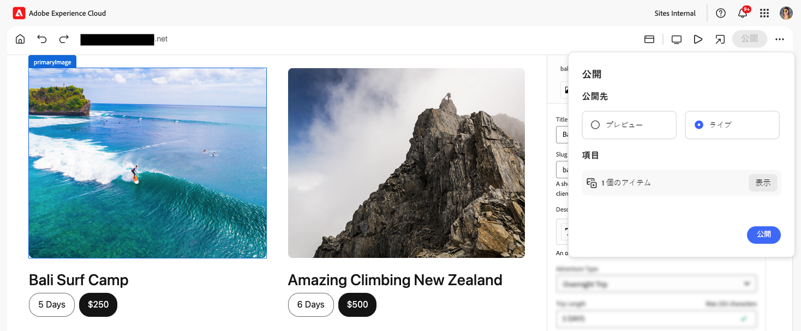
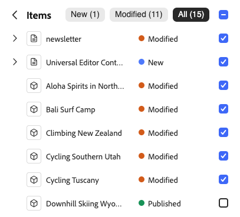

# ユニバーサルエディターを使用したコンテンツの公開 {#publishing}

ユニバーサルエディターでのコンテンツの公開方法と、アプリでの公開済みコンテンツの処理方法を説明します。

>[!TIP]
>
>ここで説明する公開プロセスは、ユニバーサルエディターの標準の機能です。
>
>また、ユニバーサルエディターは、[拡張機能と UI 拡張機能](/help/implementing/universal-editor/extending.md)もサポートしているので、ワークフローで公開プロセスをサポートできます。したがって、公開フローが異なる場合があります。

## ユニバーサルエディターからのコンテンツの公開 {#publishing-content}

コンテンツ作成者としてコンテンツを公開する準備が整ったら、ユニバーサルエディターのツールバーにある「**公開**」アイコンをタップまたはクリックするだけです。

1. ユニバーサルエディターで、[ユニバーサルエディターのツールバーにある「**公開**」アイコン](/help/sites-cloud/authoring/universal-editor/navigation.md#publish)をタップまたはクリックします。
1. [ プレビューサービス ](/help/sites-cloud/authoring/sites-console/previewing-content.md) を使用できる場合は、**[プレビュー](/help/sites-cloud/authoring/sites-console/previewing-content.md)** （使用可能な場合）または **公開** にコンテンツを公開する場所を選択できます。
1. 「**項目**」セクションには、公開に含まれる次のコンテンツが一覧表示されます。
   * **新規**：まだ公開されていない項目。
   * **変更済み** 公開されたが、前回の公開以降に変更されたコンテンツ。
   * **公開済み**：公開済みで、その公開以降に変更されていないコンテンツ。

   必要に応じて、これらの項目の横にあるチェックボックスをタップまたはクリックして、公開対象に含めるか除外します。「**拡張**」をタップまたはクリックすると、3 つのカテゴリの合計に含まれる個々の項目が表示され、個別に含めたり除外したりできます。

   

   概要に戻るには、**項目**&#x200B;見出しの横にある戻る矢印をタップまたはクリックします。

1. 「**公開**」をタップまたはクリックして公開するか、「**キャンセル**」をタップまたはクリックして中止します。

>[!NOTE]
>
>プレビュー用に公開するオプション [ 無効にすることができます ](/help/implementing/universal-editor/customizing.md#publish-preview) は、エディターに表示されない場合があります。

## ユニバーサルエディターからのコンテンツの非公開 {#unpublishing-content}

コンテンツの非公開は、コンテンツの公開と同様に機能します。コンテンツ作成者としてコンテンツを公開から削除する準備が整ったら、ユニバーサルエディターのツールバーにある省略記号アイコンをタップまたはクリックし、「**非公開**」をタップまたはクリックします。

その後、[コンテンツを公開したときと同じように、コンテンツを非公開にするオプションがあります。](#publishing-content)プレビューインスタンスからの非公開やどの項目を非公開に含めるかを含めます。

## Sites コンソールからの公開と非公開 {#publishing-sites-console}

また、[Sites コンソールから](/help/sites-cloud/authoring/sites-console/publishing-pages.md)公開することもできます。これは、複数のコンテンツページを公開する場合や、公開または非公開をスケジュールする場合に便利です。

## その他のリソース {#additional-resources}

ユニバーサルエディターを使用してコンテンツをオーサリングする方法について詳しくは、このドキュメントを参照してください。

* [ユニバーサルエディターを使用したコンテンツのオーサリング](authoring.md) - コンテンツ作成者がユニバーサルエディターを使用して、簡単かつ直感的にコンテンツを作成する方法について説明します。

ユニバーサルエディターの技術的な詳細について詳しくは、次の開発者向けドキュメントを参照してください。

* [ユニバーサルエディターの概要](/help/implementing/universal-editor/introduction.md) - ユニバーサルエディターを使用して、優れたエクスペリエンスを提供し、コンテンツベロシティを向上させ、最新のデベロッパーエクスペリエンスを提供するために、あらゆる実装、あらゆるコンテンツ、あらゆる側面の編集を可能にする方法を説明します。
* [AEM のユニバーサルエディターの概要](/help/implementing/universal-editor/getting-started.md) - ユニバーサルエディターへのアクセス権を取得する方法と、これを使用するために最初の AEM アプリのインストルメントを開始する方法について説明します。
* [ユニバーサルエディターのアーキテクチャ](/help/implementing/universal-editor/architecture.md) - ユニバーサルエディターのアーキテクチャと、そのサービスとレイヤー間でのデータのフローについて説明します。
* [属性とタイプ](/help/implementing/universal-editor/attributes-types.md) - ユニバーサルエディターで必要なデータ属性とデータ型について説明します。
* [ユニバーサルエディターの認証](/help/implementing/universal-editor/authentication.md) - ユニバーサルエディターの認証方法について説明します。
