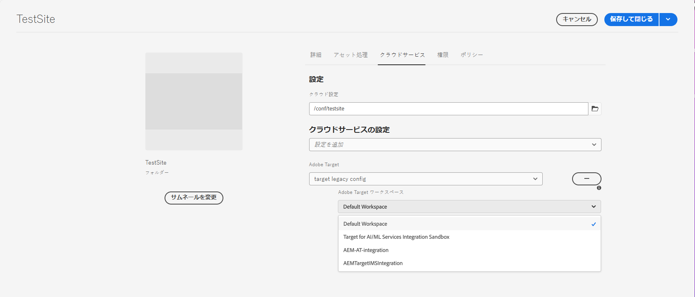

# Adobe Target へのコンテンツフラグメントの書き出し {#exporting-content-fragments-to-adobe-target}

>[!CAUTION]
>
>[Adobe Target との統合](/help/sites-cloud/integrating/integrating-adobe-target.md)で説明されている手順に従って、AEM と Adobe Target を統合する必要があります。

Adobe Experience Manager as a Cloud Service（AEM）で作成された[コンテンツフラグメント](/help/sites-cloud/authoring/fragments/content-fragments.md)を Adobe Target（Target）に書き出すことができます。書き出したエクスペリエンスフラグメントは、Target アクティビティのオファーとして使用し、幅広くエクスペリエンスをテストおよびパーソナライズできます。

コンテンツフラグメントを Adobe Target に書き出すには、次のオプションを使用できます。

* JSON：ヘッドレスコンテンツ配信のサポート

<!-- * GraphQL query ??? -->

AEM コンテンツフラグメントを Adobe Target に書き出すためのインスタンスを準備するには、次の作業が必要です。

* [Adobe Target との統合](/help/sites-cloud/integrating/integrating-adobe-target.md)
* [クラウド設定の追加](#add-the-cloud-configuration)
* [レガシー設定の追加](#add-the-legacy-configuration)

その後、以下が可能になります。

* [コンテンツフラグメントを Adobe Target に書き出す](#exporting-a-content-fragment-to-adobe-target)
* [Adobe Target でコンテンツフラグメントを使用する](#using-your-content-fragments-in-adobe-target)
* [Adobe Target に書き出し済みのコンテンツフラグメントを削除する](#deleting-a-content-fragment-already-exported-to-adobe-target)

コンテンツフラグメントは、Adobe Target のデフォルトのワークスペースに書き出すことも、Adobe Target のユーザー定義のワークスペースに書き出すこともできます。

>[!NOTE]
>
>Adobe Target ワークスペースは、Adobe Target 自体には存在しません。これらは Adobe IMS（Identity Management System）で定義および管理され、あらゆるソリューションで使用できるように Adobe 開発者コンソールで選択されます。

>[!NOTE]
>
>Adobe Target のワークスペースを使用すると、組織（グループ）のメンバーは、他のユーザーにアクセス権を付与することなく、その組織専用のオファーとアクティビティを作成および管理することができます。例えば、国際的な企業の国別の組織などです。

## 前提条件 {#prerequisites}

次のアクションが必要です。

1. [AEM と Adobe Target を統合する](/help/sites-cloud/integrating/integrating-adobe-target.md)必要があります。

<!-- link rewriter - targets in content-fragments-customizing do not exist yet

1. Content Fragments are exported from the AEM author instance, so you need to [Configure the AEM Link Externalizer](/help/implementing/developing/extending/content-fragments-customizing.md#configuring-the-aem-link-externalizer) on the author instance to ensure that any references within the Content Fragment are externalized for web delivery.

   >[!NOTE]
   >
   >For link rewriting not covered by the default, the [Content Fragment Link Rewriter Provider](/help/implementing/developing/extending/content-fragments-customizing.md#the-content-fragment-link-rewriter-provider-html) is available. With this, customized rules can be developed for your instance.
-->

## クラウド設定の追加 {#add-the-cloud-configuration}

フラグメントを書き出す前に、**Adobe Target** 用の&#x200B;**クラウド設定**&#x200B;をフラグメントまたはフォルダーに追加する必要があります。この結果、次のことも可能になります。

* 書き出しに使用する形式オプションを指定する
* Target ワークスペースを宛先として選択する

必要なオプションは、必要なフォルダーの&#x200B;**プロパティ**&#x200B;で選択できます。仕様は必要に応じて継承されます。

1. **Assets** コンソールに移動します。

1. 適切なフォルダーの&#x200B;**プロパティ**&#x200B;を開きます。

   >[!NOTE]
   >
   >クラウド設定をコンテンツフラグメントの親フォルダーに追加した場合、設定はすべての子に継承されます。

1. 「**クラウドサービス**」タブを選択します。

1. **クラウドサービス設定**&#x200B;で、ドロップダウンリストからターゲット設定を選択します。

1. Adobe Target ワークスペースを選択します。

   例：

   

1. **保存して閉じます**。

## レガシー設定の追加 {#add-the-legacy-configuration}

<!-- This is effectively the Manually Integrating with Adobe Target {#manually-integrating-with-adobe-target} section from 6.5 -->

>[!IMPORTANT]
>
>新しいレガシー設定の追加は、コンテンツフラグメントの書き出しでのみサポートされている特殊なケースのシナリオです。

Adobe Experience Platform Launch を使用するための[クラウド設定を追加](#add-the-cloud-configuration)した後で、最初 AEM を Adobe Target と統合するには、レガシー設定を使用して Adobe Target と手動で統合する必要もあります。

### Target クラウド設定の作成 {#creating-a-target-cloud-configuration}

AEM が Adobe Target とやり取りできるようにするには、Target クラウド設定を作成します。設定を作成するには、Adobe Target のクライアントコードとユーザーの資格情報を指定します。

複数の AEM キャンペーンに設定を関連付けることができるので、Target クラウド設定を作成するのは 1 回のみです。複数の Adobe Target クライアントコードがある場合、各クライアントコードに対して 1 つの設定を作成します。

クラウド設定を設定して、Adobe Target からセグメントを同期することができます。同期を有効にした場合、クラウド設定が保存されるとすぐに、バックグラウンドでセグメントが Target から読み込まれます。

AEMで Target クラウド設定を作成するには、以下の手順を実行します。

1. **AEM ロゴ**／**ツール**／**クラウドサービス**／**従来のクラウドサービス**&#x200B;を使用して、**従来のクラウドサービス**&#x200B;に移動します。例：（[http://localhost:4502/libs/cq/core/content/tools/cloudservices.html](http://localhost:4502/libs/cq/core/content/tools/cloudservices.html)）

   **Adobe Experience Cloud** の概要ページが開きます。

1. 「**Adobe Target**」セクションで、「**今すぐ設定**」をクリックします。
1. **設定を作成**&#x200B;ダイアログで、次の操作を実行します。

   1. 設定の「**タイトル**」を入力します。
   1. 「**Adobe Target 設定**」テンプレートを選択します。
   1. 「**作成**」をクリックします。

これで、新しい設定を選択して編集できます。

1. 編集ダイアログが開きます。

   

<!-- 
Can this still occur?

>[!NOTE]
>
>When configuring A4T with AEM, you may see a Configuration reference missing entry. To be able to select the analytics framework, do the following:
>
>1. Navigate to **Tools** &gt; **General** &gt; **CRXDE Lite**.
>1. Navigate to **/libs/cq/analytics/components/testandtargetpage/dialog/items/tabs/items/tab1_general/items/a4tAnalyticsConfig**
>1. Set the property **disable** to **false**.
>1. Select **Save All**.
-->

1. **Adobe Target 設定**&#x200B;ダイアログで、次のプロパティの値を入力します。

   * **認証**：デフォルトは IMS です（ユーザー資格情報は非推奨／廃止予定です）

   * **クライアントコード**：Target アカウントのクライアントコード

   * **テナント ID**：テナント ID です

   * **IMS 設定**：ドロップダウンリストから必要な設定を選択します

   * **API タイプ**：デフォルトは REST です（XML は非推奨／廃止予定です）

   * **A4T Analytics Cloud 設定**：ターゲットアクティビティの目標と指標に使用する Analytics Cloud 設定を選択します。これは、コンテンツをターゲティングするときに、Adobe Analytics をレポートソースとして使用している場合に必要です。

<!-- Is this needed?
If you do not see your cloud configuration, see note in [Configuring A4T Analytics Cloud Configuration](#configuring-a-t-analytics-cloud-configuration).
-->

* **正確なターゲティングを使用**：デフォルトでは、このチェックボックスはオンになっています。選択した場合、クラウドサービス設定は、コンテキストの読み込みを待ってからコンテンツを読み込みます。次のメモを参照してください。

* **Adobe Target からセグメントを同期**：Target で定義されているセグメントをダウンロードして AEM で使用するには、このオプションをオンにします。API Type プロパティが REST の場合は、このオプションを選択する必要があります。インラインセグメントはサポートされず、常に Target のセグメントを使用する必要があるからです。（AEM の用語「セグメント」は、Target の「オーディエンス」と同じです。）

* **クライアントライブラリ**：デフォルトは AT.js です（mbox.js は非推奨／廃止予定です）。

  >[!NOTE]
  >
  >Target ライブラリファイル [AT.JS](https://experienceleague.adobe.com/docs/target-dev/developer/client-side/at-js-implementation/at-js/how-atjs-works.html?lang=ja) は、Adobe Target 用の新しい実装ライブラリであり、通常の web 実装と単一ページアプリケーションの両方に使用できるように設計されています。
  >
  >mbox.js は非推奨（廃止予定）となり、後日で削除される予定です。
  >
  >アドビは、クライアントライブラリとして mbox.js ではなく AT.js を使用することをお勧めします。
  >
  >AT.js は mbox.js ライブラリよりも、次のような強化点を提供します。
  >
  >* Web 実装のページ読み込み時間の向上
  >* セキュリティの向上
  >* 単一ページアプリケーション向けの実装オプションの改善
  >* AT.js は、target.js に含まれていたコンポーネントを含むので、target.js を呼び出す必要がなくなりました
  >
  >**クライアントライブラリ**&#x200B;ドロップダウンメニューでは、AT.js または mbox.js を選択できます。

* **タグ管理システムを使用してクライアントライブラリを提供**：このオプションを選択すると、Adobe Launch または別のタグ管理システム（DTM は非推奨／廃止予定）からクライアントライブラリを使用できます。

* **カスタムの AT.js**：参照してカスタム AT.js をアップロードします。デフォルトのライブラリを使用する場合は、空白のままにします。

  >[!NOTE]
  >
  >デフォルトでは、Adobe Target 設定ウィザードをオプトインすると、正確なターゲティングが有効になります。
  >
  >正確なターゲティングとは、クラウドサービスの設定が、コンテキストの読み込みを待ってからコンテンツを読み込むことを意味します。その結果、パフォーマンスに関しては、正確なターゲティングによって、コンテンツを読み込む前に数ミリ秒の遅延が生じる場合があります。
  >
  >正確なターゲティングは、オーサーインスタンスで常に有効になっています。ただし、パブリッシュインスタンスでは、クラウドサービス設定（**`http://localhost:4502/etc/cloudservices.html`**）の「正確なターゲティング」の横にあるチェックマークをオフにすることで、正確なターゲティングをグローバルにオフにできます また、クラウドサービス設定での設定に関係なく、個々のコンポーネントに対して正確なターゲティングのオン／オフを切り替えることもできます。
  >
  >この設定を変更しても、作成済みの対象コンポーネントには影響しません&#x200B;***。***&#x200B;これらのコンポーネントには直接変更を加える必要があります。

1. 「**Adobe Target に接続**」をクリックして、Target の接続を開始します。接続に成功すると、「**接続に成功しました**」というメッセージが表示されます。メッセージの「**OK**」をクリックして、ダイアログの「**OK**」をクリックします。

### Target フレームワークの追加 {#adding-a-target-framework}

<!-- Is this section needed? -->

Target クラウド設定を設定したら、Target フレームワークを追加します。このフレームワークは、使用可能な [ContextHub](/help/implementing/developing/personalization/configuring-contexthub.md) コンポーネントから Adobe Target に送信されるデフォルトのパラメーターを識別します。Target は、パラメーターを使用して、現在のコンテキストに適用されるセグメントを決定します。

1 つの Target 設定に対して複数のフレームワークを作成できます。Web サイトのセクションごとに異なるパラメーターセットを Target に送信する必要がある場合は、複数のフレームワークが便利です。送信する必要のあるパラメーターのセットごとにフレームワークを作成します。Web サイトの各セクションを適切なフレームワークに関連付けます。1 つの web ページは一度に 1 つのフレームワークしか使用できません。

1. Target 設定ページで、「利用可能な設定」の横の「**+**」（プラス符号）をクリックします。

1. フレームワークを作成ダイアログで、「**タイトル**」を指定し、「**Adobe Target フレームワーク**」を選択して、「**作成**」をクリックします。

   <!--  -->

   フレームワークページが表示されます。マッピングできる [ContextHub](/help/implementing/developing/personalization/configuring-contexthub.md) の情報を表すコンポーネントがサイドキックに表示されます。

   <!--  -->

1. マッピングに使用するデータを表す ClientContext コンポーネントをドロップターゲットにドラッグします。または、**ContextHub ストア**&#x200B;コンポーネントをフレームワークにドラッグします。

   >[!NOTE]
   >
   >マッピング時に、パラメーターは単純な文字列を使用して mbox に渡されます。ContextHub から配列をマッピングすることはできません。

   例えば、サイト訪問者に関する&#x200B;**プロファイルデータ**&#x200B;を使用して Target キャンペーンを管理するには、「**プロファイルデータ**」コンポーネントをページにドラッグします。Target パラメーターへのマッピングに使用できるプロファイルデータ変数が表示されます。

   <!--  -->

1. 該当する列の「**共有**」チェックボックスをオンにして、Target システムで表示する変数を選択します。

   <!--  -->

   >[!NOTE]
   >
   >パラメーターの同期は、AEM から Adobe Target への一方向のみです。

フレームワークが作成されました。フレームワークをパブリッシュインスタンスにレプリケートするには、サイドキックの「**フレームワークをアクティベート**」オプションを使用します。

<!--
### Associating Activities With the Target Cloud Configuration  {#associating-activities-with-the-target-cloud-configuration}

Associate your [AEM activities](/help/sites-cloud/authoring/personalization/activities.md) with your Target cloud configuration so that you can mirror the activities in [Adobe Target](https://experienceleague.adobe.com/docs/target/using/experiences/offers/manage-content.html).

>[!NOTE]
>
>What types of activities are available is determined by the following:
>
>* If the **xt_only** option is enabled on the Adobe Target tenant (clientcode) used on the AEM side to connect to Adobe Target, then you can create **only** XT activities in AEM.
>
>* If the **xt_only** options is **not** enabled on the Adobe Target tenant (clientcode), then you can create **both** XT and A/B activities in AEM.
>
>**Additional note:** **xt_only** options is a setting applied on a certain Target tenant (clientcode) and can only be modified directly in Adobe Target. You cannot enable or disable this option in AEM.
-->

<!--
### Associating the Target Framework With Your Site {#associating-the-target-framework-with-your-site}

After you create a Target framework in AEM, associate your web pages with the framework. The targeted components on the pages send the framework-defined data to Adobe Target for tracking. (See [Content Targeting](/help/sites-cloud/authoring/personalization/targeted-content.md).)

When you associate a page with the framework, the child pages inherit the association.

1. In the **Sites** console, navigate to the site that you want to configure.
1. Using either [quick actions](/help/sites-cloud/authoring/basic-handling.md#quick-actions) or [selection mode](/help/sites-cloud/authoring/basic-handling.md#selecting-resources), select **View Properties.**
1. Select the **Cloud Services** tab.
1. Select **Edit**.
1. Select **Add Configuration** under **Cloud Service Configurations** and select **Adobe Target**.

  

1. Select the framework you want under **Configuration Reference**.

   >[!NOTE]
   >
   >Make sure that you select the specific **framework** that you created and not the Target cloud configuration under which it was created.

1. Select **Done**.
1. Activate the root page of the website to replicate it to the publish server. (See [How To Publish Pages](/help/sites-cloud/authoring/sites-console/publishing-pages.md).)

   >[!NOTE]
   >
   >If the framework you attached to the page was not activated yet, a wizard opens which lets you publish it as well.
-->

## Adobe Target へのコンテンツフラグメントの書き出し {#exporting-a-content-fragment-to-adobe-target}

>[!CAUTION]
>
>画像などのメディアアセットの場合、参照のみが Target に書き出されます。アセット自体は AEM Assets に保存されたままで、AEM パブリッシュインスタンスから配信されます。
>
>このため、Target に書き出す前に、コンテンツフラグメントとすべての関連アセットを公開する必要があります。

（クラウド設定を指定した後に）コンテンツフラグメントを AEM から Target に書き出すには、次の手順を実行します。

1. **Assets** コンソールのコンテンツフラグメントに移動します。
1. Target に書き出すコンテンツフラグメントを選択します。

1. 「**Adobe Target オファーに書き出し**」を選択します。

   

   <!-- this note does not seem to be accurate for CFs -->

   <!--
   
   >[!NOTE]
   >
   >If the Content Fragment has already been exported, select **Update in Adobe Target**.
   
   -->

1. 必要に応じて、「**公開せずに書き出し**」または「**公開**」を選択します。

   >[!NOTE]
   >
   >表示される実際のアクションは、フラグメントのステータスと関連アセットによって異なります。
   >
   >すべてが既に公開されていて、それ以降に何も変更されていない場合、この手順は飛ばされます。

   >[!NOTE]
   >
   >「**公開**」を選択すると、コンテンツフラグメントはすぐに公開され、Target に送信されます。

1. 確認ダイアログで「**OK**」を選択します。

   コンテンツフラグメントは Target に送信されているはずです。

   >[!NOTE]
   >
   >書き出しについての[様々な詳細](/help/sites-cloud/authoring/fragments/content-fragments.md#details-of-your-content-fragment)は、コンソールの&#x200B;**リスト表示**&#x200B;と&#x200B;**プロパティ**&#x200B;で参照できます。

   >[!NOTE]
   >
   >Adobe Target でコンテンツフラグメントを表示するときに表示される&#x200B;*最終変更日*&#x200B;は、フラグメントが Adobe Target に最後に書き出された日付ではなく、AEM でフラグメントが最後に変更された日付です。

>[!NOTE]
>
>あるいは、[ページ情報](/help/sites-cloud/authoring/page-editor/introduction.md#page-information)メニューの同等のコマンドを使用して、ページエディターから書き出しを実行することもできます。

## Adobe Target でのコンテンツフラグメントの使用 {#using-your-content-fragments-in-adobe-target}

ここまでのタスクを完了すると、コンテンツフラグメントが Target のオファーページに表示されます。Target 側でできることを詳しく知るには、[Target 固有のドキュメント](https://experienceleague.adobe.com/docs/target/using/integrate/aem/fragments/content-fragments-aem.html?lang=ja)を参照してください。

>[!NOTE]
>
>Adobe Target でコンテンツフラグメントを表示するときに表示される&#x200B;*最終変更日*&#x200B;は、フラグメントが最後に Adobe Target に書き出された日付ではなく、AEM でフラグメントが最後に変更された日付です。

## Adobe Target に書き出し済みのコンテンツフラグメントの削除 {#deleting-a-content-fragment-already-exported-to-adobe-target}

書き出しと同様に、Adobe Target からコンテンツフラグメントを削除する場合も、フラグメントを選択した後、**Assets** コンソールの上部ツールバーから選択できます。

Target に書き出し済みのコンテンツフラグメントを削除すると、そのフラグメントが既に Target のオファーで使用されている場合は、問題が発生する可能性があります。フラグメントコンテンツが AEM によって配信されるので、フラグメントを削除すると、オファーが使用できなくなります。

<!-- if the information about deleting-if-used correct, or is it not allowed at all? -->

このような状況を回避するには、次の手順に従います。

* コンテンツフラグメントが現在アクティビティで使用されていない場合、AEM を使用すると、警告メッセージを表示せずにフラグメントを削除できます。
* コンテンツフラグメントが現在 Target のアクティビティで使用されている場合、フラグメントを削除するとアクティビティに影響が及ぶ可能性があると、AEM ユーザーに警告メッセージが表示されます。

  AEM のエラーメッセージは、ユーザーによるコンテンツフラグメントの（強制）削除を禁止するものではありません。コンテンツフラグメントが削除された場合は、次のような結果になります。

   * AEM コンテンツフラグメントを使用した Target オファーで望ましくない動作が見られる場合があります。

      * コンテンツフラグメント が Target にプッシュされたため、オファーは引き続きレンダリングされる可能性があります。
      * 参照されているアセットが AEM でも削除されている場合、コンテンツフラグメント内の参照はすべて正しく機能しない可能性があります。

   * 当然ながら、コンテンツフラグメントは AEM にはもう存在しないため、さらに変更することは不可能です。

## その他のリソース {#further-resources}

詳しくは、以下のトピックを参照してください。

<!--
* [Creating a Target Cloud Configuration](/help/sites-cloud/integrating/integrating-adobe-target.md#create-configuration)
-->

* [コアコンポーネント - コンテンツフラグメント](https://experienceleague.adobe.com/docs/experience-manager-core-components/using/wcm-components/content-fragment-component.html?lang=ja)

* [Adobe Target Developers](https://developers.adobetarget.com/)

* [Adobe Target - Target アクティビティで AEM コンテンツフラグメントを使用して、最適化やパーソナライゼーションを支援](https://experienceleague.adobe.com/docs/target/using/integrate/aem/fragments/content-fragments-aem.html?lang=ja)

* [Adobe Target - AEM エクスペリエンスフラグメントとコンテンツフラグメントの概要](https://experienceleague.adobe.com/docs/target/using/integrate/aem/fragments/aem-experience-and-content-fragments.html?lang=ja)
