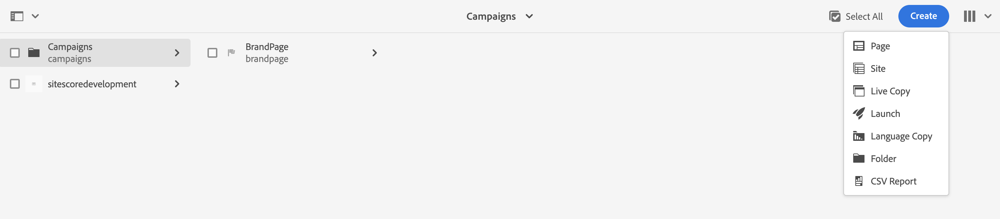

# Adobe Experience Managerニュースレターの作成 {#creating-newsletter}

以下に示す手順を実行する前に、まず [統合](/help/sites-cloud/integrating/integrating-campaign-classic.md) Adobe Campaign ClassicとAEMas a Cloud Service Adobe Campaign ClassicとAEMの両方をas a Cloud Service的に設定したら、Adobe Experience Managerニュースレターの作成方法を学習します。

1. AEMオーサーインスタンスから、ページの左上にあるAdobe Experience Managerロゴをクリックし、「 」を選択します。 **サイト**.
1. キャンペーンを選択し、 **Create→Page**.
   
1. ブランドを選択し、 **次へ**.
1. タイトルを入力し、 **作成** および **完了**.
1. キャンペーンページを作成するには、に移動します。 **Campaigns→AdobeDemo→マスター** をクリックし、 **Create→Page**.
   
1. キャンペーンテンプレートを選択し、「 **次へ** および **完了**.
1. タイトルを入力し、「 **作成** および **完了**.
1. に移動します。 **Campaign→AdobeDemo→マスター** 「 CampaignPage 」チェックボックスをオンにします。 クリック **プロパティ** を左上に置きます。
   
1. 次に移動： **Cloud Service** タブ：
   * 「Cloud Service」ドロップダウンリストから「 Adobe Campaign 」を選択します。
   * Adobe Campaign設定の名前を選択します。
   * **保存** および **閉じる**.
1. Adobe Campaign Classic E メールページを作成するには、に移動します。 **Campaign→AdobeDemo→マスター→CampaignPage** をクリックし、 **Create→Page**.
1. 「Adobe Campaign電子メール（AC 6.1 など） 」テンプレートを選択し、 **次へ**.
1. 作成ページで、ニュースレターのタイトルを入力し、「 **作成** および **完了**.
1. に移動します。 **Campaign→AdobeDemo→マスター→CampaignPage**「Campaign Classic」チェックボックスを選択し、 **編集** 左上に表示され、e メールページを開きます。
1. 必要に応じて、Adobe Campaign Classic電子メールニュースレターページを編集します。
1. をクリックします。 **ページ情報** ボタンを左上に置き、 **ページを公開**.
1. ページを公開する設定を選択します。 「**公開する**」をクリックします。
   
1. ニュースレターページは、パブリッシュインスタンスおよびAEM Adobe Campaign Classic設定で公開されました。
   * これで、ニュースレターページがAdobe Campaign Classicに表示されます
1. ページ情報ボタンをクリックし、 **ワークフローを開始**.
1. 選択 **Adobe Campaignの承認** をワークフローモデルとして設定し、「 **ワークフローを開始** 」ボタンをクリックします。
1. ページの上部に免責事項が表示されます。 クリック **完了** レビューを確認し、再度クリックするには、 **OK**.
1. クリック **完了** を選択し、 **ニュースレターの承認** 「次のステップ」ドロップダウンリストで、 **OK** 」ボタンをクリックします。

## 受信者の作成 {#creating-recipient}

1. Adobe Campaign Classicクライアントコンソールを使用してAdobe Campaign Classicサーバーを開きます。
1. エクスプローラービューに移動します。
1. 左側のツリービューで、「プロファイルとターゲット」に移動し、「 」を選択します。 **受信者**.
   
1. 受信者の詳細を入力します。
   * 名を入力します。
   * 姓を入力します。
   * E メールを入力します。
   * 「**保存**」をクリックします。

## Adobe Campaign Classicでの電子メール配信の作成 {#create-delivery}

1. Adobe Campaign Classicクライアントコンソールを使用してAdobe Campaign Classicサーバーを開きます。
1. エクスプローラービューに移動します。
1. 左側のツリービューで、を選択します。 **Campaign Management** を選択し、 **配信**.
1. 右上隅で、 **新規**.
1. 選択 **E メール配信 (AEM Content)** 「配信テンプレート」ドロップダウンリストから、「 **続行**.
1. E メールパラメーターの下の「送信者」リンクをクリックします。
   * 送信者のアドレスを入力します。
   * 「開始日」フィールドに入力します。
   * 「**OK**」をクリックします。
1. クリック **宛先** リンク、次にクリック **追加** をクリックします。
1. 選択 **受信者** をクリックし、 **次へ**.
   
1. 作成した受信者を選択 [以前](#creating-recipient) をクリックし、 **完了**.
1. 受信者が選択されています。 「**OK**」をクリックします。
1. クリック **同期**.
1. リストから電子メールページを選択し、 **OK**.
1. E メールテンプレートが同期されます。 クリック **コンテンツを更新** 読み込まれていない場合は。
1. クリック **送信** 電子メールを送信します。
1. 次の画面で、 **可能な限り早く配信** 次に、 **分析**.
   
1. 配信が作成されたら、 **配信を確定** ：電子メールの送信を開始します。 「**はい**」をクリックして実行を確認します。
   
1. 配信が開始されました。 「**閉じる**」をクリックします。
1. クリック **保存** 配信を保存します。
