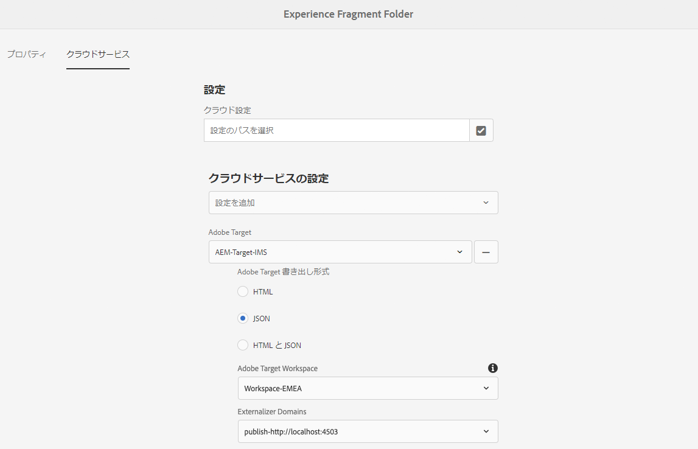

# エクスペリエンスフラグメントのAdobe Targetへの書き出し{#exporting-experience-fragments-to-adobe-target}

>[!CAUTION]
>
>* AEMエクスペリエンスフラグメントは、Adobe Targetのデフォルトのワークスペースに書き出されます。
>* AEMは、 [Adobe Targetとの統合](/help/sites-cloud/integrating/integrating-adobe-target.md).

書き出し可能 [エクスペリエンスフラグメント](/help/sites-cloud/authoring/fundamentals/experience-fragments.md)(Adobe Experience Manager as a Cloud Service(AEM) で作成、Adobe Target(Target) に対して ) 書き出したエクスペリエンスフラグメントは、Target アクティビティのオファーとして使用し、幅広くエクスペリエンスをテストおよびパーソナライズできます。

エクスペリエンスフラグメントをAdobe Targetに書き出すには、次の 3 つのオプションを使用できます。

* HTML（デフォルト）:Web およびハイブリッドコンテンツ配信のサポート
* JSON:ヘッドレスコンテンツ配信のサポート
* HTML と JSON

AEMエクスペリエンスフラグメントをAdobe Targetに書き出すインスタンスを準備するには、次の操作が必要です。

* [Adobe Target と統合します。](/help/sites-cloud/integrating/integrating-adobe-target.md)
* [クラウド設定を追加](#add-the-cloud-configuration)
* [レガシー設定の追加](#add-the-legacy-configuration)

その後、次の操作を実行できます。

* [エクスペリエンスフラグメントをAdobe Targetに書き出す](#exporting-an-experience-fragment-to-adobe-target)
* [Adobe Targetでエクスペリエンスフラグメントを使用する](#using-your-experience-fragments-in-adobe-target)
* また、 [既にAdobe Targetに書き出されたエクスペリエンスフラグメントを削除する](#deleting-an-experience-fragment-already-exported-to-adobe-target)

エクスペリエンスフラグメントは、Adobe Targetのデフォルトのワークスペースに書き出すことも、Adobe Targetのユーザー定義のワークスペースに書き出すこともできます。

>[!NOTE]
>
>Adobe Targetワークスペースは、Adobe Target自体には存在しません。 これらはAdobe IMS(Identity Management System) で定義および管理され、Adobe開発者コンソールを使用してソリューション全体で使用するために選択されます。

>[!NOTE]
>
>Adobe Targetのワークスペースを使用して、組織（グループ）のメンバーに対し、この組織のオファーとアクティビティの作成と管理のみを許可できます。他のユーザーへのアクセス権を付与することなく 例えば、グローバルに関係する国固有の組織などです。

>[!NOTE]
>
>詳しくは、以下を参照してください。
>
>* [Adobe Target開発](http://developers.adobetarget.com/)
>* [コアコンポーネント — エクスペリエンスフラグメント](https://experienceleague.adobe.com/docs/experience-manager-core-components/using/introduction.html?lang=ja)
>* [Adobe Target - Adobe Experience Manager(AEM) エクスペリエンスフラグメントを使用する方法を教えてください。](https://experienceleague.adobe.com/docs/target/using/experiences/offers/aem-experience-fragments.html?lang=en)
>* [AEM 6.5 - Adobe Targetとの統合の手動設定 — Target クラウド設定の作成](https://experienceleague.adobe.com/docs/experience-manager-65/administering/integration/target-configuring.html#creating-a-target-cloud-configuration)

## 前提条件 {#prerequisites}

様々なアクションが必要です。

1. 必要な操作 [AEMとAdobe Targetの統合](/help/sites-cloud/integrating/integrating-adobe-target.md).

1. エクスペリエンスフラグメントはAEMオーサーインスタンスから書き出されるので、次の操作を行う必要があります。 [AEM Link Externalizer を設定](/help/implementing/developing/extending/experience-fragments.md#configuring-the-aem-link-externalizer) オーサーインスタンスを使用して、エクスペリエンスフラグメント内の参照が Web 配信用に外部化されていることを確認します。

   >[!NOTE]
   >
   >デフォルトでカバーされていないリンクの書き換えでは、[Experience Fragment Link Rewriter Provider](/help/implementing/developing/extending/experience-fragments.md#the-experience-fragment-link-rewriter-provider-html) が利用可能です。これにより、インスタンスに合わせてカスタマイズされたルールを開発できます。

## クラウド設定を追加 {#add-the-cloud-configuration}

フラグメントを書き出す前に、**Adobe Target** 用の&#x200B;**クラウド設定**&#x200B;をフラグメント、またはフォルダーに追加する必要があります。また、次のことも可能です。

* エクスポートに使用するフォーマットオプションを指定します
* 宛先としての Target ワークスペースの選択
* エクスペリエンスフラグメント内の参照を書き換える externalizer ドメインを選択します（オプション）

必要なオプションは、必要なフォルダーやフラグメントの&#x200B;**ページのプロパティ**&#x200B;で選択できます。仕様は必要に応じて継承されます。

1. **エクスペリエンスフラグメント**&#x200B;コンソールに移動します。

1. 適切なフォルダーまたはフラグメントの&#x200B;**ページのプロパティ**&#x200B;を開きます。

   >[!NOTE]
   >
   >クラウド設定をエクスペリエンスフラグメントの親フォルダーに追加すると、設定はすべての子に継承されます。
   >
   >クラウド設定をエクスペリエンスフラグメント自体に追加すると、設定はすべての変更によって継承されます。

1. 「**クラウドサービス**」タブを選択します。

1. の下 **Cloud Service設定**&#x200B;を選択します。 **Adobe Target** 」を選択します。

   >[!NOTE]
   >
   >エクスペリエンスフラグメントオファーの JSON 形式はカスタマイズできます。 これをおこなうには、顧客のエクスペリエンスフラグメントコンポーネントを定義し、そのプロパティを Sling Model コンポーネントに書き出す方法に注釈を付けます。
   >
   >次のコアコンポーネントを参照してください。 [コアコンポーネント — エクスペリエンスフラグメント](https://experienceleague.adobe.com/docs/experience-manager-core-components/using/components/experience-fragment.html)

1. の下 **Adobe Target** 選択：

   * 適切な設定
   * 必須フォーマットオプション
   * Adobe Target
   * 必要に応じて、Externalizer ドメインを設定します。

   >[!CAUTION]
   >
   >Externalizer ドメインはオプションです。
   >
   > AEM Externalizer は、書き出されるコンテンツが特定の *公開* ドメイン。 詳しくは、 [AEM Link Externalizer の設定](/help/implementing/developing/extending/experience-fragments.md#configuring-the-aem-link-externalizer).
   >
   > また、Externalizer ドメインは、Target に送信されるエクスペリエンスフラグメントのコンテンツにのみ関連し、「オファーコンテンツを表示」などのメタデータには関連しません。

   例えば、フォルダーの場合：

   

1. **保存して閉じます**。

## レガシー設定の追加 {#add-the-legacy-configuration}

<!-- This is effectively the Manually Integrating with Adobe Target {#manually-integrating-with-adobe-target} section from 6.5 -->

>[!IMPORTANT]
>
>新しいレガシー設定の追加は、エクスペリエンスフラグメントの書き出しでのみサポートされる特殊なシナリオです。

後 [クラウド設定の追加](#add-the-cloud-configuration) Launch by Adobeを使用するには、最初にAEMをAdobe Targetと統合する場合、従来の設定を使用してAdobe Targetと手動で統合する必要もあります。

### Target クラウド設定の作成 {#creating-a-target-cloud-configuration}

AEM が Adobe Target とやり取りできるようにするには、Target クラウド設定を作成します。この設定を作成するために、Adobe Target のクライアントコードとユーザー資格情報を入力します。

Target クラウド設定は複数の AEM キャンペーンと関連付けることができるので、設定は一度だけ作成します。Adobe Target クライアントコードが複数ある場合は、クライアントコードごとにひとつ設定を作成します。

Adobe Target からセグメントを同期するように、クラウド設定を指定できます。同期を有効にした場合は、クラウド設定が保存されるとすぐに、バックグラウンドでセグメントが Target から読み込まれます。

次の手順を実行して、AEM に Target クラウド設定を作成します。

1. に移動します。 **従来のCloud Services** 経由 **AEMロゴ** > **ツール** > **Cloud Services** > **従来のCloud Services**.
例：([http://localhost:4502/libs/cq/core/content/tools/cloudservices.html](http://localhost:4502/libs/cq/core/content/tools/cloudservices.html))

   この **Adobe Experience Cloud** 概要ページが開きます。

1. 内 **Adobe Target** セクションで、 **今すぐ設定**.
1. 内 **設定を作成** ダイアログ：

   1. 設定に **タイトル**.
   1. を選択します。 **Adobe Target Configuration** テンプレート。
   1. 「**作成**」をクリックします。

これで、編集する新しい設定を選択できます。

1. 編集ダイアログが開きます。

   

   <!-- Can this still occur?

   >[!NOTE]
   >
   >When configuring A4T with AEM, you may see a Configuration reference missing entry. To be able to select the analytics framework, do the following:
   >
   >1. Navigate to **Tools** &gt; **General** &gt; **CRXDE Lite**.
   >1. Navigate to **/libs/cq/analytics/components/testandtargetpage/dialog/items/tabs/items/tab1_general/items/a4tAnalyticsConfig**
   >1. Set the property **disable** to **false**.
   >1. Tap or click **Save All**.

   -->

1. 内 **Adobe Target Settings** ダイアログで、これらのプロパティの値を指定します。

   * **認証**:デフォルトは IMS です（ユーザー資格情報は廃止されました）

   * **クライアントコード**：Target アカウントのクライアントコード

   * **テナント ID**:テナント ID

   * **IMS 設定**:ドロップダウンリストから必要な設定を選択します。

   * **API タイプ**:デフォルトは REST です（XML は非推奨です）

   * **A4T Analytics クラウド設定**：ターゲットアクティビティの目標と指標に使用する Analytics クラウド設定。これは、コンテンツをターゲット化するときに、Adobe Analytics をレポートソースとして使用している場合に必要です。

      <!-- Is this needed?
     If you do not see your cloud configuration, see note in [Configuring A4T Analytics Cloud Configuration](#configuring-a-t-analytics-cloud-configuration).
     -->

   * **正確なターゲット設定を使用**：デフォルトでは、このチェックボックスはオンになっています。オンにすると、クラウドサービス設定はコンテンツが読み込まれるまでコンテキストの読み込みを待機します。続きのメモを確認してください。

   * **Adobe Targetからセグメントを同期：** このオプションを選択すると、Target で定義されたセグメントをダウンロードしてAEMで使用することができます。 「API のタイプ」プロパティが REST のときは、インラインのセグメントがサポートされておらず、常に Target からセグメントを使用する必要があるので、このオプションをオンにする必要があります（AEM の用語「セグメント」は、Target の「オーディエンス」と同じです）。

   * **クライアントライブラリ：** デフォルトは AT.js です（mbox.js は非推奨です）。

      >[!NOTE]
      >
      >ターゲットライブラリファイル [AT.JS](https://experienceleague.adobe.com/docs/target/using/implement-target/client-side/implement-target-for-client-side-web.html)は、一般的な Web 実装とシングルページアプリケーションの両方のために設計された、Adobe Targetの新しい実装ライブラリです。
      >
      >mbox.js は廃止され、後の段階で削除されます。
      >
      >mbox.js の代わりに AT.js をクライアントライブラリとして使用することをお勧めします。
      >
      >AT.js は、mbox.js ライブラリと比較して、いくつかの点で改善されています。
      >
      >* Web 実装のページ読み込み時間が改善されています。
      >* セキュリティが改善されています。
      >* 単一ページアプリケーションの実装オプションが改善されています。
      >* target.js に含まれていたコンポーネントが AT.js にも含まれているので、target.js への呼び出しがなくなりました。

      >
      >**クライアントライブラリ**&#x200B;ドロップダウンメニューでは、AT.js または mbox.js を選択できます。

   * **Tag Management System を使用してクライアントライブラリを配信** - Launch または他のタグ管理システム（または、廃止される DTM）のクライアントライブラリを使用する場合は、このオプションをAdobeします。

   * **カスタムの AT.js**:を参照して、カスタム AT.js をアップロードします。 デフォルトのライブラリを使用する場合は空白のままにします。

      >[!NOTE]
      >
      >デフォルトでは、Adobe Target 設定ウィザードをオプトインすると、正確なターゲット設定が有効になります。
      >
      >正確なターゲット設定を有効にすると、クラウドサービス設定はコンテンツが読み込まれるまでコンテキストの読み込みを待機します。結果として、正確なターゲット設定を有効にすると、パフォーマンスの面ではコンテンツの読み込みに数ミリ秒の遅延が発生することがあります。
      >
      >正確なターゲット設定はオーサーインスタンスでは常に有効になっています。ただし、パブリッシュインスタンスではクラウドサービス設定（**http://localhost:4502/etc/cloudservices.html**）の正確なターゲット設定の横にあるチェックマークをオフにすることで、正確なターゲット設定をグローバルにオフにできます。また、クラウドサービス設定の設定に関係なく、個々のコンポーネントの正確なターゲット設定のオンとオフを切り替えることもできます。
      >
      >この設定を変更しても、作成済み&#x200B;******&#x200B;の対象コンポーネントには影響しません。これらのコンポーネントには直接変更を加える必要があります。

1. 「**Adobe Target に接続**」をクリックして、Target の接続を開始します。接続に成功すると、「**接続に成功しました**」というメッセージが表示されます。メッセージの「**OK**」をクリックして、ダイアログの「**OK**」をクリックします。

   Target に接続できない場合は、[トラブルシューティング](#troubleshooting-target-connection-problems)のセクションを参照してください。

### Target フレームワークの追加 {#adding-a-target-framework}

<!-- Is this section needed? -->

Target クラウド設定を設定したら、Target フレームワークを追加します。このフレームワークは、使用可能な [ContextHub](/help/implementing/developing/personalization/configuring-contexthub.md) コンポーネント。 Target はこのパラメーターを使用して、現在のコンテキストに該当するセグメントを判別します。

ひとつの Target 設定に対して複数のフレームワークを作成できます。複数のフレームワークは、Web サイトの異なるセクション向けの異なるセットのパラメーターを Target に送信する必要があるときに便利です。送信する必要があるパラメーターのセットごとにフレームワークを作成します。Web サイトの各セクションに該当するフレームワークを関連付けます。Web ページでは、一度に 1 つのフレームワークのみを使用できます。

1. Target 設定ページで、 **+** （プラス記号）をクリックします。

1. フレームワークを作成ダイアログで、 **タイトル**&#x200B;を選択し、 **Adobe Target Framework**&#x200B;をクリックし、 **作成**.

   <!--  -->

   フレームワークページが表示されます。サイドキックは、 [ContextHub](/help/implementing/developing/personalization/configuring-contexthub.md) 地図を作れる

   <!--  -->

1. マッピングに使用するデータを表す ClientContext コンポーネントをドロップターゲットにドラッグします。または、**ContextHub ストア**&#x200B;コンポーネントをフレームワークにドラッグします。

   >[!NOTE]
   >
   >マッピングするときに、パラメーターは単純な文字列を介して mbox に渡されます。ContextHub から配列をマッピングすることはできません。

   例えば、 **プロファイルデータ** Target キャンペーンを制御するためのサイト訪問者について、 **プロファイルデータ** コンポーネントをページに追加します。 Target パラメーターへのマッピングに使用できるプロファイルデータ変数が表示されます。

   <!--  -->

1. 該当する列の「**共有**」チェックボックスをオンにして、Target システムで表示する変数を選択します。

   <!--  -->

   >[!NOTE]
   >
   >パラメーターの同期は、AEM から Adobe Target への一方向のみです。

フレームワークが作成されます。フレームワークをパブリッシュインスタンスにレプリケートするには、サイドキックで「**フレームワークをアクティベート**」オプションを使用します。

<!--
### Associating Activities With the Target Cloud Configuration  {#associating-activities-with-the-target-cloud-configuration}

Associate your [AEM activities](/help/sites-cloud/authoring/personalization/activities.md) with your Target cloud configuration so that you can mirror the activities in [Adobe Target](https://experienceleague.adobe.com/docs/target/using/experiences/offers/manage-content.html).

>[!NOTE]
>
>What types of activities are available is determined by the following:
>
>* If the **xt_only** option is enabled on the Adobe Target tenant (clientcode) used on the AEM side to connect to Adobe Target, then you can create **only** XT activities in AEM.
>
>* If the **xt_only** options is **not** enabled on the Adobe Target tenant (clientcode), then you can create **both** XT and A/B activities in AEM.
>
>**Additional note:** **xt_only** options is a setting applied on a certain Target tenant (clientcode) and can only be modified directly in Adobe Target. You cannot enable or disable this option in AEM.
-->

<!--
### Associating the Target Framework With Your Site {#associating-the-target-framework-with-your-site}

After you create a Target framework in AEM, associate your web pages with the framework. The targeted components on the pages send the framework-defined data to Adobe Target for tracking. (See [Content Targeting](/help/sites-cloud/authoring/personalization/targeted-content.md).)

When you associate a page with the framework, the child pages inherit the association.

1. In the **Sites** console, navigate to the site that you want to configure.
1. Using either [quick actions](/help/sites-cloud/authoring/getting-started/basic-handling.md#quick-actions) or [selection mode](/help/sites-cloud/authoring/getting-started/basic-handling.md#selecting-resources), select **View Properties.**
1. Select the **Cloud Services** tab.
1. Tap/click **Edit**.
1. Tap/click **Add Configuration** under **Cloud Service Configurations** and select **Adobe Target**.

  

1. Select the framework you want under **Configuration Reference**.

   >[!NOTE]
   >
   >Make sure that you select the specific **framework** that you created and not the Target cloud configuration under which it was created.

1. Tap/click **Done**.
1. Activate the root page of the website to replicate it to the publish server. (See [How To Publish Pages](/help/sites-cloud/authoring/fundamentals/publishing-pages.md).)

   >[!NOTE]
   >
   >If the framework you attached to the page was not activated yet, a wizard opens which allows you to publish it as well.
-->

<!--
### Troubleshooting Target Connection Problems {#troubleshooting-target-connection-problems}

Perform the following tasks to troubleshoot problems that occur when connecting to Target:

* Make sure that the user credentials that you provide are correct.
* Make sure that the AEM instance can connect to the Target server. For example, make sure that firewall rules are not blocking outbound AEM connections, or that AEM is configured to use necessary proxies.
* Look for helpful messages in the AEM error log. The error.log file is located in the **crx-quickstart/logs** directory where AEM is installed.
* When editing the activity in Adobe Target, the URL is pointing to localhost. Work around this by setting the AEM externalizer to the correct URL.
-->

## エクスペリエンスフラグメントのAdobe Targetへの書き出し {#exporting-an-experience-fragment-to-adobe-target}

>[!CAUTION]
>
>画像などのメディアアセットでは、参照のみが Target に書き出されます。アセット自体は AEM Assets に格納されたままで、AEM パブリッシュインスタンスから配信されます。
>
>このため、エクスペリエンスフラグメントは、すべての関連アセットと共に、Target に書き出す前に公開する必要があります。

AEM から Target にエクスペリエンスフラグメントを書き出すには（クラウド設定を指定した後）：

1. エクスペリエンスフラグメントコンソールに移動します。
1. Target に書き出すエクスペリエンスフラグメントを選択します。

   >[!NOTE]
   >
   >エクスペリエンスフラグメント Web のバリエーションである必要があります。

1. **Adobe Target に書き出し**&#x200B;をタップ／クリックします。

   >[!NOTE]
   >
   >エクスペリエンスフラグメントがすでに書き出されている場合は、**Adobe Target でアップデート** を選択します。

1. 要求に応じて&#x200B;**公開せずに書き出し**&#x200B;または&#x200B;**公開**&#x200B;をタップ／クリックします。

   >[!NOTE]
   >
   >**公開**&#x200B;を選択すると、エクスペリエンスフラグメントはすぐに公開され、Target に送信されます。

1. タップまたはクリック **OK** をクリックします。

   エクスペリエンスフラグメントは Target に送信されているはずです。

   >[!NOTE]
   >
   >書き出しについての[様々な詳細](/help/sites-cloud/authoring/fundamentals/experience-fragments.md#details-of-your-experience-fragment)は、コンソールの&#x200B;**リストビュー**&#x200B;と&#x200B;**プロパティ**&#x200B;で参照できます。

   >[!NOTE]
   >
   >Adobe Target でエクスペリエンスフラグメントを表示すると、表示される&#x200B;*最終変更日*&#x200B;は、フラグメントが最後に Adobe Target に書き出された日付ではなく、AEM でフラグメントが最後に変更された日付です。

>[!NOTE]
>
>あるいは、[ページ情報](/help/sites-cloud/authoring/fundamentals/environment-tools.md#page-information)メニューの同等のコマンドを使用して、ページエディターから書き出しを実行することもできます。

## Adobe Targetでのエクスペリエンスフラグメントの使用 {#using-your-experience-fragments-in-adobe-target}

上記のタスクを実行すると、エクスペリエンスフラグメントが Target のオファーページに表示されます。 Target 側でできることを詳しく知るには、[Target に特化したドキュメント](https://experiencecloud.adobe.com/resources/help/en_US/target/target/aem-experience-fragments.html)を参照してください。

>[!NOTE]
>
>Adobe Target でエクスペリエンスフラグメントを表示すると、表示される&#x200B;*最終変更日*&#x200B;は、フラグメントが最後に Adobe Target に書き出された日付ではなく、AEM でフラグメントが最後に変更された日付です。

## Adobe Targetに既に書き出されているエクスペリエンスフラグメントの削除 {#deleting-an-experience-fragment-already-exported-to-adobe-target}

Target に書き出し済みのエクスペリエンスフラグメントを削除すると、そのフラグメントがすでに Target のオファーで使用されている場合に問題が発生する可能性があります。フラグメントのコンテンツが AEM によって配信されているため、フラグメントを削除するとオファーが使用できなくなります。

そのような状況を避けるためには：

* エクスペリエンスフラグメントが現在アクティビティで使用されていない場合、AEM はユーザーに警告メッセージなしでフラグメントを削除することを許可します。
* エクスペリエンスフラグメントが現在ターゲットのアクティビティで使用されている場合、フラグメントを削除するとアクティビティに影響が及ぶ可能性があると、AEM ユーザーに警告メッセージが表示されます。

   AEM のエラーメッセージは、ユーザーがエクスペリエンスフラグメントを（強制的に）削除することを禁止するものではありません。エクスペリエンスフラグメントを削除した場合：

   * AEMエクスペリエンスフラグメントを含む Target オファーで、望ましくない動作が表示される場合があります

      * エクスペリエンスフラグメントHTMLが Target にプッシュされたので、オファーは引き続きレンダリングされる可能性が高くなります
      * 参照元のアセットがAEMでも削除された場合、エクスペリエンスフラグメント内の参照は正しく機能しない可能性があります。
   * もちろん、エクスペリエンスフラグメントがAEMに存在しなくなったので、エクスペリエンスフラグメントに対するそれ以上の変更は不可能です。
