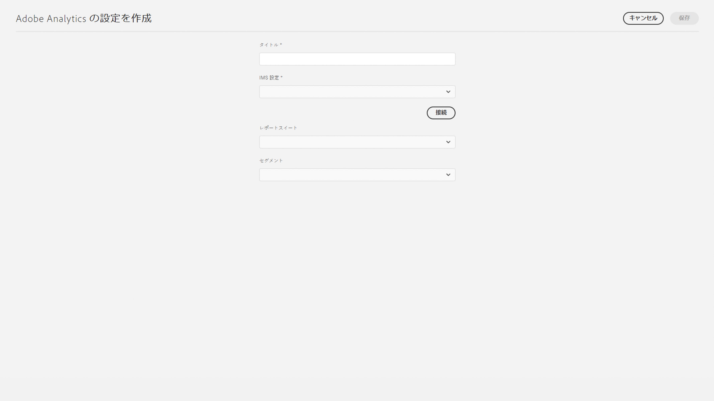

# Adobe Analytics との統合{#integrating-with-adobe-analytics}

Adobe Analytics と AEM as a Cloud Service の統合により、Web ページのアクティビティを追跡できます。統合には次の要件が必要です。

* AEM as a Cloud Service で Analytics 設定を作成するためのタッチ UI を使用できることAdobe AnalyticsをAEM as a Cloud Serviceと統合するには、IMS 認証が必要です。
* [Adobe Launch](#analytics-launch) の拡張機能として Adobe Analytics を追加し、設定できることAdobe Launch について詳しくは、[このページ](https://experienceleague.adobe.com/docs/experience-platform/tags/get-started/quick-start.html?lang=ja)を参照してください。

旧バージョンの AEM と比較して、フレームワークのサポートは、AEM as a Cloud Service の Analytics 設定では提供されません。代わりに、AEM サイトに Analytics 機能（JS ライブラリ）を実装するデファクトツールである Adobe Launch によって実行されます。Adobe Launch では、Adobe Analytics の拡張を設定できるプロパティが作成され、Adobe Analytics にデータを送信するルールが作成されます。Adobe Launch は、SiteCatalyst が提供する解析のタスクに代わるものです。

>[!NOTE]
>
>既存の Analytics アカウントを持たない Adobe Experience Manager as a Cloud Service ユーザーは、Experience Cloud 用の Analytics Foundation パックへのアクセスをリクエストできます。この Foundation パックでは、Analytics の使用量が制限されます。

## Adobe Analytics 設定の作成 {#analytics-configuration}

1. **ツール**／**クラウドサービス**&#x200B;に移動します。
2. 「**Adobe Analytics**」を選択します。
   
3. 「**作成**」ボタンを選択します。
4. 詳細（以下を参照）を入力し、「**接続**」をクリックします。

### 設定パラメーター {#configuration-parameters}

設定ウィンドウに表示されるフィールドを次に示します。

| プロパティ | 説明 |
|---|---|
| タイトル | 設定名 |
| IMS 設定 | IMS 設定を選択します（以下の章を参照）。 |
| セグメント | 現在のレポートスイートで定義されている Analytics セグメントを使用するオプション。Analytics レポートは、セグメントに基づいてフィルタリングされます。詳細は、[このページ](https://experienceleague.adobe.com/docs/analytics/components/segmentation/seg-overview.html?lang=ja)を参照してください。 |
| レポートスイート | データを送信し、レポートを取り込むリポジトリー。レポートスイートでは、選択した Web サイト、Web サイト群、または Web サイトページのサブセットに関する完全な独立したレポートが定義されます。単一のレポートスイートから取得したレポートを表示し、必要に応じて、いつでも設定でこのフィールドを編集できます。 |

### Adobe Analyticsと IMS 認証 {#configuration-parameters-ims}

Adobe AnalyticsをAEM as a Cloud Serviceと適切に統合するには、IMS 設定が必要です。 この設定を作成する必要があります。詳しくは、こちらを参照してください。 [ページ](/help/sites-cloud/integrating/integration-adobe-analytics-ims.md) を参照してください。

### サイトへの設定の追加 {#add-configuration}

タッチ操作対応 UI 設定をサイトに適用するには、**サイト**&#x200B;に移動して、**任意のサイトページを選択**&#x200B;し、**プロパティ**／**詳細**／**設定**&#x200B;で、設定するテナントを選択します。

## Adobe Launch を使用した AEM Sites と Adobe Analytics の統合 {#analytics-launch}

Adobe Analytics は、Launch プロパティで拡張機能として追加できます。マッピングの実行と、Adobe Analytics に対して POST 呼び出しを行うルールを定義できます。

* 基本的なサイトに対して Analytics の拡張機能を Launch で設定する方法については、[このビデオ](https://experienceleague.adobe.com/docs/analytics-learn/tutorials/implementation/via-adobe-launch/basic-configuration-of-the-analytics-launch-extension.html?lang=ja)をご覧ください。

* ルールを作成して Adobe Analytics にデータを送信する方法の詳細については、[このページ](https://experienceleague.adobe.com/docs/core-services-learn/implementing-in-websites-with-launch/implement-solutions/analytics.html?lang=ja)を参照してください。

>[!NOTE]
>
>Launch の IMS 設定（技術アカウント）は、AEM as a Cloud Service に事前に設定されています。この設定を作成する必要はありません。

>[!NOTE]
>
>既存の（レガシー）フレームワークは引き続き機能しますが、タッチ操作対応 UI では設定できません。Launch で変数マッピング設定を再構築することをお勧めします。
