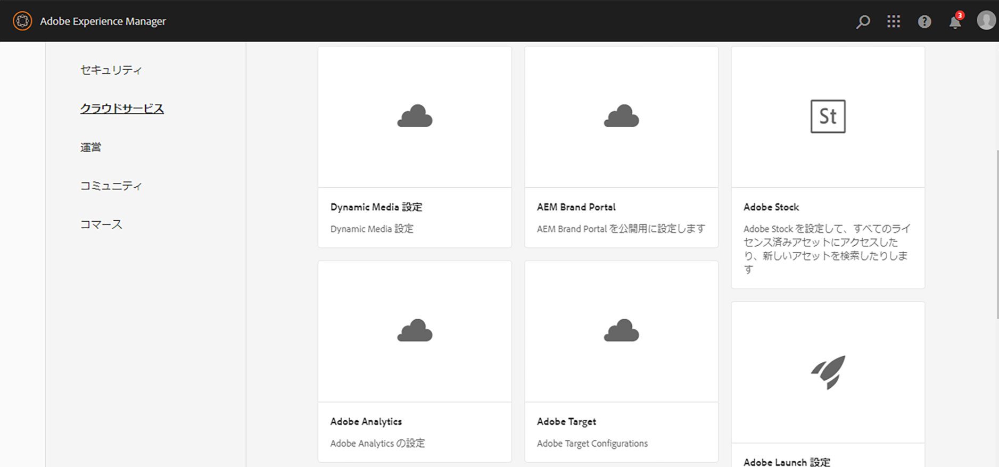
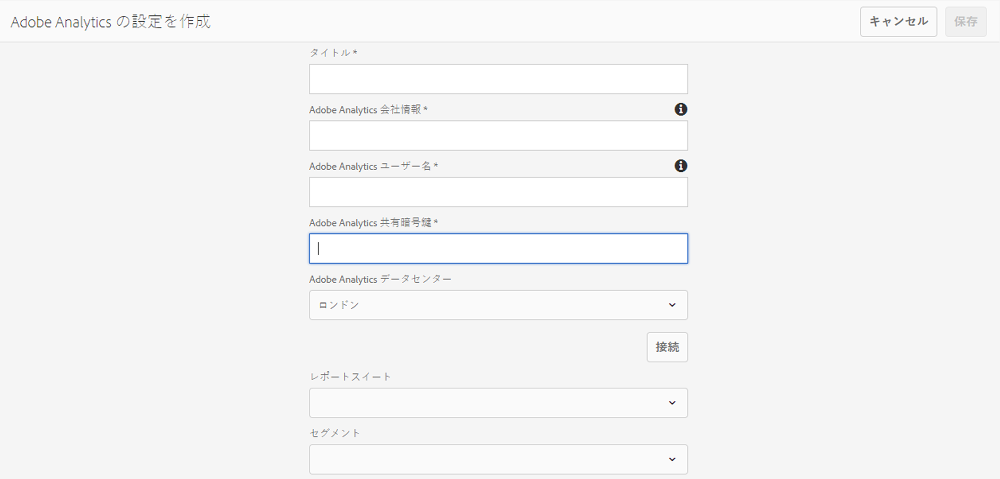

# Adobe Analytics との統合{#integrating-with-adobe-analytics}

Adobe AnalyticsとAEMをCloud Serviceとして統合すると、Webページのアクティビティを追跡できます。 統合には次の要件が必要です。

* タッチUIを使用したAEMでのCloud ServiceとしてのAnalytics設定の作成
* 「 [Adobeの起動」の拡張機能としてAdobe Analyticsを追加し、設定する方法について説明します](#analytics-launch)。 Adobeの起動について詳しくは、 [このページを参照してください](https://docs.adobe.com/content/help/en/launch/using/intro/get-started/quick-start.html)。

旧バージョンのAEMと比較して、フレームワークのサポートは、AEMのAnalytics設定でCloud Serviceとして提供されていません。 代わりに、現在は、AEMサイトにAnalytics機能（JSライブラリ）を実装するデファクトツールである、Adobeの起動を通じて実行されます。 Adobeの起動では、Adobe Analyticsの拡張を設定できるプロパティが作成され、Adobe Analyticsにデータを送信するルールが作成されます。 Adobeの開始は、sitecatalystが提供する解析のタスクに代わるものです。

>[!NOTE]
>
>既存の Analytics アカウントを持たない Adobe Experience Manager as a Cloud Service ユーザーは、Experience Cloud 用の Analytics Foundation パックへのアクセスをリクエストできます。この Foundation パックでは、Analytics の使用量が制限されます。

## Adobe Analytics設定の作成 {#analytics-configuration}

1. Navigate to **Tools** → **Cloud Services**.
2. Select **Adobe Analytics**.
   
3. Select the **Create** button.
4. 詳細（以下を参照）を入力し、「 **接続**」をクリックします。

### Configuration Parameters {#configuration-parameters}

「Adobe Analytics設定」(Configuration)ウィンドウの設定フィールドは次のとおりです。

| プロパティ | 説明 |
|---|---|
| 会社 | Adobe Analyticsログイン会社 |
| ユーザー名 | Adobe AnalyticsAPIユーザ |
| パスワード | 認証に使用されるAdobe Analyticsパスワード |
| データセンター | アカウントが関連付けられているAdobe Analyticsデータセンター（ロンドンのサンノゼなどのサーバ） |
| セグメント | 現在のレポートスイートで定義されているAnalyticsセグメントを使用するオプション。 Analyticsレポートは、セグメントに基づいてフィルタリングされます。 詳細は [このページ](https://docs.adobe.com/content/help/en/analytics/components/segmentation/seg-overview.html) を参照してください。 |
| レポートスイート | データを送信し、レポートを取り込むリポジトリ。 レポートスイートでは、選択したWebサイト、Webサイト群、またはWebサイトページのサブセットに関する完全な独立したレポートが定義されます。 単一のレポートスイートから取得したレポートを表示し、必要に応じていつでも設定でこのフィールドを編集できます。 |

### サイトへの設定の追加 {#add-configuration}

タッチ操作対応UI設定をサイトに適用するには、次のページに移動します。 **サイト** →任意のサイトページを選択 **→** プロパティ **→詳細→設定→設定→設定********** テナントを選択します。

## Adobe発表を使用して、AEMサイトにAdobe Analyticsを統合する {#analytics-launch}

Adobe Analyticsは、起動プロパティで拡張機能として追加できます。 マッピングを実行し、Adobe Analyticsに対して次のような後続呼び出しを行うルールを定義できます。

* 基本的なサイト [に対してAnalyticsの拡張機能を「起動」で設定する方法については](https://docs.adobe.com/content/help/en/analytics-learn/tutorials/implementation/via-adobe-launch/basic-configuration-of-the-analytics-launch-extension.html) 、このビデオをご覧ください。

* ルールを作成してAdobe Analyticsにデータを送信する方法の詳細については、 [このページを参照してください](https://docs.adobe.com/content/help/en/core-services-learn/implementing-in-websites-with-launch/implement-solutions/analytics.html) 。

>[!NOTE]
>
>既存の（レガシー）フレームワークは引き続き機能しますが、タッチ操作対応UIでは設定できません。 「起動」で変数マッピング設定を再構築することをお勧めします。

>[!NOTE]
>
>Launch の IMS 設定（技術アカウント）は、AEM as a Cloud Service に事前に設定されています。ユーザーはこの設定を作成する必要はありません。
