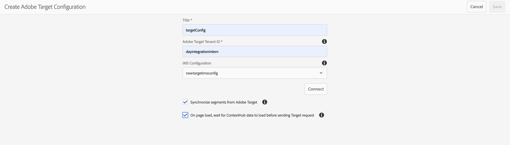

# Adobe Target との統合{#integrating-with-adobe-target}

Adobe Marketing Cloud に含まれている Adobe Target を使用すると、あらゆるチャネルにわたってターゲット設定と測定をおこない、コンテンツの関連性を高めることができます。Adobe TargetとAEMをCloud Serviceとして統合するには、次の作業が必要です。

* タッチUIを使用して、AEMでCloud ServiceとしてAnalytics設定を作成する（IMS設定が必要）。
* 「 [Adobeの起動」の拡張機能としてAdobe Analyticsを追加し、設定する方法について説明します](https://docs.adobe.com/content/help/en/launch/using/intro/get-started/quick-start.html)。

Adobeの起動は、AEMページ（JSライブラリ/タグ）のAnalyticsとTargetの両方のクライアント側プロパティを管理するために必要です。 ただし、「エクスペリエンスのターゲット設定」には、Launchとの統合が必要です。 エクスペリエンスフラグメントをTargetに書き出す場合は、Adobe Target設定とIMSのみが必要です。

>[!NOTE]
>
>既存の Target アカウントを持たない Adobe Experience Manager as a Cloud Service ユーザーは、Experience Cloud 用の Target Foundation パックへのアクセスをリクエストできます。この Foundation パックでは、Target の使用量が制限されます。

## Adobe Target設定の作成 {#create-configuration}

1. Navigate to **Tools** → **Cloud Services**.
   
2. 「 **Adobe Target**」を選択します。
3. Select the **Create** button.
   
4. 詳細（以下を参照）を入力し、「 **接続**」を選択します。
   

### IMS 設定

TargetをAEMおよびLaunchと適切に統合するには、起動とTargetの両方のIMS設定が必要です。 LaunchのIMS設定はAEMでCloud Serviceとして事前に設定されていますが、TargetIMS設定は、Targetのプロビジョニング後に作成する必要があります。 Target [IMS設定の作成方法については、](https://helpx.adobe.com/experience-manager/kt/sites/using/aem-sites-target-standard-technical-video-understand.html) このビデオ  、およびこのページを参照してください。

### Target設定の編集 {#edit-target-configuration}

Target設定を編集するには、次の手順に従います。

1. 既存の設定を選択し、「 **プロパティ**」をクリックします。
2. プロパティを編集します。
3. Select **Re-connect to Adobe Target**.
   
4. 「**保存して閉じる**」を選択します。

### サイトへの設定の追加 {#add-configuration}

タッチ操作対応UI設定をサイトに適用するには、次のページに移動します。 **サイト** →任意のサイトページを選択 **→** プロパティ **→詳細→設定→設定→設定********** テナントを選択します。

## Adobe起動を使用したAEMサイトのAdobe Targetの統合 {#integrate-target-launch}

AEMオファーは、Experience Platform Launchとの初期設定の統合を行います。 Experience Platform LaunchにAdobe Target拡張子を追加することで、AEM WebページのAdobe Targetの機能を使用できます。Targetライブラリは、「起動」を使用した場合にのみレンダリングされます。

>[!NOTE]
>
>既存の（レガシー）フレームワークは引き続き機能しますが、タッチ操作対応UIでは設定できません。 「起動」で変数マッピング設定を再構築することをお勧めします。

一般的な概要として、統合手順は次のとおりです。

1. 起動プロパティの作成
2. 必要追加な拡張子
3. データ要素の作成（コンテキストハブのパラメーターを取り込むため）
4. ページルールの作成
5. 構築と公開

### Creating a Launch Property {#create-property}

プロパティは、拡張子、ルール、データ要素が入力されるコンテナです。

1. 「 **新規プロパティ** 」ボタンを選択します。
2. プロパティの名前を指定します。
3. ドメインに応じて、起動ライブラリを読み込むIP/ホストを入力します。
4. Select the **Save** button.
   

### 必要な拡張子の追加 {#add-extension}

**拡張機能** は、コアライブラリ設定を管理するコンテナです。 Adobe Target拡張機能は、最新のWeb用のTargetJavaScript SDKを使用したat.jsによるクライアント側実装をサポートします。 **Adobe Targetと** AdobeのContextHub **** 拡張を追加する必要があります。

1. 「拡張機能カタログ」オプションを選択し、フィルターでTargetを検索します。
2. 「 **Adobe Target** at.js」を選択し、「インストール」オプションをクリックします。
   
3. Select the **Configure** button. 設定ウィンドウに、読み込まれたTargetアカウントの資格情報と、この拡張のat.jsバージョンが表示されます。
4. 「 **保存** 」を選択して、ターゲット式を起動プロパティに追加します。 「 **インストール済みの拡張機能** 」リストの下にターゲット式が表示されます。
   
5. 上記の手順を繰り返して、 **AdobeContextHub** 拡張機能を検索してインストールします（これは、どのターゲット設定に基づいてcontexthubパラメーターとの統合に必要です）。

### データ要素の作成 {#data-element}

**データ要素** は、コンテキストハブパラメーターをマップできるプレースホルダーです。

1. 「 **データ要素**」を選択します。
2. 「 **追加データ要素**」を選択します。
3. データ要素の名前を指定し、コンテキストハブパラメーターにマップします。
4. select **Save**.
   

### ページルールの作成 {#page-rule}

ル **ール** (Rule)では、サイトで実行される一連のアクションを定義し、順序を付けて、ターゲティングを達成します。

1. スクリ追加ーンショットに示す一連のアクション。
   
2. 「す追加べてのmboxに対するパラメーター」で、前に設定したデータ要素（前述のデータ要素を参照）を、mbox呼び出しで送信されるパラメーターに追加します。
   

### 構築と公開 {#build-publish}

構築と公開の方法については、この [ページを参照してください](https://docs.adobe.com/content/help/en/experience-manager-learn/aem-target-tutorial/aem-target-implementation/using-launch-adobe-io.html)。

## クラシックUIとタッチUIの設定の間のコンテンツ構造の変更 {#changes-content-structure}

| **変更点** | **クラシックUIの設定** | **タッチ操作対応UIの設定** | **結果** |
|---|---|---|---|
| Target設定の場所。 | /etc/cloudservices/testandtarget/ | /conf/tenant/settings/cloudservices/ターゲット | 以前は、/etc/cloudservices/testandtargetの下に複数の設定が存在していましたが、現在は1つの設定がテナントの下に存在します。 |

>[!NOTE]
>
>既存のお客様は、既存の設定を引き続きサポートします（新しい設定を編集または作成するオプションはありません）。 既存の設定は、VSTSを使用して顧客がアップロードしたコンテンツパッケージの一部です。
