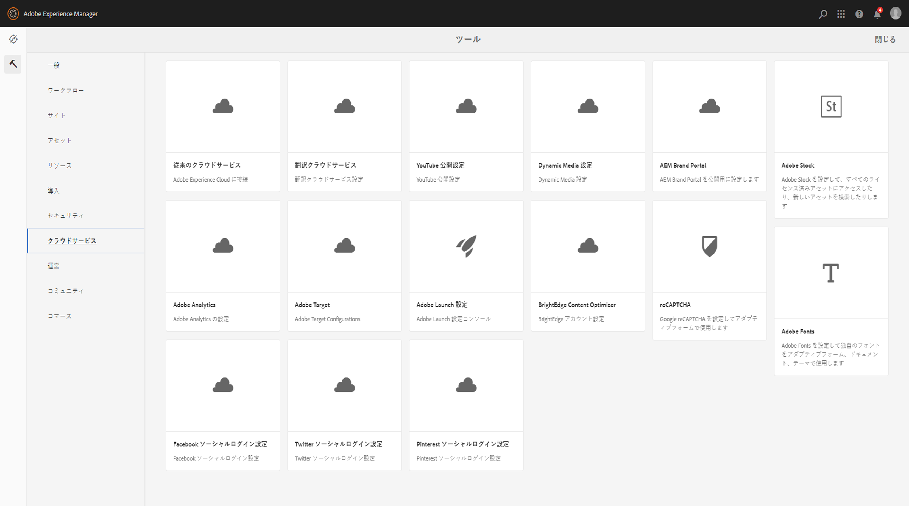
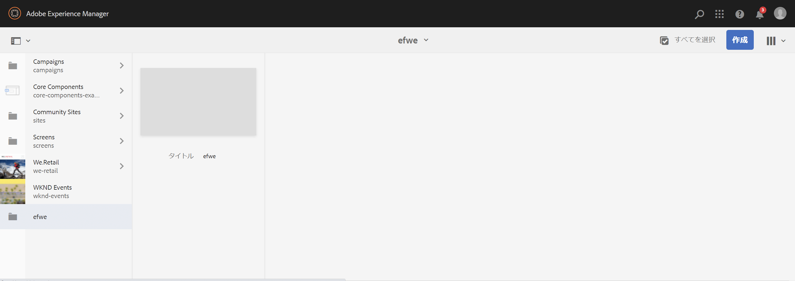
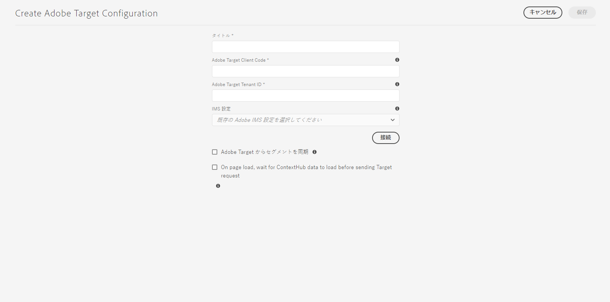
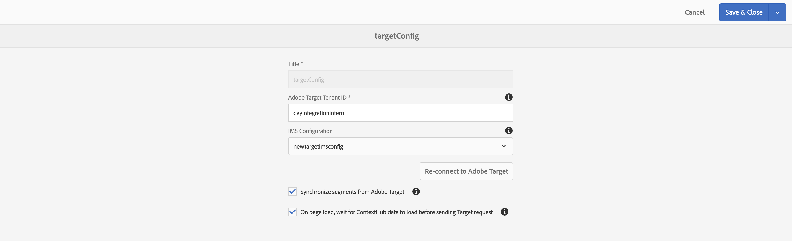
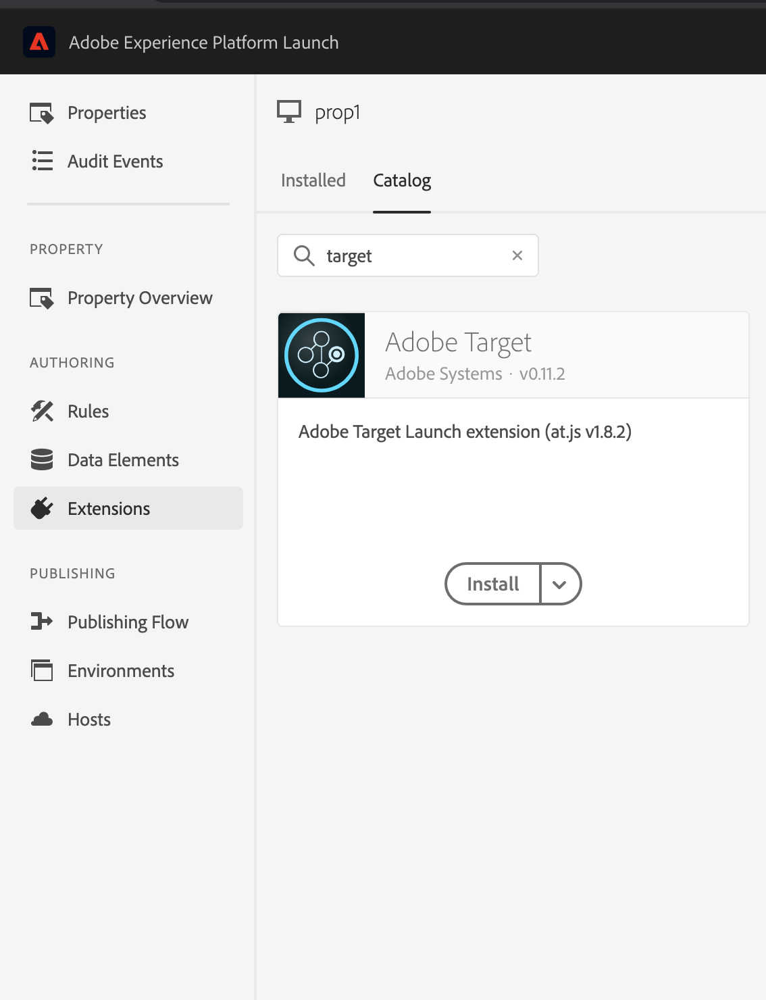
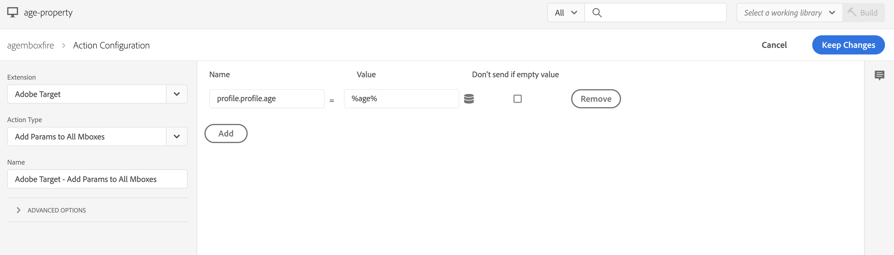

# Adobe Target との統合{#integrating-with-adobe-target}

Adobe Experience Cloud に含まれている Adobe Target を使用すると、あらゆるチャネルでターゲット設定と測定をおこない、コンテンツの関連性を高めることができます。Adobe Target と AEM as a Cloud Service の統合には、次のものが必要です。

* タッチ操作対応 UI を使用して、AEM as a Cloud Service で Target 設定を作成します（IMS 設定が必要）。
* [Adobe Launch](https://docs.adobe.com/content/help/ja-JP/launch/using/intro/get-started/quick-start.html) の拡張機能として Adobe Target を追加し、設定する方法について説明します。

Adobe Launch は、AEM ページの Analytics と Target（JS ライブラリ／タグ）の両方のクライアントサイドプロパティを管理するために必要です。ただし、「エクスペリエンスのターゲット設定」には、Launch との統合が必要です。エクスペリエンスフラグメントを Target にエクスポートする場合は、Adobe Target 設定と IMS のみが必要です。

>[!NOTE]
>
>既存の Target アカウントを持たない Adobe Experience Manager as a Cloud Service ユーザーは、Experience Cloud 用の Target Foundation パックへのアクセスをリクエストできます。この Foundation パックでは、Target の使用量が制限されます。

## Adobe Target 設定の作成 {#create-configuration}

1. **ツール**／**クラウドサービス**に移動します。
   
2. 「**Adobe Target**」を選択します。
3. 「**作成**」ボタンを選択します。
   
4. 詳細（以下を参照）を入力し、「**接続**」を選択します。
   

### IMS 設定

Target を AEM および Launch と適切に統合するには、Launch と Target の両方の IMS 設定が必要です。Launch の IMS 設定は AEM as a Cloud Service で事前に設定されていますが、Target の IMS 設定は、Target のプロビジョニング後に作成する必要があります。Target IMS 設定の作成方法については、 [このビデオ](https://helpx.adobe.com/experience-manager/kt/sites/using/aem-sites-target-standard-technical-video-understand.html)および[このページ](https://docs.adobe.com/content/help/ja-JP/experience-manager-65/administering/integration/integration-ims-adobe-io.translate.html)を参照してください。

### Target 設定の編集 {#edit-target-configuration}

Target 設定を編集するには、次の手順に従います。

1. 既存の設定を選択し、「**プロパティ**」をクリックします。
2. プロパティを編集します。
3. 「**Adobe Target に再接続**」を選択します。
   
4. 「**保存して閉じる**」を選択します。

### サイトへの設定の追加 {#add-configuration}

タッチ操作対応 UI 設定をサイトに適用するには、**サイト**&#x200B;に移動して、**任意のサイトページを選択し、****プロパティ**／**詳細**／**設定**&#x200B;で、選設定テナントを選択します。

## Adobe Launch を使用して、AEM サイトに Adobe Target を統合する {#integrate-target-launch}

AEM は、Experience Platform Launch との標準の統合を提供します。Experience Platform Launch に Adobe Target 拡張機能を追加することで、AEM Web ページ上で Adobe Target の機能を使用できます。Target ライブラリは、Launch を使用した場合にのみレンダリングされます。

>[!NOTE]
>
>既存の（レガシー）フレームワークは引き続き機能しますが、タッチ操作対応 UI では設定できません。Launch で変数マッピング設定を再構築することをお勧めします。

一般的な概要として、統合手順は次のとおりです。

1. Launch プロパティの作成
2. 必要な拡張機能の追加
3. データ要素の作成（コンテキストハブのパラメーターを取り込むため）
4. ページルールの作成
5. ビルドとパブリッシュ

### Launch プロパティの作成 {#create-property}

プロパティは、拡張機能、ルール、データ要素が入力されるコンテナです。

1. 「**新規プロパティ**」ボタンを選択します。
2. プロパティの名前を指定します。
3. ドメインに応じて、Launch ライブラリを読み込む IP／ホストを入力します。
4. 「**保存**」ボタンを選択します。
   

### 必要な拡張機能の追加 {#add-extension}

**拡張機能**&#x200B;は、コアライブラリ設定を管理するコンテナです。Adobe Target 拡張機能は at.js（最新の Web 用 Target JavaScript SDK）によるクライアントサイド実装をサポートしています。**Adobe Target** と **Adobe ContextHub** の両方の拡張機能を追加する必要があります。

1. 「拡張機能カタログ」オプションを選択し、フィルターで Target を検索します。
2. 「**Adobe Target** at.js」を選択し、「インストール」オプションをクリックします。
   
3. 「**設定**」ボタンを選択します。設定ウィンドウに、読み込まれた Target アカウントの資格情報と、この拡張機能の at.js バージョンが表示されます。
4. 「**保存**」を選択して、Target 拡張機能を Launch プロパティに追加します。「**インストール済みの拡張機能**」リストの下に Target 拡張機能が表示されます。
   
5. 上記の手順を繰り返して、**Adobe ContextHub** 拡張機能を検索してインストールします（これは、どのターゲットが設定されるかに基づいて contexthub パラメーターとの統合に必要です）。

### データ要素の作成 {#data-element}

**データ要素**&#x200B;は、コンテキストハブパラメーターをマッピングできるプレースホルダーです。

1. 「**データ要素**」を選択します。
2. 「**データ要素を追加**」を選択します。
3. データ要素の名前を指定し、コンテキストハブパラメーターにマッピングします。
4. 「**保存**」を選択します。
   

### ページルールの作成 {#page-rule}

**ルール**&#x200B;では、ターゲット設定を達成するために、一連のアクション（サイトで実行される）を定義し、順序を決めます。

1. スクリーンショットに示されたように、一連のアクションを追加します。
   
2. 「すべての mbox にパラメーターを追加」で、前に設定したデータ要素（前述のデータ要素を参照）を、mbox 呼び出しで送信されるパラメーターに追加します。
   

### ビルドとパブリッシュ {#build-publish}

ビルドとパブリッシュの方法については、この[ページ](https://docs.adobe.com/content/help/ja-JP/experience-manager-learn/aem-target-tutorial/aem-target-implementation/using-launch-adobe-io.html)を参照してください。

## Classic とタッチ操作対応 UI の設定の間のコンテンツ構造の変更 {#changes-content-structure}

| **変更点** | **クラシック UI の設定** | **タッチ操作対応 UI の設定** | **結果** |
|---|---|---|---|
| ターゲット設定の場所。 | /etc/cloudservices/testandtarget/ | /conf/tenant/settings/cloudservices/target | 以前は、/etc/cloudservices/testandtarget 内に複数の設定が存在していましたが、現在は 1 つの設定がテナントの下に存在します。 |

>[!NOTE]
>
>既存顧客のレガシー設定は引き続きサポートされます（編集オプション新規作成オプションはありません）。レガシー設定は、VSTS を使用して顧客がアップロードしたコンテンツパッケージの一部です。
