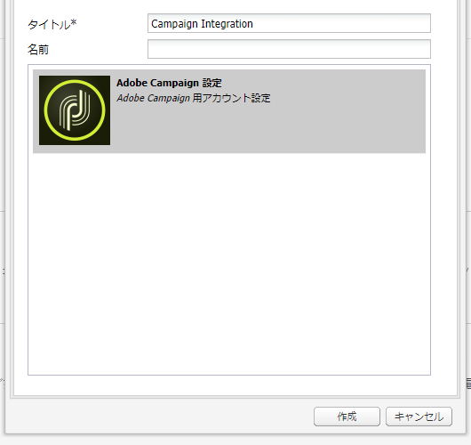
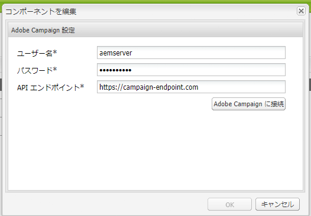

# Adobe Campaign Classic との統合 {#integrating-campaign-classic}

AEM as a Cloud ServiceをAdobe Campaignと統合すると、E メール配信、コンテンツ、フォームをAEM as a Cloud Serviceで直接管理できます。 ソリューション間の双方向通信を可能にするには、Adobe Campaign ClassicとAEMの両方のas a Cloud Serviceでの設定手順が必要です。

この統合により、AEM as a Cloud ServiceとAdobe Campaign Classicを個別に使用できます。 マーケターはAdobe Campaignでキャンペーンを作成し、ターゲティングを使用できますが、コンテンツ作成者は同時にAEM as a Cloud Serviceのコンテンツデザインを操作できます。 この統合により、AEMのキャンペーンのコンテンツとデザインを、Campaign がターゲットにして配信できるようになります。

## 統合手順 {#integration-steps}

AEMと Campaign の統合には、両方のソリューションで多数の手順が必要です。

1. [Campaign にAEM統合パッケージをインストールします。](#install-package)
1. [Campaign でのAEMのオペレーターの作成](#create-operator)
1. [AEMでの Campaign 統合の設定](#campaign-integration)
1. [AEM Externalizer を設定します。](#externalizer)
1. [AEMでの campaign-remote ユーザーの設定](#configure-user)
1. [Campaign でのAEM外部アカウントの設定](#acc-setup)

このドキュメントでは、これらの各手順の詳細を説明します

## 前提条件 {#prerequisites}

* Adobe Campaign Classicへの管理者アクセス
   * 統合を実行するには、設定済みのデータベースを含む、動作中のAdobe Campaign Classicインスタンスが必要です。
   * Adobe Campaign Classicのセットアップおよび設定方法について詳しくは、 [Adobe Campaign Classicのドキュメント](https://experienceleague.adobe.com/docs/campaign-classic/using/campaign-classic-home.html) 特に、『インストールと設定』ガイド。

* AEM as a Cloud Serviceへの管理者アクセス

## Campaign でのAEM統合パッケージのインストール {#install-package}

この **AEM統合** Adobe Campaignのパッケージには、AEMへの接続に必要な多数の標準設定が含まれています。

1. 管理者は、クライアントコンソールを使用してAdobe Campaignインスタンスにログインします。

1. **ツール**／**詳細**／**パッケージをインポート...**&#x200B;を選択します。

   

1. クリック **標準パッケージのインストール** 次に、 **次へ**.

1. 次を確認します。 **AEM統合** パッケージ。

   

1. クリック **次へ**、 **開始** をクリックして、インストールを開始します。

   

1. クリック **閉じる** インストールが完了したら、

これで、統合パッケージがインストールされました。

## Campaign でのAEM用オペレーターの作成 {#create-operator}

統合パッケージによって `aemserver` AEMがAdobe Campaignに接続する際に使用する演算子。 このオペレーターのセキュリティゾーンを定義し、そのパスワードを設定する必要があります。

1. クライアントコンソールを使用して、Adobe Campaignに管理者としてログインします。

1. 選択 **ツール** -> **エクスプローラ** をクリックします。

1. エクスプローラーで、 **管理** > **アクセス管理** > **演算子** ノード。

1. を選択します。 `aemserver` 演算子

1. の **編集** 」タブで、 **アクセス権** サブタブで **アクセスパラメーターを編集…** リンク。

   

1. 適切なセキュリティゾーンを選択し、必要に応じて信頼済み IP マスクを定義します。

1. 「**保存**」をクリックします。

1. Adobe Campaignクライアントからログアウトします。

1. Adobe Campaignサーバーのファイルシステムで、Campaign のインストール場所に移動し、 `serverConf.xml` ファイルを管理者として保存します。 このファイルは、通常、次の場所にあります。
   * `C:\Program Files\Adobe\Adobe Campaign Classic v7\conf` （Windows の場合）
   * `/usr/local/neolane/nl6/conf/eng` （Linux の場合）

1. を検索 `securityZone` AEMオペレーターのセキュリティゾーンで、次のパラメーターが設定されていることを確認してください。

   * `allowHTTP="true"`
   * `sessionTokenOnly="true"`
   * `allowUserPassword="true"`

1.  ファイルを保存します。

1. セキュリティゾーンが `config-<server name>.xml` ファイル。

   * 構成ファイルに別のセキュリティゾーン設定が含まれている場合は、 `allowUserPassword` 属性 `true`.

1. Adobe Campaign Classicサーバーポートを変更する場合は、 `8080` 目的のポートに置き換えます。

>[!CAUTION]
>
>デフォルトでは、オペレーターのセキュリティゾーンは設定されていません。 AEMがAdobe Campaignに接続するには、前の手順で説明したようにゾーンを選択する必要があります。
>
>Adobeでは、セキュリティ上の問題を回避するために、AEM専用のセキュリティゾーンを作成することを強くお勧めします。 このトピックについて詳しくは、 [Adobe Campaign Classicドキュメント。](https://experienceleague.adobe.com/docs/campaign-classic/using/installing-campaign-classic/additional-configurations/security-zones.html)

1. Campaign クライアントで、 `aemserver` 演算子を選択し、 **一般** タブをクリックします。

1. 次をクリック： **パスワードをリセット…** リンク。

1. パスワードを指定し、今後使用するために安全な場所に保存します。

1. クリック **OK** パスワードを `aemserver` 演算子

## AEMでの Campaign 統合の設定 {#campaign-integration}

AEM uses [キャンペーンで既に設定済みのオペレーター](#create-operator) キャンペーンとのコミュニケーションを図るため

1. AEMオーサリングインスタンスに管理者としてログインします。

1. グローバルナビゲーションサイドレールで、「 」を選択します。 **ツール** > **Cloud Services** > **従来のCloud Services** > **Adobe Campaign**&#x200B;を選択し、「 **今すぐ設定**.

   

1. ダイアログで、 **タイトル** をクリックし、 **作成**.

   

1. 設定を編集するための新しいウィンドウとダイアログが開きます。 必要な情報を入力します。

   * **ユーザー名**  — これは [前の手順で作成したAdobe Campaign AEM統合パッケージ演算子。](#create-operator) デフォルトでは、 `aemserver`.
   * **パスワード**  — これは、 [前の手順で作成したAdobe Campaign AEM統合パッケージ演算子。](#create-operator)
   * **API エンドポイント**  — これはAdobe Campaignインスタンスの URL です。

   

1. 選択 **Adobe Campaignに接続** 接続を確認し、 **OK**.

AEMはAdobe Campaignと通信できるようになりました。

>[!NOTE]
>
>Adobe Campaignサーバーがインターネット経由で接続できることを確認します。 AEM as a Cloud Serviceはプライベートネットワークにアクセスできません。

## AEM Externalizer の設定 {#externalizer}

Externalizer は、リソースパスを外部および絶対 URL に変換するAEMの OSGi サービスです。この URL は、AEMが Campaign で使用できるコンテンツを提供するために必要です。

1. AEMオーサリングインスタンスに管理者としてログインします。
1. Externalizer 設定でパブリッシュインスタンスを確認します。それには、 [開発者コンソール。](https://experienceleague.adobe.com/docs/experience-manager-learn/cloud-service/debugging/debugging-aem-as-a-cloud-service/developer-console.html#osgi-services)
1. 正しくない場合は、対応するインスタンス Git リポジトリで必要な変更をおこない、 [cloud manager を使用して設定をデプロイします。](/help/implementing/cloud-manager/deploy-code.md)

```text
Service 3310 - [com.day.cq.commons.externalizer] (pid: com.day.cq.commons.impl.externalizerImpl)",
"  from Bundle 420 - Day Communique 5 Commons Library (com.day.cq.cq-commons), version 5.12.16",
"    component.id: 2149",
"    component.name: com.day.cq.commons.impl.externalizerImpl",
"    externalizer.contextpath: ",
"    externalizer.domains: [local https://author-p17558-e33255-cmstg.adobeaemcloud.com, author https://author-p17558-e33255-cmstg.adobeaemcloud.com,
     publish https://publish-p17558-e33255-cmstg.adobeaemcloud.com]",
"    externalizer.encodedpath: false",
"    externalizer.host: ",
"    feature-origins: [com.day.cq:cq-quickstart:slingosgifeature:cq-platform-model_quickstart_author:6.6.0-V23085]",
"    service.bundleid: 420",
"    service.description: Creates absolute URLs",
"    service.scope: bundle",
"    service.vendor: Adobe Systems Incorporated",
```

>[!NOTE]
>
>パブリッシュインスタンスは、Adobe Campaignサーバーから到達可能である必要があります。

## AEMでの campaign-remote ユーザーの設定 {#configure-user}

Campaign がAEMと通信するには、 `campaign-remote` AEMのユーザー。

1. AEM に管理者としてログインします。
1. メインナビゲーションコンソールで、 **ツール** をクリックします。
1. 次に、 **セキュリティ** -> **ユーザー** をクリックして、ユーザー管理コンソールを開きます。
1. を `campaign-remote` ユーザー。
1. を選択します。 `campaign-remote` ユーザーとクリック **プロパティ** をクリックして、ユーザーを編集します。
1. 内 **ユーザー設定の編集** ウィンドウ、クリック **パスワードを変更**.
1. ユーザーの新しいパスワードを入力し、今後の使用のために安全な場所にパスワードをメモします。
1. クリック **保存** をクリックして、パスワードの変更を保存します。
1. クリック **保存して閉じる** 変更を `campaign-remote` ユーザー。

## Campaign でのAEM外部アカウントの設定 {#acc-setup}

条件 [インストール **AEM統合** Campaign にパッケージ化し、](#install-package) AEM用の外部アカウントが作成されます。 この外部アカウントを設定すると、Adobe CampaignはAEM as a Cloud Serviceに接続し、ソリューション間の双方向通信を可能にします。

1. クライアントコンソールを使用して、Adobe Campaignに管理者としてログインします。

1. 選択 **ツール** -> **エクスプローラ** をクリックします。

1. エクスプローラーで、 **管理** > **Platform** > **外部アカウント** ノード。

   

1. 外部AEMアカウントを見つけます。 デフォルトでは、次の値が設定されています。

   * **タイプ** - AEM
   * **ラベル** - AEM Instance
   * **内部名** - aemInstance

1. の **一般** 」タブで、 [キャンペーンリモートユーザーパスワードの設定](#set-campaign-remote-password) 手順

   * **サーバー** - AEMオーサーサーバーのアドレス
      * AEMオーサーサーバーは、Adobe Campaign Classicサーバーインスタンスから到達可能である必要があります。
      * サーバーアドレスが **not** 末尾にスラッシュを付けます。
   * **アカウント**  — デフォルトでは、 `campaign-remote` AEMで [キャンペーンリモートユーザーパスワードの設定](#set-campaign-remote-password) 手順
   * **パスワード**  — このパスワードは `campaign-remote` AEMで [キャンペーンリモートユーザーパスワードの設定](#set-campaign-remote-password) 手順

1. 「**Enabled**」チェックボックスをオンにします。

1. 「**保存**」をクリックします。

Adobe CampaignはAEMと通信できるようになりました。

## 次の手順 {#next-steps}

Adobe Campaign ClassicとAEMの両方がas a Cloud Service設定された状態で、統合が完了しました。

次に進み、Adobe Experience Managerでニュースレターを作成する方法を学ぶことができるようになりました [このドキュメント。](/help/sites-cloud/integrating/creating-newsletter.md)
