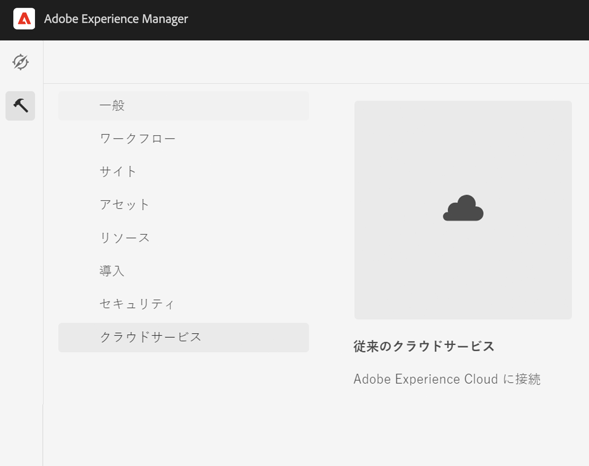
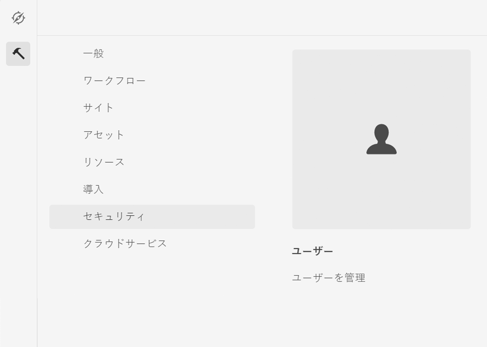

# Adobe Campaign Classic との統合 {#integrating-campaign-classic}

Adobe Campaignとの統合により、E メール配信、コンテンツ、フォームをAEM as a Cloud Serviceで直接管理できます。 ソリューション間の双方向通信を可能にするには、Adobe Campaign ClassicとAEMの両方のas a Cloud Serviceでの設定手順が必要です。

AEM as a Cloud ServiceとAdobe Campaign Classicは別々に使用することもできます。 例えば、Adobe Campaignでキャンペーンを作成してターゲティングを使用し、コンテンツ作成者がAEM as a Cloud Serviceのデザインで作業できるようにします。

## 統合ワークフロー {#integration-workflow}

次の章では、ソリューションの統合方法について詳しく説明します。 これには、Adobe Campaign ClassicとAEM as a Cloud Serviceの両方の設定手順が必要です。 そのため、次の方法を学習します。

* [オペレーターユーザーの作成](#create-operator)
* [統合用のAEMas a Cloud Serviceの設定](#aem-configuration)
* [キャンペーンリモートユーザーの設定](#configure-user)
* [Adobe Campaign Classic外部アカウントのセットアップ](#acc-setup)

### 前提条件 {#prerequisites}

**Adobe Campaign Classic**

統合を実行するには、データベースを含む、動作中のAdobe Campaign Classicインスタンスが必要です。 Adobe Campaign Classicのセットアップおよび設定方法に関する詳細が必要な場合は、 [Adobe Campaign Classicドキュメント](https://experienceleague.adobe.com/docs/campaign-classic/using/campaign-classic-home.html) 特に、『インストールと設定』ガイド。 以下に示す操作を実行するには、管理者の役割も必要です。

**AEM as a Cloud Service**

必要な [AEMas a Cloud Service](https://experienceleague.adobe.com/docs/experience-manager-cloud-service/content/overview/introduction.html) 解決策

### Adobe Campaign Classicでのオペレーターユーザーの作成 {#create-operator}

スタートメニューからAdobe Campaign Classicクライアントコンソールを開き、ログインします。 ホームページが表示されます。

1. クリック **エクスプローラ** をクリックして、エクスプローラービューを開きます。
   
1. 左側のツリービューで、に移動します。 **管理/アクセス管理/オペレーター**.
1. をダブルクリックします。 `aemserver` 右側の「演算子」リストにエントリを追加します。
1. 次に切り替え： **編集** タブをクリックします。 aemserver のパスワードを設定します。
   
1. をクリックします。 **アクセス権** 」タブで、 **アクセスパラメーターの編集** リンクをクリックします。
1. 「暗号化」で、許可された接続ゾーンとして「パブリックネットワーク」を選択します。 「**OK**」をクリックします。
   
1. 「**保存**」をクリックします。
1. ログアウト.
1. Adobe Campaign Classic v7 のインストール場所（例： ）に移動します。 `C:\Program Files\Adobe\Adobe Campaign Classic v7\conf` をクリックし、 `serverConf.xml` 管理者として。
   * を検索 **セキュリティゾーン**.
   * 次のパラメーターを設定します。 `allowHTTP="true"` `sessionTokenOnly="true"` `allowUserPassword="true"`.
   *  ファイルを保存します。
1. セキュリティゾーンが `config-<server name>.xml` ファイル (C:\Program Files\Adobe\Adobe Campaign Classic v7\conf\config_acc-test.xml) に書き込みます。
   * 構成ファイルに別のセキュリティゾーン設定が含まれている場合は、 `allowUserPassword` 属性を true に設定します。
1. Adobe Campaign Classicサーバーポートを変更する場合は、8080 を目的のポート ( 例：80)。

>[!NOTE]
>
>デフォルトでは、オペレーターのセキュリティゾーンは設定されていません。 AEM as a Cloud Serviceを使用してAdobe Campaignに接続するには、1 つ選択する必要があります（上記の手順を参照）。 セキュリティ上の問題を回避するために、AEM専用のセキュリティゾーンを作成することを強くお勧めします。

### AEM as a Cloud Service の設定 {#aem-configuration}

1. Cloud Manager にログインし、AEM as a Cloud Serviceオーサーインスタンスを起動します。
1. に移動します。 **ツール→Cloud Service→レガシーCloud Service**.
   
1. 下にスクロールしてAdobe Campaignに移動し、 **今すぐ設定** リンク。
   * タイトルを入力します。
   * 名前を入力します。
   * 「**作成**」をクリックします。
1. コンポーネントを編集画面で、
   * ユーザー名を入力します。 [オペレーターユーザーの作成](#create-operator).
   * パスワードを入力します。
   * Adobe Campaign Classicサーバー API エンドポイント（例： ）を入力します。 `http://3.22625.51:80`) をクリックします。
   * 「**Adobe Campaign に接続**」をクリックします。
   * 「**OK**」をクリックします。

   >[!NOTE]
   >
   >AEM as a Cloud Serviceがプライベートネットワークに到達できないので、Adobe Campaignサーバーがインターネット上で到達可能であることを確認してください。
1. Link Externalizer の設定でパブリッシュインスタンスを確認してください。
この設定を表示するには、 [開発者コンソール](https://experienceleague.adobe.com/docs/experience-manager-learn/cloud-service/debugging/debugging-aem-as-a-cloud-service/developer-console.html#osgi-services).
正しくない場合は、対応するインスタンス Git リポジトリで変更を加え、 [cloud manager](https://experienceleague.adobe.com/docs/experience-manager-cloud-service/content/implementing/using-cloud-manager/deploy-code.html).

```
Service 3310 - [com.day.cq.commons.Externalizer] (pid: com.day.cq.commons.impl.ExternalizerImpl)",
"  from Bundle 420 - Day Communique 5 Commons Library (com.day.cq.cq-commons), version 5.12.16",
"    component.id: 2149",
"    component.name: com.day.cq.commons.impl.ExternalizerImpl",
"    externalizer.contextpath: ",
"    externalizer.domains: [local https://author-p17558-e33255-cmstg.adobeaemcloud.com, author https://author-p17558-e33255-cmstg.adobeaemcloud.com,
     publish https://publish-p17558-e33255-cmstg.adobeaemcloud.com]",
"    externalizer.encodedpath: false",
"    externalizer.host: ",
"    feature-origins: [com.day.cq:cq-quickstart:slingosgifeature:cq-platform-model_quickstart_author:6.6.0-V23085]",
"    service.bundleid: 420",
"    service.description: Creates absolute URLs",
"    service.scope: bundle",
"    service.vendor: Adobe Systems Incorporated",
```

>[!NOTE]
>
>また、パブリッシュインスタンスは、Adobe Campaignサーバーから到達可能である必要があります。

### Adobe Campaign Remote User の設定 {#configure-user}

campaign-remote ユーザーのパスワードを設定する必要があります。 Adobe Campaign ClassicをAEM as a Cloud Service と接続するには、次が必要です。

1. に移動します。 **AEM→Tools→Security→Users**.
   
1. を検索します。 `campaign-remote` をクリックします。
1. 「パスワードを変更」をクリックします。
   * 新しいパスワードを 2 回入力します。
   * AEMパスワードを入力します。
   * 「**保存**」をクリックします。

### Adobe Campaign Classic外部アカウントの設定 {#acc-setup}

Adobe Campaign ClassicをAEM as a Cloud Serviceインスタンスに接続するには、外部アカウントも設定する必要があります。

1. クライアントコンソールを使用してAdobe Campaign Classicサーバーにログインします。
1. エクスプローラビューに移動します。
1. 左側のツリービューで、に移動します。 **管理→Platform→外部アカウント**.
1. 右上のリスト表示で、「 AEM instance 」をクリックします。
1. AEMインスタンスの設定
   * 「 AEMas a Cloud Serviceオーサー IP/FQN 」と入力します。例： `https://author-p17558-e33255-cmstg.adobeaemcloud.com`.
   * ユーザーとアカウントを入力します。
   * AEMas a Cloud Serviceインスタンスで設定した campaign-remote ユーザーのパスワードを入力します（上記の手順を参照）。
   * 「**Enabled**」チェックボックスをオンにします。
   * 「**保存**」をクリックします。

   >[!NOTE]
   >
   >AEM オーサーサーバーの IP/FQN は、Adobe Campaign Classicサーバーインスタンスから到達可能である必要があります。 また、AEM オーサーサーバーの IP/FQN にバックスラッシュ文字を追加しないでください。

Adobe Campaign ClassicとAEMの両方をas a Cloud Service的に設定したので、統合は完了です。 また、Adobe Experience Managerニュースレターの作成方法については、 [このページ](/help/sites-cloud/integrating/creating-newsletter.md).
