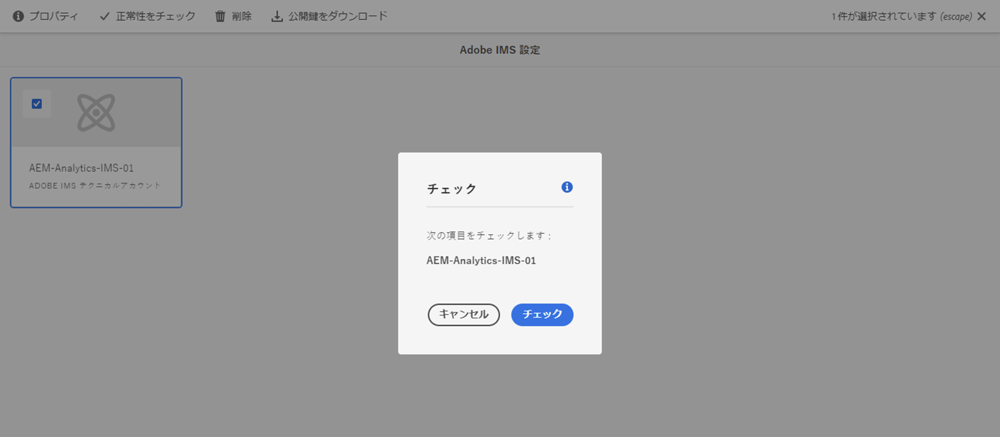

# Adobe Analyticsとの統合時に使用する IMS 設定 {#ims-configuration-for-integration-with-adobe-analytics}

Analytics Standard API を使用してAdobe Experience Manager as a Cloud Service(AEMaCS) とAdobe Analyticsを統合するには、Adobe IMS(Identity Management System) を設定する必要があります。 この設定は、Adobe Developerコンソールで実現されます。

>[!NOTE]
>
>AEMaaCS 2022.2.0 で、Adobe Analytics Standard API 2.0 のサポートが新しく追加されました。このバージョンの API は、IMS 認証をサポートしています。
>
>API の選択は、AEM/Analytics 統合に使用される認証方法によって実行されます。
>
>詳しくは、 [2.0 API への移行](https://developer.adobe.com/analytics-apis/docs/2.0/guides/migration/).

## 前提条件 {#prerequisites}

この手順を開始する前に、以下を実行します。

* [アドビサポート](https://helpx.adobe.com/jp/contact/enterprise-support.ec.html)は、次のアカウントをプロビジョニングする必要があります。

   * アドビコンソール
   * Adobe 開発者コンソール
   * Adobe Analyticsと
   * Adobe IMS（Identity Management System）

* 組織のシステム管理者は、Admin Consoleを使用して、組織内の必要な開発者を関連する製品プロファイルに追加する必要があります。

   * これにより、特定の開発者に、 Adobe Developerコンソールを使用した統合を有効にする権限を付与できます。
   * 詳しくは、[開発者の管理](https://helpx.adobe.com/jp/enterprise/admin-guide.html/enterprise/using/manage-developers.ug.html)を参照してください。

## IMS 設定の指定 - 公開鍵の生成 {#configuring-ims-generating-a-public-key}

設定の最初の段階は、AEMで IMS 設定を作成し、公開鍵を生成することです。

1. AEM で、**ツール**&#x200B;メニューを開きます。
1. **セキュリティ**&#x200B;セクションで、**Adobe IMS 設定**&#x200B;を選択します。
1. **作成**&#x200B;を選択して、**Adobe IMS テクニカルアカウント設定**&#x200B;を開きます。
1. 下のドロップダウンを使用 **クラウド設定**&#x200B;を選択します。 **Adobe Analytics**.
1. **新しい証明書の作成**&#x200B;をアクティブにして、新しいエイリアスを入力します。
1. 「**証明書の作成**」で確認します。

   

1. 選択 **ダウンロード** ( または **公開鍵をダウンロード**) をクリックして、ファイルをローカルドライブにダウンロードし、 [AEMとのAdobe Analytics統合用の IMS の設定](#configuring-ims-adobe-analytics-integration-with-aem).

   >[!CAUTION]
   >
   >この設定は、[AEM で IMS 設定を完了する](#completing-the-ims-configuration-in-aem)ときに再び必要になるため、開いたままにしてください。

   

## AEMとのAdobe Analytics統合用の IMS の設定 {#configuring-ims-adobe-analytics-integration-with-aem}

Adobe開発者コンソールを使用して、Adobe Analyticsでプロジェクト（統合）を作成し (AEMで使用するために )、必要な権限を割り当てる必要があります。

### プロジェクトの作成 {#creating-the-project}

Adobe開発者コンソールを開き、AEMが使用するAdobe Analyticsでプロジェクトを作成します。

1. プロジェクト用のAdobe開発者コンソールを開きます。

   [https://developer.adobe.com/console/projects](https://developer.adobe.com/console/projects)

1. 既に作成したプロジェクトが表示されます。 **新規プロジェクトの作成**&#x200B;を選択 - 場所と使用方法は、以下に依存します。

   * まだプロジェクトがない場合は、 **新規プロジェクトを作成**が中央の下に表示されます。
      
   * 既存のプロジェクトがある場合は、それらがリストされ、 **新規プロジェクトの作成**が右上に表示されます。
      

1. **プロジェクトに追加**&#x200B;を選択し、続いて **API** を選択します。

   

1. 選択 **Adobe Analytics**&#x200B;を、 **次へ**:

   >[!NOTE]
   >
   >Adobe Analyticsを購読しているが、リストに表示されない場合は、 [前提条件](#prerequisites).

   

1. 選択 **サービスアカウント (JWT)** 認証のタイプとして、次に **次へ**:

   

1. **公開鍵**&#x200B;をアップロードして、完了したら&#x200B;**次へ**&#x200B;に進みます。

   

1. 資格情報を確認して、**次へ**&#x200B;に進みます。 

   

1. 必要な製品プロファイルを選択して、**設定済み API を保存**&#x200B;に進みます。 

   

1. 設定が確認されます。

### 統合への権限の割り当て {#assigning-privileges-to-the-integration}

次に、必要な権限を統合に割り当てる必要があります。

1. Adobe **Admin Console** を開きます。

   * [https://adminconsole.adobe.com](https://adminconsole.adobe.com/)

1. に移動します。 **製品** （上部のツールバー）、「 **Adobe Analytics - &lt;*your-tenant-id*>** （左のパネルから）。
1. **製品プロファイル**&#x200B;を選択して、表示されるリストから必要なワークスペースを選択します（例：「デフォルトのワークスペース」）。
1. 選択 **API 資格情報**&#x200B;を選択し、必要な統合設定を選択します。
1. **製品の役割**&#x200B;として、**オブザーバー**&#x200B;の代わりに&#x200B;**編集者**&#x200B;を選択します。

## 開発者コンソール統合プロジェクト用にAdobeされた詳細 {#details-stored-for-the-ims-integration-project}

Adobe開発者コンソール — プロジェクトで、すべての統合プロジェクトのリストを表示できます。

* [https://developer.adobe.com/console/projects](https://developer.adobe.com/console/projects)

特定のプロジェクトエントリを選択して、設定の詳細を表示します。 次のものが含まれます。

* プロジェクトの概要
* Insights
* 資格情報
   * サービスアカウント（JWT）
      * 資格情報の詳細
      * JWT の生成
* API
   * 例： Adobe Analytics

これらの一部は、IMS に基づいてAEMでAdobe Analyticsの統合を完了する必要があります。

## AEM での IMS 設定の完了 {#completing-the-ims-configuration-in-aem}

AEMに戻ると、Analytics 用の IMS 統合から必要な値を追加することで、IMS 設定を完了できます。

1. [AEM で IMS 設定を開く](#configuring-ims-generating-a-public-key)に戻ります。
1. 「**次へ**」を選択します。

1. ここで、 [開発者コンソールでのプロジェクト設定のAdobeの詳細](#details-stored-for-the-ims-integration-project):

   * **タイトル**：テキスト。
   * **認証サーバー**：以下の&#x200B;**ペイロード**&#x200B;セクションの `aud` 行からこれをコピーして貼り付けます。例：以下の例では `https://ims-na1.adobelogin.com`　
   * **API キー**:これを **資格情報** セクション [プロジェクトの概要](#details-stored-for-the-ims-integration-project)
   * **クライアント秘密鍵**:これを [「サービスアカウント (JWT) 」セクションの「クライアントの秘密鍵」タブ](#details-stored-for-the-ims-integration-project)、および
   * **ペイロード**:これを [「サービスアカウント (JWT) 」セクションの「 JWT 」タブを生成](#details-stored-for-the-ims-integration-project)

   

1. 「**作成**」で確認します。

1. Adobe Analyticsの設定がAEMコンソールに表示されます。

   

## IMS 設定の確認 {#confirming-the-ims-configuration}

設定が期待どおりに動作していることを確認するには：

1. 次を開きます。

   * `https://localhost<port>/libs/cq/adobeims-configuration/content/configurations.html`

   次に例を示します。

   * `https://localhost:4502/libs/cq/adobeims-configuration/content/configurations.html`

1. 設定を選択します。
1. ツールバーから&#x200B;**ヘルスチェック**&#x200B;を選択し、次に&#x200B;**チェック**&#x200B;を選択します。

   

1. 成功した場合は、確認メッセージが表示されます。

## Adobe Analyticsとの統合の完了 {#complete-the-integration-with-adobe-analytics}

これで、この IMS 設定を使用して [Adobe Analyticsとの統合](/help/sites-cloud/integrating/integrating-adobe-analytics.md).

<!--
## Configuring the Adobe Analytics Cloud Service {#configuring-the-adobe-analytics-cloud-service}

The configuration can now be referenced for a Cloud Service to use the Analytics Standard API:

1. Open the **Tools** menu. Then, within the **Cloud Services** section, select **Legacy Cloud Services**.
1. Scroll down to **Adobe Analytics** and select **Configure now**.

   The **Create Configuration** dialog will open.

1. Enter a **Title** and, if you want, a **Name** (if left blank this will be generated from the title).

   You can also select the required template (if more than one is available).

1. Confirm with **Create**.

   The **Edit Component** dialog will open.

1. Enter the details in the **Analytics Settings** tab:

    * **Authentication**: IMS

    * **IMS Configuration**: select the name of the IMS Configuration

1. Click **Connect to Analytics** to initialize the connection with Adobe Analytics.

   If the connection is successful, the message **Connection successful** is displayed.

1. Select **OK** on the message.

1. Complete other parameters as required, followed by **OK** on the dialog to confirm the configuration.

1. You can now proceed to [Adding an Analytics Framework](/help/sites-administering/adobeanalytics-connect.md) to configure parameters that will be sent to Adobe Analytics. 
-->
