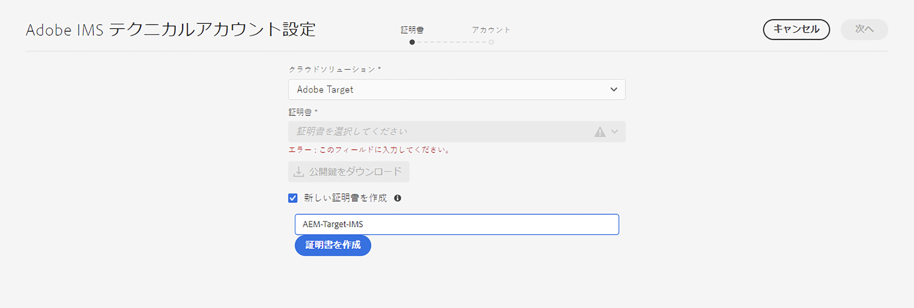
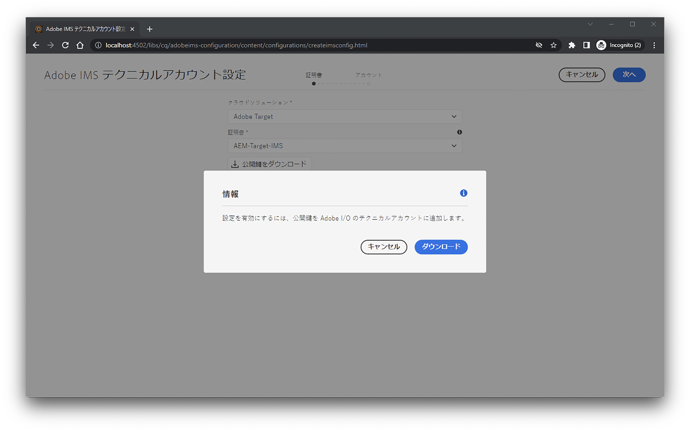
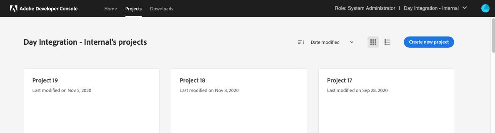
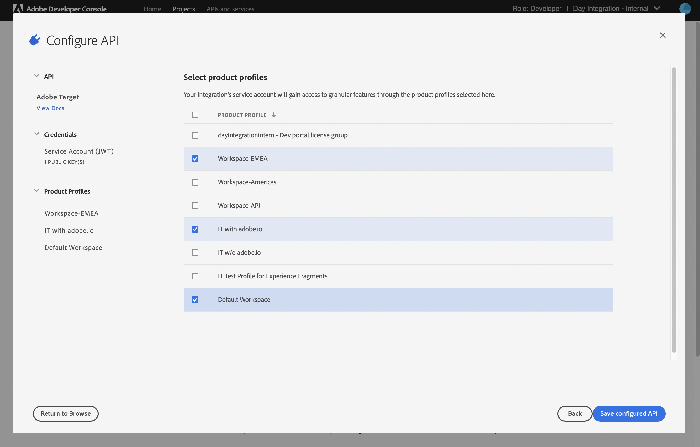
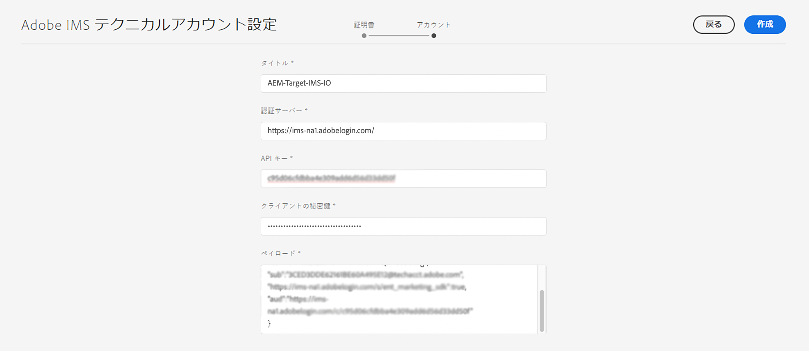
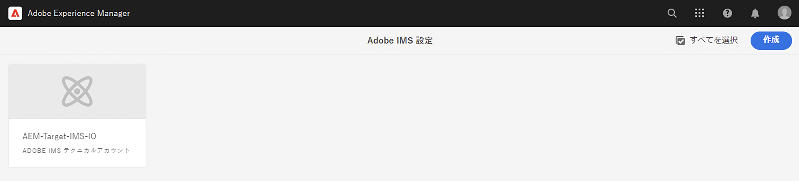
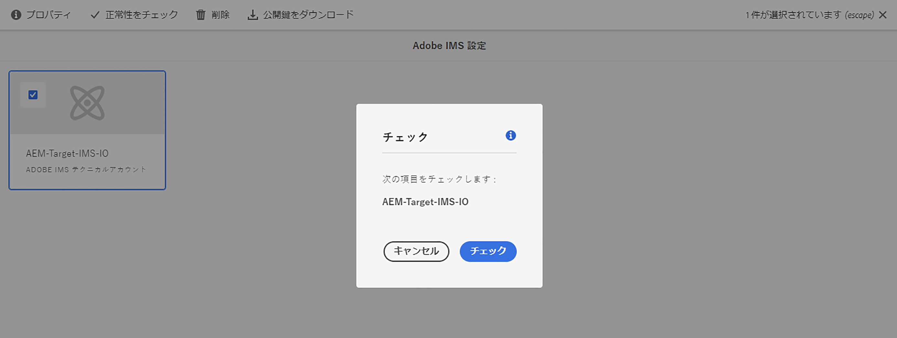

# Adobe Target との統合時に使用する IMS 設定{#ims-configuration-for-integration-with-adobe-target}

Target Standard API を介して AEM と Adobe Target を統合するには、Adobe IMS（Identity Management System）の設定が必要です。この設定は、Adobe Developer コンソールで行います。

>[!NOTE]
>
>AEMaaCS には、Adobe Target Standard API のサポートが新しく追加されました。Target Standard API では IMS 認証を使用します。
>
>API の選択は、AEM/Target 統合に使用される認証方法によって決定されます。

## 前提条件 {#prerequisites}

この手順を開始する前に、以下を実行します。

* [アドビサポート](https://helpx.adobe.com/jp/contact/enterprise-support.ec.html)は、次のアカウントをプロビジョニングする必要があります。

   * アドビコンソール
   * Adobe 開発者コンソール
   * Adobe Target と
   * Adobe IMS（Identity Management System）

* 組織のシステム管理者は、Admin Console を使用して、組織内で必要な開発者を関連する製品プロファイルに追加する必要があります。

   * これにより、Adobe Developer Console 使用して統合を有効にする権限が特定の開発者に付与されます。
   * 詳しくは、[開発者の管理](https://helpx.adobe.com/jp/enterprise/admin-guide.html/enterprise/using/manage-developers.ug.html)を参照してください。

## IMS 設定の指定 - 公開鍵の生成 {#configuring-an-ims-configuration-generating-a-public-key}

設定の最初の段階は、AEMで IMS 設定を作成し、公開鍵を生成することです。

1. AEM で、**ツール**&#x200B;メニューを開きます。
1. **セキュリティ**&#x200B;セクションで、**Adobe IMS 設定**&#x200B;を選択します。
1. **作成**&#x200B;を選択して、**Adobe IMS テクニカルアカウント設定**&#x200B;を開きます。
1. **クラウド設定**&#x200B;の下のドロップダウンを使用して、**Adobe Target**&#x200B;を選択します。
1. **新しい証明書の作成**&#x200B;をアクティブにして、新しいエイリアスを入力します。
1. 「**証明書の作成**」で確認します。

   

1. 「**ダウンロード**」（または「**公開鍵のダウンロード**」）を選択してファイルをローカルドライブにダウンロードし、[Adobe Target と AEM の統合に向けて IMS を設定する](#configuring-ims-adobe-target-integration-with-aem)際に使用できるようにします。

   >[!CAUTION]
   >
   >この設定は、[AEM で IMS 設定を完了する](#completing-the-ims-configuration-in-aem)ときに再び必要になるため、開いたままにしてください。

   

## Adobe Target と AEM の統合に向けた IMS の設定 {#configuring-ims-adobe-target-integration-with-aem}

AEM で使用する Adobe Target を組み込んだ Adobe 開発者コンソールプロジェクト（統合）を作成し、必要な権限を割り当てます。

### プロジェクトの作成 {#creating-the-project}

Adobe 開発者コンソールを開いて、AEM で使用する Adobe Target を組み込んだプロジェクトを作成します。

1. Adobe Developer Console を開いて、プロジェクトを表示します。

   [https://developer.adobe.com/console/projects](https://developer.adobe.com/console/projects)

1. 既に作成したプロジェクトが表示されます。**新規プロジェクトの作成**&#x200B;を選択 - 場所と使用方法は、以下に依存します。

   * まだプロジェクトがない場合は、 **新規プロジェクトを作成**が中央の下に表示されます。
      
   * 既存のプロジェクトがある場合は、それらがリストされ、 **新規プロジェクトの作成**が右上に表示されます。
      

1. **プロジェクトに追加**&#x200B;を選択し、続いて **API** を選択します。

   

1. **Adobe Target** を選択し、続いて&#x200B;**次へ**&#x200B;を選択します。

   >[!NOTE]
   >
   >Adobe Target を購読しているが、リストに表示されない場合は、 [前提条件](#prerequisites)を確認する必要があります。

   

1. **公開鍵**&#x200B;をアップロードして、完了したら&#x200B;**次へ**&#x200B;をクリックして進みます。

   

1. 資格情報を確認して、**次へ**&#x200B;をクリックして進みます。

   

1. 必要な製品プロファイルを選択して、**設定済み API を保存**&#x200B;に進みます。

   >[!NOTE]
   >
   >で表示される製品プロファイルは、次のものがあるかどうかによって異なります。
   >
   >* Adobe Target Standard - **デフォルトのワークスペース**&#x200B;のみ使用可能です
   >* Adobe Target Premium - 以下に示すように、使用可能なすべてのワークスペースが一覧表示されます

   

1. 作成が確定します。

<!--
1. The creation will be confirmed, you can now **Continue to integration details**; these are needed for [Completing the IMS Configuration in AEM](#completing-the-ims-configuration-in-aem).

   
-->

<!-- could not verify - only saw Adobe Target Classic -->

### 統合への権限の割り当て {#assigning-privileges-to-the-integration}

次に、必要な権限を統合に割り当てる必要があります。

1. Adobe **Admin Console** を開きます。

   * [https://adminconsole.adobe.com](https://adminconsole.adobe.com/)

1. **製品** （上部のツールバー）に移動し、**Adobe Target - &lt;*your-tenant-id*>**（左のパネルから）を選択します。
1. **製品プロファイル**&#x200B;を選択して、表示されるリストから必要なワークスペースを選択します（例：「デフォルトのワークスペース」）。
1. **API 資格情報**&#x200B;を選択して、必要な統合設定を選択します。
1. **製品の役割**&#x200B;として、**オブザーバー**&#x200B;の代わりに&#x200B;**編集者**&#x200B;を選択します。

## Adobe Developer Console 統合プロジェクト用に保存された詳細 {#details-stored-for-the-ims-integration-project}

Adobe 開発者コンソールプロジェクトコンソールで、すべての統合プロジェクトのリストを表示できます。

* [https://developer.adobe.com/console/projects](https://developer.adobe.com/console/projects)

**表示**（特定のプロジェクトエントリの右側）を選択して、設定に関する詳細を表示します。次のものが含まれます。

* プロジェクトの概要
* Insights
* 資格情報
   * サービスアカウント（JWT）
      * 資格情報の詳細
      * JWT の生成
* API
   * 例：Adobe Target

これらの一部は、IMS に基づいて AEM で Adobe Target の統合を完了するために必要になります。

## AEM での IMS 設定の完了 {#completing-the-ims-configuration-in-aem}

AEM に戻り、Target の IMS 統合から必要な値を追加して、IMS 設定を完了できます。

1. [AEM で IMS 設定を開く](#configuring-an-ims-configuration-generating-a-public-key)に戻ります。
1. 「**次へ**」を選択します。

1. ここで、[Adobe 開発者コンソールのプロジェクト設定から得られる詳細](#details-stored-for-the-ims-integration-project)を使用できます。

   * **タイトル**：テキスト。
   * **認証サーバー**：以下の&#x200B;**ペイロード**&#x200B;セクションの `aud` 行からこれをコピーして貼り付けます。（たとえば以下の例では `https://ims-na1.adobelogin.com`）
   * **API キー**：これはプロジェクトの「[概要](#details-stored-for-the-ims-integration-project)」セクションからコピーします
   * **クライアントの秘密鍵**：これはプロジェクトの「[概要](#details-stored-for-the-ims-integration-project)」セクションで生成しコピーします
   * **ペイロード**：これは「[JWT を生成](#details-stored-for-the-ims-integration-project)」セクションからコピーします

   

1. 「**作成**」で確認します。

1. Adobe Target の設定が AEM コンソールに表示されます。

   

## IMS 設定の確認 {#confirming-the-ims-configuration}

設定が期待どおりに動作していることを確認するには：

1. 次を開きます。

   * `https://localhost<port>/libs/cq/adobeims-configuration/content/configurations.html`

   次に例を示します。

   * `https://localhost:4502/libs/cq/adobeims-configuration/content/configurations.html`

1. 設定を選択します。
1. ツールバーから&#x200B;**ヘルスチェック**&#x200B;を選択し、次に&#x200B;**チェック**&#x200B;を選択します。

   

1. 成功した場合は、確認メッセージが表示されます。

## Adobe Target との統合の完了 {#complete-the-integration-with-adobe-target}

これで、この IMS 設定を使用して [Adobe Target との統合](/help/sites-cloud/integrating/integrating-adobe-target.md)を完了できます。

<!--

## Configuring the Adobe Target Cloud Service {#configuring-the-adobe-target-cloud-service}

The configuration can now be referenced for a Cloud Service to use the Target Standard API:

1. Open the **Tools** menu. Then, within the **Cloud Services** section, select **Legacy Cloud Services**.
1. Scroll down to **Adobe Target** and select **Configure now**.

   The **Create Configuration** dialog will open.

1. Enter a **Title** and, if you want, a **Name** (if left blank this will be generated from the title).

   You can also select the required template (if more than one is available).

1. Confirm with **Create**.

   The **Edit Component** dialog will open.

1. Enter the details in the **Adobe Target Settings** tab:

    * **Authentication**: IMS

    * **Client Code**: See the [Tenant ID and Client Code](#tenant-client) section.

    * **Tenant ID**: the Adobe IMS Tenant ID. See also the [Tenant ID and Client Code](#tenant-client) section.

      >[!NOTE]
      >
      >For IMS this value needs to be taken from Target itself. You can log into Target and extract the Tenant ID from the URL.
      >
      >For example, if the URL is:
      >
      >`https://experience.adobe.com/#/@yourtenantid/target/activities`
      >
      >Then you would use `yourtenantid`.

    * **IMS Configuration**: select the name of the IMS Configuration

    * **API Type**: REST

    * **A4T Analytics Cloud Configuration**: Select the Analytics cloud configuration that is used for target activity goals and metrics. You need this if you are using Adobe Analytics as the reporting source when targeting content.   

      <!--
      If you do not see your cloud configuration, see note in [Configuring A4T Analytics Cloud Configuration](/help/sites-administering/target-configuring.md#configuring-a-t-analytics-cloud-configuration).
      -- >

    * **Use accurate targeting**: By default this check box is selected. If selected, the cloud service configuration will wait for the context to load before loading content. See note that follows.

    * **Synchronize segments from Adobe Target**: Select this option to download segments that are defined in Target to use them in AEM. You must select this option when the API Type property is REST, because inline segments are not supported and you always need to use segments from Target. (Note that the AEM term of 'segment' is equivalent to the Target 'audience'.)

    * **Client library**: Select whether you want the AT.js client library, or mbox.js (deprecated).

    * **Use Tag Management System to deliver client library**: Use DTM (deprecated), Adobe Launch or any other tag management system.

    * **Custom AT.js**: Leave blank if you checked the Tag Management box or to use the default AT.js. Alternatively upload your custom AT.js. Only appears if you have selected AT.js.

   <!--
   >[!NOTE]
   >
   >[Configuration of a Cloud Service to use the Target Classic API](/help/sites-administering/target-configuring.md#manually-integrating-with-adobe-target) has been deprecated (uses the Adobe Recommendations Settings tab).
   -- >

1. Click **Connect to Adobe Target** to initialize the connection with Adobe Target.

   If the connection is successful, the message **Connection successful** is displayed.

1. Select **OK** on the message, followed by **OK** on the dialog to confirm the configuration.

1. You can now proceed to [Adding a Target Framework](/help/sites-administering/target-configuring.md#adding-a-target-framework) to configure ContextHub or ClientContext parameters that will be sent to Target. Note this may not be required for exporting AEM Experience Fragments to Target.

### Tenant ID and Client Code {#tenant-client}

With [Adobe Experience Manager as a Cloud Service](/help/release-notes/release-notes-cloud/release-notes-current.md), the Client Code field had been added to the Target configuration window.

When configuring the Tenant ID and Client Code fields, please be aware of that for most customers, the **Tenant ID** and the **Client Code** are the same. This means that both fields contain the same information and are identical. Make sure you enter the Tenant ID in both fields.

>[!NOTE]
>
>For legacy purposes, you can also enter different values in the Tenant ID and the Client Code fields.

In both cases, be aware that:

* By default, the Client Code (if added first) will also be automatically copied into the Tenant ID field.
* You have the option to change the default Tenant ID set.
* Accordingly, the backend calls to Target will be based on the **Tenant ID** and the client side calls to Target will be based on the **Client Code**.

As stated previously, the default case is the most common for AEM as a Cloud Service. Either way, make sure **both** fields contain the correct information depending on your requirements.

>[!NOTE]
>
> If you want to change an existing Target Configuration:
>
> 1. Re-enter the Tenant ID.
> 2. Re-connect to Target.
> 3. Save the configuration.
-->
