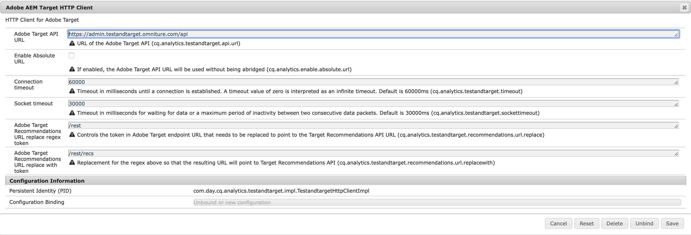

# 概要 {#introduction}

このページでは、Adobe AEM Target HTTP ウィンドウに表示される設定可能なパラメーターについて説明します。

## パラメーター {#parameters}

このウィンドウには、次の設定可能なパラメーターが含まれています。

| パラメーター | 説明 |
|---|---|
| Adobe Target API URL | Adobe Target API の URL。 |
| Enable Absolute URL | URL のホスト部分または完全な URL のどちらを使用するかを決定します。完全な URL を使用する場合は、このチェックボックスをオンにします。デフォルトでは、このチェックボックスはオフになっています。 |
| Connection Timeout | 接続が確立されるまでのタイムアウト（ミリ秒）。デフォルト値は 60000 ミリ秒です。値 0 は、無限タイムアウトと解釈されます。 |
| Socket Timeout | タイムアウトするまでデータを待機する時間（ミリ秒）、または 2 つの連続したデータパケットの間に可能な無操作状態の最長時間（ミリ秒）です。デフォルト値は 30000 ミリ秒です。 |
| Adobe Target Recommendations URL Replace Regex Token | Target Recommandations API URL を指すように置き換える必要がある、Adobe Target エンドポイント URL のトークンを制御します。 |
| Adobe Target Recommendations URL Replace with Token | 上記のパラメーターで説明されている正規表現の代わりとなるものです。したがって、結果の URL は Target Recommandations API を指します。 |
