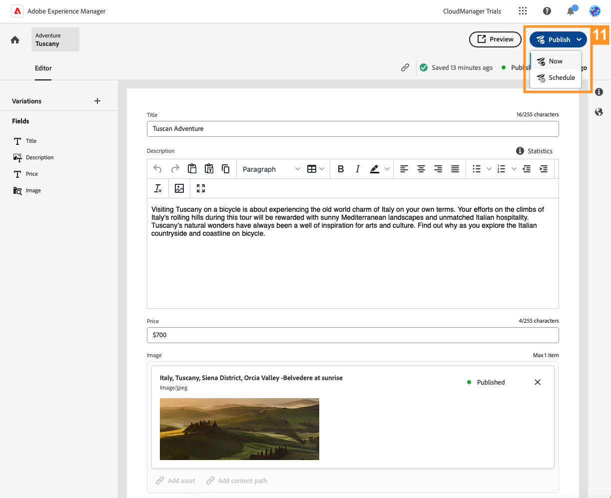

# ヘッドレスコンテンツの作成 {#create-content}

>[!CONTEXTUALHELP]
>id="aemcloud_sites_trial_admin_content_fragments_create_content"
>title="ヘッドレスコンテンツを作成"
>abstract="前のモジュールで作成したモデルを使用して、ページオーサリングにもヘッドレスコンテンツの基礎としても使用できるコンテンツの作成方法について説明します。"

>[!CONTEXTUALHELP]
>id="aemcloud_sites_trial_admin_content_fragments_create_content_guide"
>title="コンテンツフラグメントコンソールの起動"
>abstract="アプリや web サイトをまたいでシームレスに機能する、一貫性のある高品質のコンテンツを作成することで、優れた顧客体験を実現します。このモジュールでは、コンテンツフラグメントコンソールを使用して最初のヘッドレスコンテンツを作成する手順を説明します。<br><br>下をクリックして、新しいタブでこのモジュールを起動し、このガイドに従ってください。"

>[!CONTEXTUALHELP]
>id="aemcloud_sites_trial_admin_content_fragments_create_content_guide_footer"
>title="お疲れ様でした。このモジュールでは、前に作成したモデルに基づいてコンテンツフラグメントをコンテンツ ラグメントとして作成する方法を学びました。これで、開発サイクルに関係なく、コンテンツチームがアプリや web サイトのコンテンツを作成および管理する方法を理解できました。"
>abstract=""

## コンテンツフラグメントの作成 {#create-fragment}

コンテンツフラグメントはヘッドレスコンテンツを表し、コンテンツフラグメントモデルと呼ばれる事前定義済みの構造に基づいています。以前のモジュールで既にモデルを作成しています。

このモジュールでは、コンテンツフラグメントコンソールを使用して、そのモデルに基づいてコンテンツフラグメントを作成します。コンテンツフラグメントコンソールは、ヘッドレスコンテンツのライブラリと考えてください。この機能を使用して、新しいコンテンツフラグメントを作成し、既存のフラグメントを管理します。

コンテンツフラグメントコンソールは、配信チャネルをまたいでヘッドレスコンテンツを作成および編集し、コンテキストに依存しません。これは、多くのオーサリングケースで最も効果的な方法です。後のモジュールでは、ヘッドレスコンテンツのコンテキスト内およびインプレースでの編集について検討します。

1. コンソールの右上にある「**作成**」ボタンを選択します。

1. **新しいコンテンツフラグメント**&#x200B;ダイアログボックスが開き、コンテンツフラグメントの作成を開始できます。**場所**&#x200B;には、新しいコンテンツが保存される場所が自動的に入力されます。

1. 「**コンテンツフラグメントモデル**」ドロップダウンで、前に作成した&#x200B;**アドベンチャー**&#x200B;コンテンツフラグメントモデルを選択します。

1. コンテンツフラグメントを説明する&#x200B;**タイトル**&#x200B;として、`Tuscany` を追加します。これは、コンソールでフラグメントを識別するために行います。

1. 「**作成して開く**」を選択します。


>[!TIP]
>
>ブラウザーの設定によっては、新しいブラウザータブがポップアップブロッカーによって抑制される場合があります。「**作成して開く**」をクリックしても新しいフラグメントが開かない場合は、ブラウザーの設定を確認してください。

## コンテンツフラグメントへのコンテンツの追加 {#add-content}

新しいコンテンツフラグメントを保存して開くと、新しいタブでコンテンツフラグメントエディターが開きます。ここで、新しいフラグメントのコンテンツを追加できます。

1. コンテンツフラグメントエディターには、選択したモデルで定義したフィールドが表示されます。ここで、各フィールドにコンテンツを追加してコンテンツフラグメントを完成させることができます。進行状況は自動的に保存されます。

1. `Tuscan Adventure` と入力して、フラグメントの&#x200B;**タイトル**&#x200B;を指定します。

1. 次をのテキストを貼り付けて、フラグメントの&#x200B;**説明**&#x200B;を指定します。

   ```text
   Visiting Tuscany on a bicycle is about experiencing the old world charm of Italy on your own terms. Your efforts on the climbs of Italy's rolling hills during this tour are rewarded with sunny Mediterranean landscapes and unmatched Italian hospitality. Tuscany's natural wonders have always been a well of inspiration for arts and culture. Find out why as you explore the Italian countryside and coastline on bicycle.
   ```

1. `$700` と入力して、フラグメントの&#x200B;**価格**&#x200B;を指定します。

1. **画像**&#x200B;フィールドの「**アセットを追加**」をタップまたはクリックして、旅を象徴的に表す&#x200B;**画像**&#x200B;を指定します。

1. アセットのポップアップで、「**アセットを参照**」を選択し、アセットライブラリ内の既存のアセットから選択します。

   

1. 「**アセットを選択**」ダイアログが開きます。左側のパネルのツリーナビゲーターを使用して、**すべてのアセット**／**aem-demo-assets**／**en**／**adventures**／**cycling-tuscany** に移動します。

1. **cycling-tuscany**&#x200B;フォルダーのコンテンツが右側に表示されます。画像 `ADOBESTOCK_141786166.JPEG` を選択します。

1. 「**選択**」を選択します。

   

1. 選択した画像がコンテンツフラグメントに表示されます。エディターが自動的に変更を保存します。

1. コンテンツの追加が完了したら、エディターの右上にある「**公開**」ボタンを選択します。これにより、コンテンツフラグメントを外部アプリで使用できるようになります。ドロップダウンから「**今すぐ**」を選択します。また、後で公開するようにスケジュールすることもできます。

   

1. **コンテンツフラグメントを公開**&#x200B;ダイアログが表示されます。AEM は参照チェックを自動的に実行し、コンテンツフラグメントに必要なすべてのリソースが公開されていることを確認します。この場合、作成したモデルも公開する必要があります。「**公開**」を選択します。

   

1. バナーで公開を確認します。

コンテンツが公開され、コンテンツフラグメントとしてアプリまたは web サイトに配信する準備が整いました。
