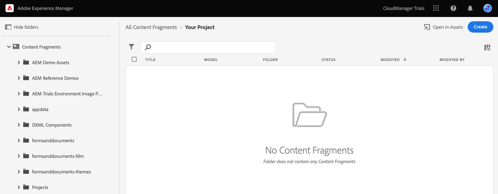
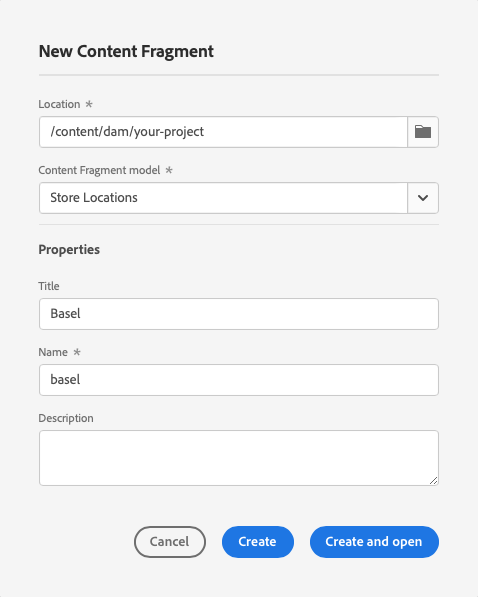

# ヘッドレスコンテンツを作成 {#create-content}

製品内学習モジュールに従って、の使用方法を学びます。 [前に作成したコンテンツフラグメントモデル](content-structure.md) ページのオーサリングに使用できるコンテンツを作成する場合、またはヘッドレスコンテンツの基礎として使用できます。 このドキュメントは、同じ手順を説明し、必要に応じて追加のリソースにリンクする、インタラクティブツアーの補足として機能します。

## コンテンツフラグメント {#introduction}

AEM as a Cloud Serviceでは、コンテンツフラグメントは、コンテンツフラグメントモデルで定義された構造に基づくヘッドレスコンテンツです。 独自のコンテンツフラグメントを作成するには、コンテンツフラグメントコンソールで開始します。 コンテンツフラグメントコンソールは、ヘッドレスコンテンツのライブラリと考えることができます。 コンソールを使用して、新しいコンテンツフラグメントを作成し、既存のフラグメントを管理します。 コンソールが空になるので、新しいフラグメントを作成しましょう。

アプリ内ガイダンスの外側でコンテンツフラグメントコンソールに移動する場合は、ページの左上にあるAdobeアイコンを使用します。 AEMのグローバルナビゲーションが開きます。 ここから、 **ナビゲーション** タブと **コンテンツフラグメント**.

>[!TIP]
>
>AEMでのナビゲーションについて詳しくは、 [「その他のリソース」セクション](#additional-resources) このドキュメントのを参照して、AEMの基本操作の詳細を確認してください。

## コンテンツフラグメントを作成 {#create-fragment}

コンテンツフラグメントは、ヘッドレスコンテンツを表します。 ただし、事前定義されたコンテンツ構造に基づいてのみ作成できます。 以前に作成したコンテンツフラグメントモデルがその構造として機能します。

1. をタップまたはクリックします。 **作成** コンソールの右上にあるボタンで、 **新しいコンテンツフラグメント** ダイアログが開き、新しいコンテンツフラグメントの作成が開始されます。

   

1. アプリ内ガイダンスに従っている場合は、 **場所** が自動的に入力されます。

   1. ガイダンスに従わない場合は、パスブラウザを使用してプロジェクトフォルダを選択します。

   1. 内 **新しいコンテンツフラグメント** ダイアログで、 **場所を選択** ボタン（フォルダーに似たアイコン）を **場所** フィールドに入力します。

      
   * または、コンテンツフラグメントコンソールの左側のナビゲーションパネルでパスを選択してから、 **作成**.

1. 内 **コンテンツフラグメントモデル** ドロップダウンから、以前に作成したコンテンツフラグメントモデルをドロップダウンから選択します。

1. を追加します。 **タイトル** コンテンツフラグメント用。

1. タップまたはクリック **作成して開く**.

## コンテンツフラグメントエディター {#edit-fragment}

新しいコンテンツフラグメントを保存すると、コンテンツフラグメントエディターが開き、フラグメントの実際のコンテンツを指定できます。

1. エディターには、選択したモデルで定義したフィールドが表示されます。 ここで編集して、コンテンツフラグメントを完成させることができます。 進行状況は自動的に保存されます。

   

1. コンテンツフラグメントのモデルに多数のフィールドがある場合は、 **変数** パネルを使用して、製品内で利用できます。 エラーのあるフィールドは、ここでフラグ付けされます。

1. コンテンツフラグメントを外部アプリで使用できるようにするには、コンテンツフラグメントを公開する必要があります。 をタップまたはクリックします。 **公開** ボタンをクリックします。

1. 選択 **今すぐ** 」をクリックします。 また、後で公開するようにスケジュールすることもできます。

   

   >[!TIP]
   >
   >AEMでのコンテンツの公開について詳しくは、 [「その他のリソース」セクション](#additional-resources) 」を参照してください。

1. AEMは自動的に参照チェックを実行し、コンテンツフラグメントに必要なすべてのリソースが公開されていることを確認します。 この場合、作成したモデルも公開する必要があります。 「**公開**」をタップまたはクリックします。

   

1. バナーで公開が確認されました。

   

## これで、コンテンツフラグメントの作成方法を学びました。 {#conclusion}

このモジュールでは、前に作成したモデルに基づいてコンテンツフラグメントを作成する方法を学びました。 この方法で、コンテンツ作成者は構造化されたヘッドレスコンテンツを作成します。

コンテンツが作成されて公開されたので、AEM API を使用して Graph QL を介してそのコンテンツを抽出できます。 詳しくは、モジュールを参照してください。 [GraphQL API を使用してコンテンツを抽出します。](extract-content.md)

体験版のホーム画面に戻るには、 **ソリューション** ボタンをクリックし、 **Experience Manager**.

## その他のリソース {#additional-resources}

コンテンツフラグメントとAEMの詳細については、この追加ドキュメントを参照してください。

* [基本操作](/help/sites-cloud/authoring/getting-started/basic-handling.md)  — 新規ユーザー向けのAEMのナビゲート方法と使用方法に関するドキュメント
* [コンテンツフラグメントの管理 — 公開と参照](/help/assets/content-fragments/content-fragments-managing.md#publishing-and-referencing-a-fragment) - AEMでのコンテンツの公開方法の詳細
* [コンテンツフラグメント](/help/assets/content-fragments/content-fragments.md)  — コンテンツフラグメントの概要と、コンテンツフラグメントに関する完全なドキュメントへのリンク
* [コンテンツフラグメントの管理](/help/assets/content-fragments/content-fragments-managing.md)  — コンテンツフラグメントの作成および管理方法
