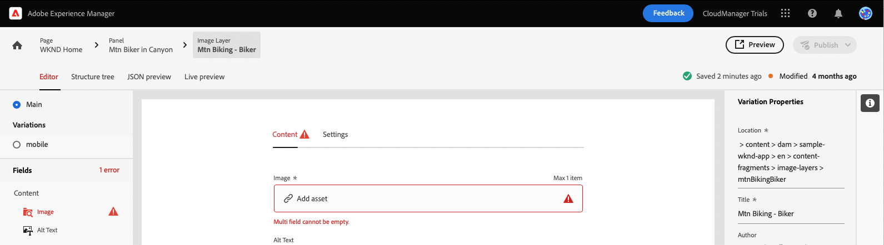

# サンプル React アプリのコンテンツのカスタマイズ {#customize-app}

ヘッドレス向けのAEMトライアルは、ヘッドレスコンテンツを紹介するシンプルな React アプリでプリロードされます。 このモジュールでは、そのアプリをプレビューし、画像を入れ替えて、そのアプリのショッパブルモーメントを作成することでそのアプリのコンテンツを変更する方法を学びます。

アプリ自体は、コンテンツフラグメントの構造に基づいています。 AEMのコンテンツフラグメントエディターを使用して、アプリのコンテンツを変更できます。 このモジュールのAEM Trials では、このプロセスを簡単でインタラクティブなツアーで理解できます。 このドキュメントは、同じ手順を説明し、必要に応じて追加のリソースにリンクする、インタラクティブツアーの補足として機能します。

>[!CONTEXTUALHELP]
>id="aemcloud_sites_trial_admin_content_fragments_react_app"
>title="サンプル React アプリのコンテンツのカスタマイズ"
>abstract="ヘッドレス機能セットを使用してコンテンツをカスタマイズする方法を学ぶために使用できる最新の React アプリを設定しました。"

>[!CONTEXTUALHELP]
>id="aemcloud_sites_trial_admin_content_fragments_react_app_guide"
>title="コンテンツフラグメントエディターを起動します。"
>abstract="ヘッドレス向けのAEMトライアルは、ヘッドレスコンテンツを紹介するシンプルな React アプリでプリロードされます。 アプリは、コンテンツフラグメントの構造に基づいています。 AEMのコンテンツフラグメントエディターを使用して、アプリのコンテンツを変更できます。  以下をクリックして新しいタブで機能を起動し、このガイドに従ってください。"
>additional-url="https://video.tv.adobe.com/v/328618" text="導入ビデオのプレースホルダー"

## コンテンツフラグメントエディター {#fragment-editor}

サンプルアプリのコンテンツフラグメントエディターを開始します。

アプリ内ガイダンスの外部でコンテンツフラグメントエディターに移動する場合は、ページの左上にあるAdobeアイコンを使用します。 AEMのグローバルナビゲーションが開きます。 ここから、 **ナビゲーション** タブと **コンテンツフラグメント**.

コンテンツフラグメントコンソールが開きます。 ここから、左側のパネルのコンテンツツリーを使用して、アプリコンテンツの場所に移動します。 この場合、 **コンテンツフラグメント** -> **サンプル WKND アプリ** -> **英語** -> **コンテンツフラグメント** -> **ページ**.

をタップまたはクリックします。 **WKND ホーム** コンテンツツリーの右側のコンソールに表示されるページフラグメントで、アプリコンテンツのエディターを起動します。

>[!TIP]
>
>AEMでのナビゲーションについて詳しくは、 [「その他のリソース」セクション](#additional-resources) このドキュメントのを参照して、AEMの基本操作の詳細を確認してください。

## アプリのプレビュー {#preview}

アプリの変更を開始する前に、まず、現在の状態をプレビューして、アプリに慣れてください。 をタップまたはクリックします。 **プレビュー** ボタンをクリックします。

新しいタブでデモアプリが開きます。

アプリ自体は、React で実装された架空の WKND アウトドアライフスタイルブランドのシンプルな e コマースアプリです。 クリックしてサンプルコンテンツに移動します。

続行するには、コンテンツフラグメントエディターの「 」タブに戻ります。

## アプリ内のテキストの編集 {#edit-app}

前述のように、アプリ自体はコンテンツフラグメントで構成されています。 これらのフラグメントは、アプリを作成するために構造内で相互にリンクされています。

コンテンツフラグメントエディターは、アプリの基本レイアウトをページとして表示します。 このページはコンテンツフラグメントで、それ自体が他のフラグメントのコレクションです。 この **パネル** は、アプリの様々なページを表し、それぞれが独自のコンテンツフラグメントです。 これらのフラグメントを変更すると、アプリのコンテンツを変更できます。

1. タップまたはクリック **Mtn Biker in Canyon** 内 **パネル** 」セクションに入力します。

   

1. 編集者がマウンテンバイカーのヘッダーパネルを開きます。 各パネルは、アプリのページ内の様々なコンテンツを表すレイヤーで構成されています。

   

1. テキストレイヤーを選択 **Mtn Biker in Canyon Text Layer**. これにより、エディタで画層の詳細が開きます。 レイヤーは複数のコンテンツフラグメントで構成されています。

   

1. を選択します。 **Mtn Biker in Canyon Title** テキスト項目。 コンテンツフラグメントエディターが開き、このフラグメントのコンテンツが表示され、変更できます。

   

1. 次のテキストを変更： `Your next great adventure is calling` から `Choose your own adventure`. 変更はエディターによって自動的に保存されます。

1. 「プレビュー」をクリックして、変更を確認します。 新しいタブでデモアプリが開きます。

   

コンテンツフラグメントエディターの「 」タブに戻り、モジュールを続行します。

## アプリのメイン画像の変更 {#change-image}

アプリ内のテキストを変更したので、アプリのメイン画像を変更してみてください。 まず、そのコンテンツを見つける必要があります。

エディターの左上にあるパンくずリストには、コンテンツ階層内の位置が表示されます。

1. タップまたはクリック **Mtn Biker in Canyon** 」をクリックして、そのページに戻ります。

   

1. アプリの様々なレイヤーを含むパネルに戻ります。 レイヤーは、テキストコンテンツを表すだけではありません。 これらは、アプリ内のすべてのコンテンツを表します。 そのため、コンテンツフラグメントエディターを使用して画像を入れ替えることもできます。

   

1. を選択します。 **Mtn Biking - Biker** 画像レイヤー。 コンテンツフラグメントエディターが開き、このフラグメントのコンテンツが表示され、変更できます。

   

1. をタップまたはクリックします。 **X** バイカー画像を削除します。 画像はこのコンテンツフラグメントモデルに必要なデータなので、画像が消え、エディターにエラーが表示されます。

   

1. タップまたはクリック **アセットを追加** で黄色いバイカー画像を探します。 **sample-wknd-app** > **en** > **image-files**. の左側にあるツリービューを使用します。 **アセットを選択** ダイアログで、コンテンツ階層をナビゲートします。

   

1. テキストのフィルター `yellow`. 以下を使用： **すべてのアセットを検索** 上部のフィールド **アセットを選択** ウィンドウで画像を検索します。 検索テキストを入力し、Enter キーを押すか、検索に戻ります。

   

1. タップまたはクリックして `biker-yellow.png` 画像をタップまたはクリック **選択**.

   

1. バイカーの画像は、選択した画像に置き換えられました。 エディターが自動的に変更を保存します。

   

## ショッパブルモーメントの作成 {#create-moment}

これで、バイカーの画像を更新したので、バイカーの黄色いショートのショッパブルモーメントを追加できます。

1. まず、ページフラグメントのコンテンツフラグメントエディターに戻ります。 エディターの左上にあるパンくずリストには、コンテンツ階層内の位置が表示されます。 タップまたはクリック **WKND ホーム** 」をクリックして、そのページに戻ります。

   

1. を選択します。 **Mtn Biker on WKND Yellow** パネル。

   

1. これで、バイカーのイメージを構成するレイヤーが表示されます。 買い物かごの黄色いショートにショッパブルな時間を追加するには、 **Mtn Biking - Shoppable** レイヤー。

   

1. ショッパブルモーメントを作成するには、その瞬間を表す新しいコンテンツフラグメントを作成する必要があります。 をタップまたはクリックします。 **+新しいフラグメントを作成** ボタンをクリックして、自転車のショートカットのショッパブルモーメントを追加します。

   

1. コンテンツフラグメントは構造化されたヘッドレスデータを表すので、コンテンツフラグメントを作成する際は必ず、最初にそのフラグメントのベースとなるモデルを選択する必要があります。 を選択します。 **ショッパブルモーメント項目** モデル **コンテンツフラグメントモデル** 」ドロップダウンリストから選択できます。

   

1. この新しいショッパブルモーメントを表すコンテンツフラグメントに名前を付けます。 例えば、 `Shorts` に **名前** フィールドに入力します。

   

1. タップまたはクリック **作成して開く**.

1. 新しいコンテンツフラグメント用のエディターが開きます。
   * ショッパブルモーメントに **テキスト** 次のようなフィールド： `Yellow shorts`.
   * この買い物かごのモーメントをオーバーレイする位置の X と Y を設定します。
      * **X**: `-18`
      * **Y**: `-28`
   * フラグメントに対する変更は、エディターによって自動的に保存されます

   

1. タップまたはクリック **プレビュー** この位置をテストし、必要に応じて調整します。

   

## サンプル React アプリをカスタマイズする方法を学習しました。 {#conclusion}

このモジュールでは、サンプル React アプリをカスタマイズする方法を学びました。 最初に、既存のテキストの編集方法を学びました。 その後、その画像の別のインスタンスと入れ替わりました。 最後に、ショッパブルモーメント項目の作成方法と配置方法を確認しました。

必ず [「その他のリソース」セクション](#additional-resources) AEMとそのコンテンツフラグメントの使用に関する追加リソース

カスタムアプリで使用するためにコンテンツフラグメントとヘッドレスコンテンツがどのように作成されるかを学ぶ場合は、まずモジュールを確認してください [アプリのコンテンツ構造を作成します。](content-structure.md)

体験版のホーム画面に戻るには、 **ソリューション** ボタンをクリックし、 **Experience Manager**.

## その他のリソース {#additional-resources}

コンテンツフラグメントとAEMの詳細については、この追加ドキュメントを参照してください。

* [コンテンツフラグメントモデル](/help/assets/content-fragments/content-fragments-models.md)  — コンテンツフラグメントモデルに関する完全なドキュメント
* [コンテンツフラグメント](/help/assets/content-fragments/content-fragments.md)  — コンテンツフラグメントの概要と、コンテンツフラグメントに関する完全なドキュメントへのリンク
* [基本操作](/help/sites-cloud/authoring/getting-started/basic-handling.md)  — 新規ユーザー向けのAEMのナビゲート方法と使用方法に関するドキュメント
