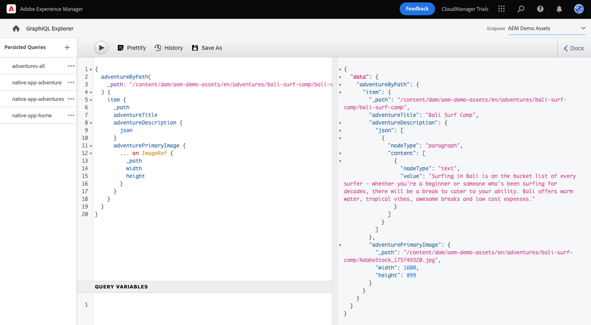

# GraphQL API を使用したコンテンツの抽出 {#extract-content}

これまでのAEM Trials for headless では、 [独自のコンテンツフラグメントモデルを作成しました。](content-structure.md) 自分のヘッドレスコンテンツを作成し [コンテンツフラグメント。](create-content.md) コンテンツフラグメントと GraphQL API をヘッドレスコンテンツ管理システムとして使用し、コンテンツを配信する方法を学ぶことができます。

GraphQLは、1 回の API 呼び出しを使用して、外部のクライアントアプリケーションがAEMに対して、必要なコンテンツに対してのみクエリを実行できるクエリベースの API を提供します。

まず、2 つの異なるタイプのクエリを実行する方法を学びます。 **リスト** および **byPath** クエリ。 次に、前に作成したコンテンツフラグメントからコンテンツを取得する方法を学びます。 このドキュメントは、同じ手順を説明し、必要に応じて追加のリソースにリンクする、インタラクティブツアーの補足として機能します。

>[!TIP]
>
>GraphQL API について詳しくは、 [「その他のリソース」セクション](#additional-resources) ( GraphQL API ガイド用 ) を参照してください。

## GraphQL Explorer {#graphql-explorer}

GraphQL Explorer を起動します。 ここで、ヘッドレスコンテンツに対するクエリを作成し、実行できます。


アプリ内ガイダンスの外部からGraphQL Explorer に移動する場合は、ページの左上にあるAdobeアイコンを使用します。 AEMのグローバルナビゲーションが開きます。 ここから、 **ツール** タブと **一般** -> **GraphQL Query Editor**.

>[!TIP]
>
>AEMでのナビゲーションについて詳しくは、 [「その他のリソース」セクション](#additional-resources) このドキュメントのを参照して、AEMの基本操作の詳細を確認してください。

AEM Trials には、テスト用にコンテンツを抽出できるエンドポイントに、コンテンツがプリロードされています。


を選択します。 **AEMデモアセット** エンドポイント **エンドポイント** エディターの右上隅にあるドロップダウンメニュー（まだ表示されていない場合）。

## リストクエリのコピーと実行 {#list-query}

AEM as a Cloud ServiceのGraphQL API の動作に合わせて簡単なリストクエリから始めます。 このリストクエリの例は、特定のコンテンツフラグメントモデルを使用するすべてのコンテンツのリストを返します。 在庫ページとカテゴリページでは、通常、このクエリ形式を使用します。

1. 次のコードスニペットをコピーします。

   ```text
   {
       adventureList {
         items {
            _path
            adventureTitle
            adventurePrice
            adventureTripLength
            adventurePrimaryImage {
              ... on ImageRef {
               _path
               mimeType
               width
               height
             }
           }
         }
      }
    }
   ```

1. 次に、コピーしたコードを貼り付けて、クエリエディターで既存のコンテンツを置き換えます。

   

1. 貼り付けたら、 **再生** ボタンをクリックしてクエリを実行します。

1. クエリが正常に実行されると、結果が右側のパネルのクエリエディターの横に表示されます。 クエリが正しくない場合は、右側のパネルにエラーが表示されます。

   

すべてのコンテンツフラグメントの完全なリストのリストクエリを検証しました。 このプロセスは、応答がアプリが期待するものであることを確認するのに役立ちます。その結果、アプリや Web サイトがAEMで作成されたコンテンツを取得する方法が示されます。

コンテンツを表示する必要がある様々なチャネルおよびプラットフォームは、このクエリを使用するか、ヘッドレスコンテンツを取得する際に同様の操作をおこなうことができます。

## byPath クエリのコピーと実行 {#bypath-query}

byPath クエリを実行すると、特定のコンテンツフラグメントのアセットを取得できます。 特定のコンテンツのセットに焦点を当てる製品の詳細ページやページには、通常、このタイプのクエリが必要です。

1. 次のコードスニペットをコピーします。

   ```text
    {
     adventureByPath(
       _path: "/content/dam/aem-demo-assets/en/adventures/bali-surf-camp/bali-surf-camp"
     ) {
       item {
         _path
         adventureTitle
         adventureDescription {
           json
         }
         adventurePrimaryImage {
           ... on ImageRef {
             _path
             width
             height
           }
         }
       }
     }
   }
   ```

1. 次に、コピーしたコードを貼り付けて、クエリエディターで既存のコンテンツを置き換えます。

   

1. 貼り付けたら、 **再生** ボタンをクリックしてクエリを実行します。

1. クエリが正常に実行されると、結果が右側のパネルのクエリエディターの横に表示されます。 クエリが正しくない場合は、右側のパネルにエラーが表示されます。

1. クエリが正常に実行されると、結果が右側のパネルのクエリエディターの横に表示されます。 クエリが正しくない場合は、右側のパネルにエラーが表示されます。

   

すべてのコンテンツフラグメントの完全なリストのリストクエリを検証しました。 このプロセスは、応答がアプリが期待するものであることを確認するのに役立ちます。その結果、アプリや Web サイトがAEMで作成されたコンテンツを取得する方法が示されます。

コンテンツを表示する必要がある様々なチャネルおよびプラットフォームは、このクエリを使用するか、ヘッドレスコンテンツを取得する際に同様の操作をおこなうことができます。

## 独自のコンテンツに対するクエリの実行 {#own-queries}

これで、2 つの主なタイプのクエリを実行したので、自分で作成したコンテンツに対するクエリを設定して実行する準備が整いました。

1. 独自のコンテンツフラグメントに対してクエリを実行するには、エンドポイントを **AEMデモアセット** フォルダーを **プロジェクト** フォルダー。

   

1. 最初に、クエリエディターで既存のコンテンツをすべて選択して削除します。 次に、開き角括弧を入力します `{` をクリックし、 Ctrl + Space キーまたは Option + Space キーを押して、コンテンツフラグメントモデルで定義されたモデルのオートコンプリートリストを表示します。 作成したで終わるモデルを選択します。 `List` を選択します。

   

1. 選択したコンテンツフラグメントモデルに対してクエリに含める項目を定義します。 繰り返しに、開き角括弧を入力します。 `{`をクリックし、Ctrl +スペースキーまたは Option +スペースキーを押してオートコンプリートリストを表示します。 選択 `items` を選択します。

   

1. 選択したコンテンツフラグメントモデルに対してクエリに含める必要があるフィールドを定義します。 繰り返しに、開き角括弧を入力します。 `{`をクリックし、 Ctrl + Space キーまたは Option + Space キーを押して、コンテンツフラグメントモデル内の使用可能フィールドのオートコンプリートリストを表示します。 リストから、モデルから必要なフィールドを選択します。

   

1. 複数のフィールドをコンマ (`,`) または Space キーを押しながら Ctrl + Space キーまたは Option + Space キーを押して、追加のフィールドを選択します。

1. 作業中に、 **事前設定** ボタンを使用して、読みやすくするためのコードの書式を自動的に設定します。

   

1. 完了したら、 **再生** ボタンをクリックして、クエリを実行します。

   

コンテンツをオムニチャネルのデジタルエクスペリエンスに配信する方法は次のとおりです。 詳しくは、 [「その他のリソース」セクション](#additional-resources) を参照してください。

## コンテンツのクエリ方法を学びました。 {#conclusion}

お疲れさまでした。ここでは、2 つの基本的なタイプのクエリと、独自のコンテンツに対するクエリ方法について説明します。 必ず [「その他のリソース」セクション](#additional-resources) を参照してください。

抽出したコンテンツがカスタム React アプリでどのように使用されるかを学びたい場合は、必ずモジュールを確認してください [サンプル React アプリのコンテンツをカスタマイズします。](customize-app.md)

体験版のホーム画面に戻るには、 **ソリューション** ボタンをクリックし、 **Experience Manager**.


## その他のリソース {#additional-resources}

コンテンツフラグメントとAEMの詳細については、この追加ドキュメントを参照してください。

* [GraphQL API ガイド](https://experienceleague.adobe.com/docs/experience-manager-learn/getting-started-with-aem-headless/graphql/multi-step/explore-graphql-api.html)
* [基本操作](/help/sites-cloud/authoring/getting-started/basic-handling.md)  — 新規ユーザー向けのAEMのナビゲート方法と使用方法に関するドキュメント
* [AEM での GraphQL の使用方法 - サンプルコンテンツとサンプルクエリ](https://experienceleague.adobe.com/docs/experience-manager-cloud-service/content/headless/graphql-api/sample-queries.html)
