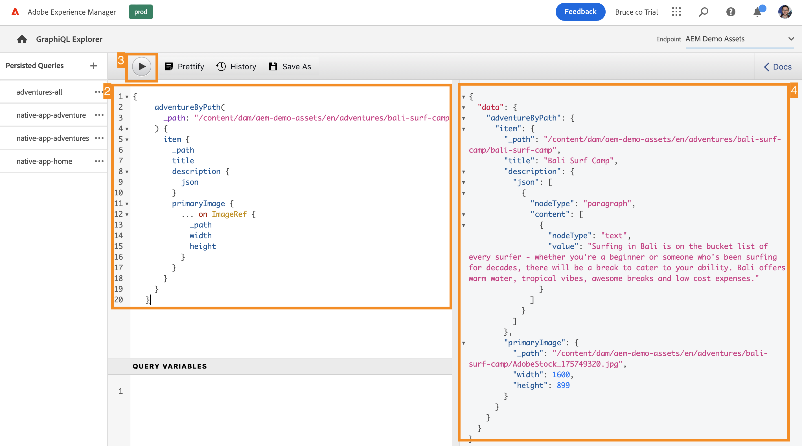

# GraphQL API を使用したコンテンツの抽出 {#extract-content}

>[!CONTEXTUALHELP]
>id="aemcloud_sites_trial_admin_content_fragments_graphql"
>title="GraphQL API を使用したコンテンツの抽出"
>abstract="このモジュールでは、コンテンツフラグメントと GraphQL API をヘッドレスコンテンツ管理システムとして使用する方法について説明します。"

>[!CONTEXTUALHELP]
>id="aemcloud_sites_trial_admin_content_fragments_graphql_guide"
>title="GraphQL Explorer の起動"
>abstract="GraphQL はクエリベースの API を提供し、1 回の API 呼び出しを使用して、外部クライアントアプリケーションが AEM に必要なコンテンツのみをクエリできるようにします。このモジュールでは、2 つの異なるタイプのクエリを実行する方法について説明します。次に、前のモジュールで作成したコンテンツフラグメントからコンテンツを取得する方法について説明します。<br><br>下をクリックして、新しいタブでこのモジュールを起動します。"

>[!CONTEXTUALHELP]
>id="aemcloud_sites_trial_admin_content_fragments_graphql_guide_footer"
>title="お疲れさまでした。2 つの基本的なタイプのクエリと、独自のコンテンツをクエリする方法について学びました。これで、AEM GraphQL API を使用して、アプリが想定する形式でコンテンツを配信する効率的なクエリの作成方法を理解できました。"
>abstract=""

## サンプルコンテンツのリストのクエリ {#list-query}

新しいタブで、GraphQL Explorer を起動します。ここでは、ヘッドレスコンテンツに対するクエリを作成して検証してから、アプリや web サイトのコンテンツを強化できます。

1. AEM ヘッドレス体験版には、テスト目的でコンテンツを抽出できるコンテンツフラグメントがプリロードされたエンドポイントが付属しています。エディターの右上隅にある「**エンドポイント**」ドロップダウンメニューで **AEM デモアセット**&#x200B;エンドポイントが選択されていることを確認します。

1. プリロードされた **AEM デモアセット** エンドポイントのリストクエリの次のコードスニペットをコピーします。リストクエリは、特定のコンテンツフラグメントモデルを使用するすべてのコンテンツのリストを返します。在庫ページとカテゴリページでは、通常、このクエリ形式を使用します。

   ```text
   {
    adventureList {
     items {
       _path
       title
       price
       tripLength
       primaryImage {
         ... on ImageRef {
           _path
           mimeType
           width
           height
         }
       }
     }
    }
   }
   ```

1. クエリエディターで既存のコンテンツを置き換えるには、コピーしたコードを貼り付けます。

1. 貼り付けたら、クエリエディターの左上にある「**再生**」ボタンをクリックしてクエリを実行します。

1. 結果は、右側のパネルの、クエリエディターの横に表示されます。クエリが正しくない場合は、右側のパネルにエラーが表示されます。

   

すべてのコンテンツフラグメントの完全なリストのリストクエリを検証しました。このプロセスは、アプリが期待する応答を確保するのに役立ち、AEM で作成されたコンテンツをアプリや web サイトがどのように取得するのかを示す結果が得られます。

## サンプルコンテンツの特定の部分に対するクエリ {#bypath-query}

byPath クエリを実行すると、特定のコンテンツフラグメントのコンテンツを取得できます。 製品詳細ページと特定のコンテンツセットに焦点を当てたページには、通常、このタイプのクエリが必要です。

1. プリロードされた **AEM デモアセット**&#x200B;エンドポイントの byPath クエリの次のコードスニペットをコピーします。

   ```text
    {
     adventureByPath(
       _path: "/content/dam/aem-demo-assets/en/adventures/bali-surf-camp/bali-surf-camp"
     ) {
       item {
         _path
         title
         description {
           json
         }
         primaryImage {
           ... on ImageRef {
             _path
             width
             height
           }
         }
       }
     }
   }
   ```

1. クエリエディターで既存のコンテンツを置き換えるには、コピーしたコードを貼り付けます。

1. 貼り付けたら、クエリエディターの左上にある「**再生**」ボタンをクリックしてクエリを実行します。

1. 結果は、右側のパネルの、クエリエディターの横に表示されます。クエリが正しくない場合は、右側のパネルにエラーが表示されます。

   

byPath クエリを検証し、そのフラグメントのパスで識別される特定のコンテンツフラグメントを取得しました。

## 独自のコンテンツのクエリ {#own-queries}

2 つの主なタイプのクエリを実行したので、独自のコンテンツをクエリする準備が整いました。

1. 独自のコンテンツフラグメントに対してクエリを実行するには、エンドポイントを **AEM デモアセット**&#x200B;フォルダーから自分の&#x200B;**プロジェクト**&#x200B;フォルダーに変更します。

1. クエリエディターで既存のコンテンツをすべて削除します。次に、左括弧 `{` を入力し、Ctrl + スペースキーまたは Option + スペースキーを押して、エンドポイントで定義されたモデルのオートコンプリートリストを表示します。オプションから、先ほど作成した、末尾に `List` が付くモデルを選択します。前のモジュールの例に沿って進めていれば、オートコンプリートリストに `adventureList` が見つかるはずです。

   

1. 選択したコンテンツフラグメントモデルに対して、クエリに含める項目を定義します。再び左括弧 `{` を入力し、Ctrl + スペースキーまたは Option + スペースキーを押してオートコンプリートリストを表示します。オプションから `items` を選択します。

1. 「**修飾**」ボタンをタップまたはクリックして、コードを読みやすいように自動的に書式設定します。

1. 完了したら、エディターの左上にある「**再生**」ボタンをタップまたはクリックして、クエリを実行します。エディターが `items` をオートコンプリートし、短時間だけ黄色でハイライト表示され、クエリが実行されます。

1. 右側のパネルのクエリエディターの横に、結果が表示されます。

   

コンテンツをオムニチャネルのデジタルエクスペリエンスに配信する方法は次のとおりです。

## 永続クエリ {#persisted-queries}

永続クエリ は、GraphQL API をクライアントアプリケーションに公開するための推奨されるメカニズムです。 クエリが永続化されると、GET リクエストを使用してリクエストでき、高速に取得できるようキャッシュされます。

クライアントアプリケーションから使用するデータを含む永続クエリを作成します。

1. 先にコンテンツフラグメントとして作成したデータを使用するので、エディターの右上隅にある「**エンドポイント**」ドロップダウンメニューで&#x200B;**プロジェクト**&#x200B;エンドポイントが選択されていることを確認します。

1. 次のコードスニペットをコピーします。

   ```text
      {
      adventureList {
       items {
         title
         description {
           plaintext
         }
         price
         image {
           ... on ImageRef {
             _publishUrl
             mimeType
           }
         }
       }
     }
   }
   ```

1. クエリエディターで既存のコンテンツを置き換えるには、コピーしたコードを貼り付けます。

   >[!NOTE]
   >
   >前のモジュールで説明したものと同じフィールドの説明を使用しなかった場合は、このクエリでフィールド名を更新する必要があります。
   >
   >前述のように、GraphQL のオートコンプリート（Ctrl+スペースキーまたは Option+スペースキー）機能を使用すると、使用可能なプロパティを特定するのに役立ちます。

1. 貼り付けたら、クエリエディターの左上にある「**再生**」ボタンをクリックしてクエリを実行します。

1. 結果は、右側のパネルの、クエリエディターの横に表示されます。クエリが正しくない場合は、右側のパネルにエラーが表示されます。

   

1. クエリが完成したら、クエリエディターの上部にある「**名前を付けて保存**」ボタンをクリックしてクエリを永続化します。

1. **クエリ名**&#x200B;ポップアップで、クエリに `adventure-list` という名前を付けます。

1. 「**名前を付けて保存**」をタップまたはクリックします。

   

1. クエリは、画面の下部に表示されるバナーメッセージで確認されたとおりに永続化されます。 また、クエリは、ウィンドウ内の永続クエリの左側のパネルにも表示されます。

1. 永続クエリを公開するには、コンテンツフラグメントと同様に、公開する必要があります。クエリエディターの右上隅にある「**公開**」ボタンをクリックして、クエリを公開します。

1. バナー通知で公開が確認されます。

これで、定義した特定のプロパティと形式のみを含む、新しい永続クエリが作成されました。
